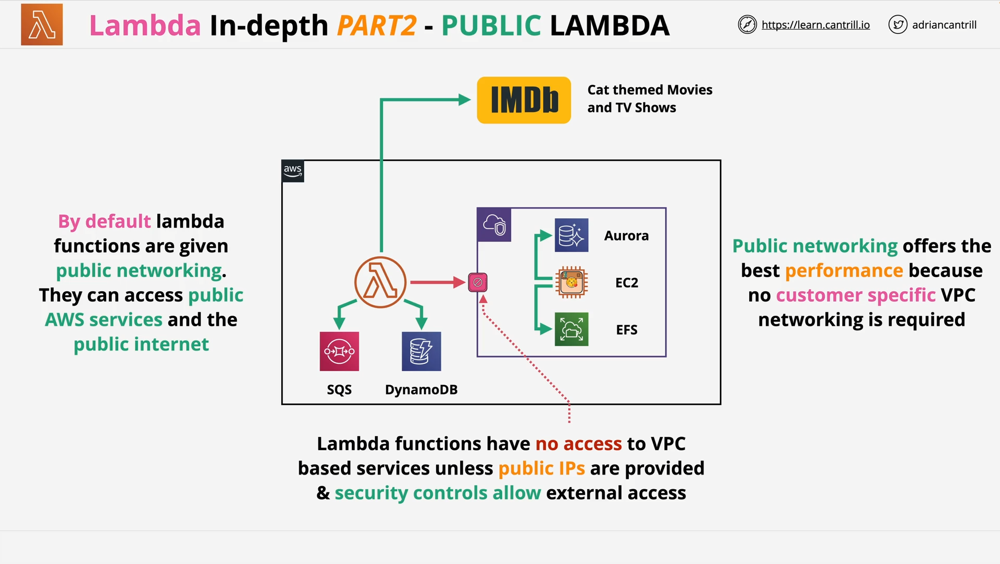
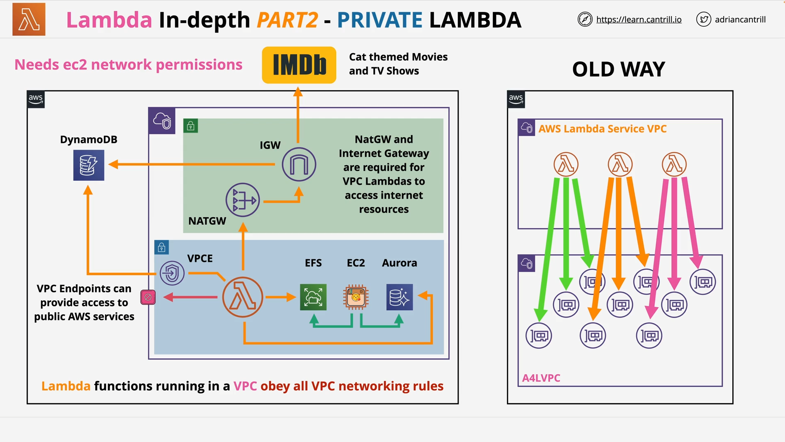
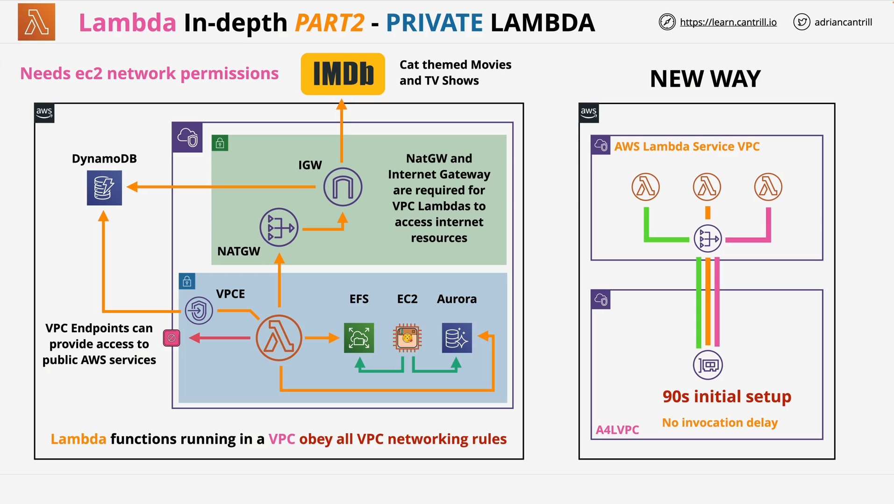
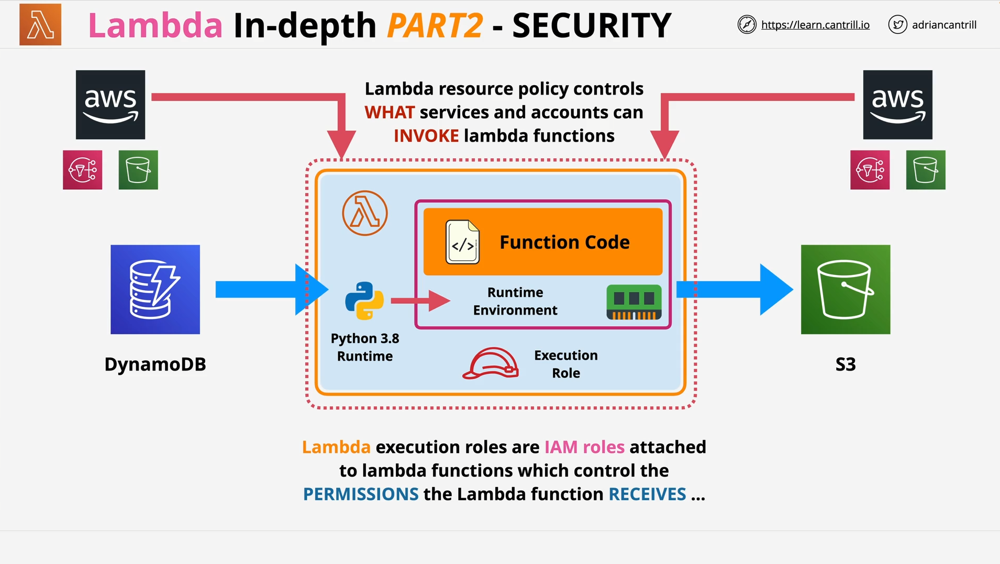

# AWS Lambda Deep Dive – Part 2

**Topics Covered**:

- Lambda Networking (Public and VPC)
- Lambda Permissions
- Monitoring and Logging

## Lambda Networking

### 1. **Networking Modes**

Lambda has two networking modes:

- **Public Networking (Default)**
- **VPC Networking**

### 2. **Public Networking (Default)**



- In this mode, Lambda runs **outside of a VPC** in the AWS public network.
- It **can access**:
  - AWS services that are publicly available (e.g., SQS, DynamoDB)
  - External internet endpoints (e.g., IMDb)

#### **Use Case Example:**

Lambda function fetching cat-themed media data from IMDb.

#### **Characteristics:**

- Best performance: runs on shared AWS infrastructure.
- **Cannot access private VPC resources** like:
  - EC2
  - Aurora
  - EFS
  - Unless those resources are publicly exposed with proper security rules.

### 3. **VPC Networking**

- Lambda is configured to run **inside private subnets** of a VPC.
- It follows **all VPC networking rules**.

#### **Capabilities**:

- **Can access** private VPC resources like:
  - EC2
  - RDS/Aurora
  - EFS
- **Cannot access** public AWS services or the internet by default.

#### **To enable external access**:

- Use **VPC endpoints** (e.g., Gateway Endpoint for DynamoDB)
- Use **NAT Gateway** and **Internet Gateway** setup in a public subnet.

### 4. **Lambda + ENI (Elastic Network Interfaces)**

#### **Old Architecture**:



- Each Lambda invocation would create an ENI.
- High **cold start latency**.
- Poor **scalability** – concurrency required more ENIs.
- VPC capacity limits could cause failures.

#### **New Architecture**:



- AWS creates **shared ENIs** based on:
  - Unique combinations of subnets and security groups.
- Created **at configuration time**, not per invocation.
- Dramatically **reduces latency and ENI usage**.

#### **Summary of Networking Models**:

| Mode   | Access VPC Resources | Access Public Services | Performance        |
| ------ | -------------------- | ---------------------- | ------------------ |
| Public | ❌                   | ✅                     | ✅ Best            |
| VPC    | ✅                   | ✅ (with NAT/VPC EP)   | ✅ (Now optimized) |

## Lambda Permissions



Lambda permissions involve two key components:

### 1. **Execution Role (IAM Role)**

- Assigned to Lambda to allow it to **access AWS services**.
- Needs:
  - **Trust Policy** (trusts Lambda service)
  - **Permissions Policy** (grants specific actions)

#### **Example**:

```json
{
  "Version": "2012-10-17",
  "Statement": [
    {
      "Effect": "Allow",
      "Action": ["dynamodb:GetItem", "s3:PutObject"],
      "Resource": "*"
    }
  ]
}
```

#### **Explanation**:

- This policy allows the Lambda function to:
  - Read items from DynamoDB
  - Write data to S3
- Applied via the IAM role attached to the function.

### 2. **Resource Policy (Less Common but Important)**

- Controls **who can invoke** the Lambda function.
- Similar to an **S3 bucket policy**.
- Used for:
  - **Cross-account access**
  - Integrating services like SNS or S3 with Lambda

#### **Key Notes**:

- Configurable via **CLI or API**, not via console.
- Important when integrating with external AWS accounts or services.

## Lambda Monitoring and Logging

### 1. **CloudWatch Logs**

- Captures:
  - Lambda logs (e.g., `console.log()` or `print()` output)
  - Errors and stack traces
  - Execution duration, logs per invocation

#### **Important**: Lambda needs **permissions to write to CloudWatch Logs**.

Use prebuilt AWS policy:

- `AWSLambdaBasicExecutionRole`

### 2. **CloudWatch Metrics**

- Captures:
  - Invocation count
  - Errors
  - Duration
  - Throttles and retries

### 3. **AWS X-Ray Integration**

- Enables **distributed tracing**
- Useful for:
  - Debugging complex serverless architectures
  - Tracking the lifecycle of a request across services

#### **Note**: Not heavily tested in exams, but be familiar with terminology:

- **X-Ray**
- **Tracing**

## Exam Tips Recap

- Understand **difference between public and VPC-based Lambda**.
- Know **how Lambda accesses VPC and internet resources**.
- Remember **execution role** vs. **resource policy**.
- Ensure Lambda has **CloudWatch permissions** for troubleshooting.
- Be aware of **ENI optimization changes** for performance.
