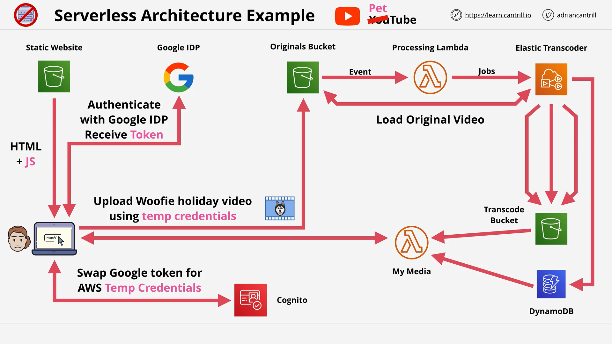

# Serverless Architecture in AWS

## What is Serverless?

Serverless is a **software architecture pattern** where developers do not need to manage or provision servers. Despite the term "serverless", there **are still servers**, but their management is **abstracted away** by cloud providers like AWS.

- **Key Goals**:
  - Minimize infrastructure management
  - Reduce cost and admin overhead
  - Increase scalability and flexibility
  - Focus on **small, stateless, and event-driven components**

## Core Concepts

### 1. Stateless and Ephemeral

Functions in a serverless system are **stateless**:

- They don’t store persistent data or session state.
- They start up, perform an action, and shut down quickly.
- Every invocation starts in a **clean environment**.

This means:

- No reliance on previous executions.
- They can scale horizontally without issues.

### 2. Event-Driven Execution

Functions only execute when triggered by an **event**, such as:

- File upload to S3
- HTTP request via API Gateway
- Change in a database
- Message in a queue

This contributes to **cost efficiency**, as nothing runs unless invoked.

## Serverless and AWS Lambda

**AWS Lambda** is the core serverless compute service in AWS.

- Executes code in response to events
- Supports multiple languages
- Billed by execution time and resource usage

Other platforms offer similar features:

- Microsoft Azure → Azure Functions
- Google Cloud → Cloud Functions

## Managed Services in Serverless

A good serverless architecture **avoids re-inventing the wheel**. Use AWS-managed services for various tasks:

| Use Case            | AWS Managed Service     |
| ------------------- | ----------------------- |
| Object Storage      | Amazon S3               |
| NoSQL Databases     | DynamoDB                |
| Identity Management | Cognito + third parties |
| Media Processing    | Elastic Transcoder      |
| Messaging           | SQS, SNS, EventBridge   |

## Building Applications the Serverless Way

> _“Code as little as possible. Consume services wherever you can.”_

This mindset promotes:

- Higher abstraction
- Lower operational burden
- Improved scalability and reliability

## Example: PetTube Application (Serverless Architecture in Action)

### Scenario Overview

**Julie**, a user, wants to upload videos to **PetTube**, a serverless web application.

### 1. Static Front-End Hosting

- Julie opens the application via her browser.
- The front-end (HTML + JS) is **hosted in S3** as a static website.
- The JavaScript runs in her browser — **no server-side hosting needed**.

### 2. Authentication

- PetTube uses a **third-party identity provider** (like Google, Twitter, Facebook) to authenticate users.
- Benefits:
  - No need to build/manage a user directory.
  - Avoids AWS IAM user limits (max 5,000 per account).
  - Users can reuse existing credentials.

### 3. Federated Identity via AWS Cognito

- After logging in through Google:
  - Julie receives an **identity token**.
  - The token is exchanged with **Amazon Cognito** for temporary **AWS credentials**.
- These credentials allow the browser to **directly interact with AWS services**.

### 4. Uploading Media to S3

- Julie uploads her video to the original S3 bucket.
- This bucket acts as the **source of truth** for raw video content.

The flow:

1. **Browser → Identity Provider → Cognito** → gets temporary AWS credentials.
2. **Browser → S3** using temporary credentials → uploads video.

## Serverless Application Architecture Summary

### Characteristics:

- **Frontend**: Static site (S3), JS runs in-browser
- **Authentication**: Delegated to third-party IdPs (Google, etc.)
- **Identity Federation**: Cognito exchanges IdP token for AWS credentials
- **Storage**: S3 for static assets and user uploads
- **Compute**: AWS Lambda (event-driven, ephemeral)
- **Other Services**: Use managed services wherever possible

### Design Principles:

- No EC2 / self-managed servers unless explicitly needed
- Small, event-triggered, stateless functions
- Managed services for storage, auth, compute, messaging

## Why It Matters

Serverless reduces:

- Infrastructure management
- Cost during idle time
- Attack surface and operational risk

It increases:

- Scalability
- Developer productivity
- Time-to-market
