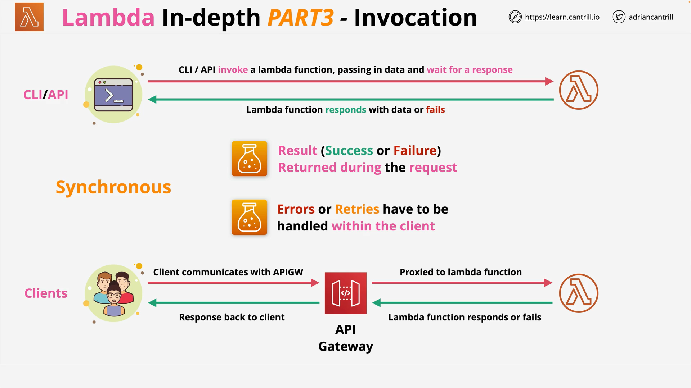
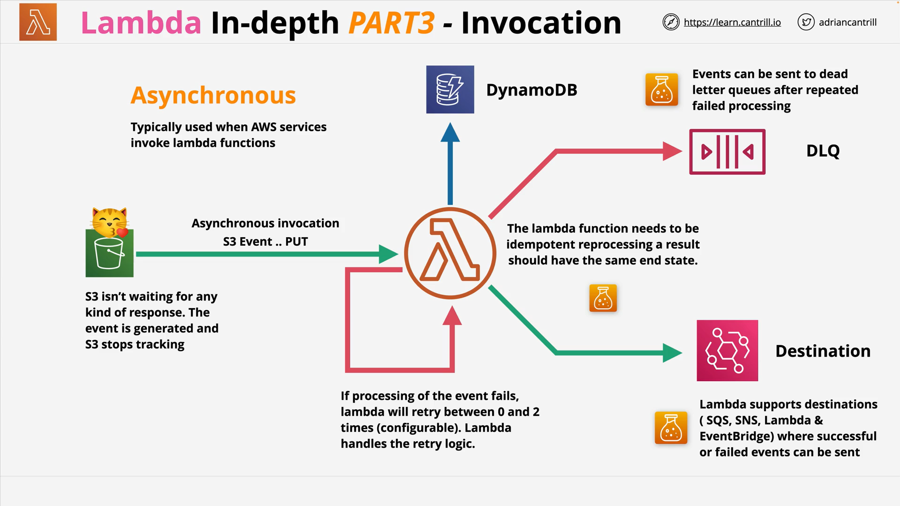
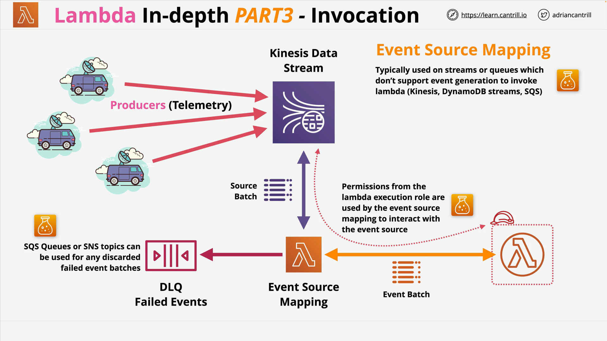
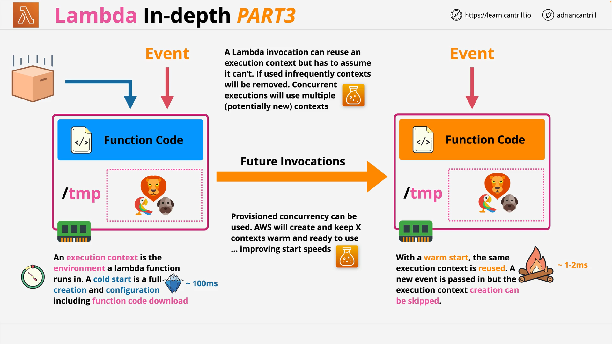

# AWS Lambda Deep Dive: Part 3 — Advanced Concepts

## Overview

This session focuses on advanced AWS Lambda concepts, particularly **invocation models**, **versioning**, and **performance optimization**. These are critical to understand for both the AWS exam and building production-ready serverless applications.

## Lambda Invocation Models

Lambda supports **three main invocation types**:

### 1. Synchronous Invocation



- **Used When**: A client (CLI, SDK, API Gateway) waits for the result of the function.
- **Behavior**:
  - The client sends a request.
  - Lambda executes and returns a result (success or failure).
  - The client **waits for a response**.
- **Example**: API Gateway → Lambda → client.
- **Error Handling**:
  - Must be handled by the **client**.
  - If Lambda fails, client retries.

**Use case**: Human-facing interactions like web or mobile apps.

### 2. Asynchronous Invocation



- **Used When**: AWS services (e.g., S3, SNS) trigger Lambda without expecting a response.
- **Behavior**:
  - Service (e.g., S3) emits an event.
  - Lambda receives it **without any wait** from the source.
  - AWS retries on failure **0 to 2 times**.
  - You can send failed events to **Dead Letter Queues (DLQs)** or **Destinations**.

#### **Idempotency**

- Code **must be idempotent** — running the same invocation multiple times should result in the same state.

```text
Example:
Set bank balance to $20 → idempotent ✅
Add $10 to balance → non-idempotent ❌
```

#### **Destinations**

- Events can be routed to:
  - Another Lambda
  - SNS
  - SQS
  - EventBridge

Separate routes can be defined for **success** and **failure** events.

### 3. Event Source Mapping Invocation



- **Used For**: Sources that **don’t push events**, but instead require **polling**.
- **Examples**:
  - SQS
  - Kinesis
  - DynamoDB Streams
  - MSK (Managed Kafka)

#### How it works:

- An **event source mapping** (a Lambda component) **polls** the stream/queue.
- Data is batched and sent to Lambda.
- Lambda processes the **entire batch** in one invocation.

#### Execution Role Permissions

- Lambda needs **permissions to read from the source**.
- Example:
  - Kinesis doesn't push events.
  - Lambda’s **execution role** must have permission to access Kinesis.

#### Failures

- Failed batches can be sent to:
  - **SQS DLQ**
  - **SNS Topics**

## Lambda Versions and Aliases



### Versions

- A **version** is a snapshot of:
  - Code
  - Configuration (environment variables, memory, timeout, etc.)
- **Immutable**: Once published, cannot be changed.
- Each version has its own **Amazon Resource Name (ARN)**.

### `$LATEST`

- Represents the **latest unversioned** code.
- **Mutable** — changes as code is updated.

### Aliases

- Point to specific versions (e.g., `dev`, `stage`, `prod`).
- **Mutable**: Can be redirected to different versions.

**Usage**:

- Create **immutable versions** for releases.
- Use **aliases** for environment targeting.

## Cold Starts and Execution Context

### Execution Context

- Lambda runs in a **runtime environment** (like a container).
- Contains:
  - OS and hardware resources
  - Runtime (e.g., Python, Node.js)
  - Your deployment package (code)

### Cold Start

- Happens when Lambda is invoked for the first time or after inactivity.
- AWS must:
  1. Provision hardware
  2. Set up runtime (e.g., Python 3.8)
  3. Download and install the code package
- **Takes hundreds of milliseconds**, which impacts latency.

### Warm Start

- If the context is reused, there’s no setup delay.
- Much faster (milliseconds).
- **Only one concurrent invocation per context**.

### Provisioned Concurrency

- AWS pre-warms execution environments.
- Used for:
  - High traffic periods
  - Pre-launch of applications

## Optimization Tips

### Shared Code and Caching

- Code **outside** the Lambda handler persists across invocations (within the same context).

#### Example (Python):

```python
# Outside handler — shared state (cached for warm starts)
db_connection = create_db_connection()

def lambda_handler(event, context):
    # Inside handler — re-run every invocation
    result = db_connection.query(event["query"])
    return result
```

**Explanation:**

- `db_connection` is created **once per container**.
- Future invocations reuse it, **improving performance**.

### `/tmp` Directory

- Temporary 512MB storage available during execution.
- Can be used to cache data like images or configuration.

**Caution**:

- Code should not **depend** on shared state or cached files.
- Assume a fresh environment every time (stateless design).

## Final Notes

- **Always write idempotent Lambda functions**, especially for asynchronous and stream-based invocations.
- Understand **when Lambda needs permissions** (e.g., for event source mappings).
- Optimize cold start impact using **provisioned concurrency** and **code structure**.
- Use **versions and aliases** for deployment stability.

### Related AWS Services for Lambda Integrations

- **Synchronous**: API Gateway
- **Asynchronous**: S3, SNS, CloudWatch Events
- **Event Source Mapping**: SQS, Kinesis, DynamoDB Streams, MSK
