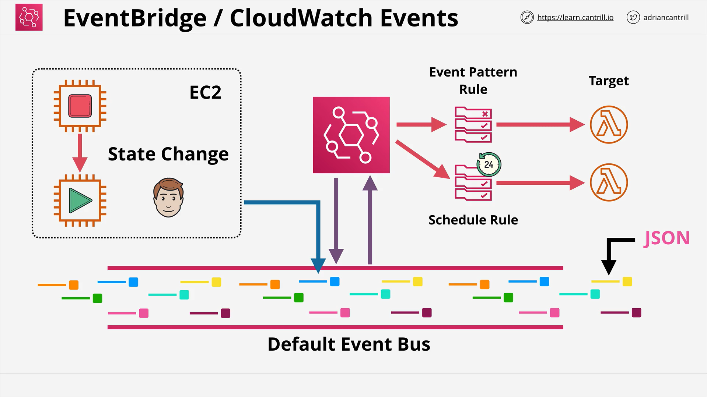

# AWS CloudWatch Events and Amazon EventBridge

## Overview



This lesson covers the transition from **CloudWatch Events** to **Amazon EventBridge**, highlighting how AWS handles real-time event streaming and automation through rules and targets.

## What Are CloudWatch Events?

**CloudWatch Events** provide a **near real-time stream of system events** that reflect changes in AWS resources and services. These include events like:

- EC2 instance state changes (e.g., start, stop, terminate)
- Scheduled times/events
- Internal AWS activity notifications

## Introducing Amazon EventBridge

**EventBridge** is the next-generation event routing service that:

- Inherits all functionalities of CloudWatch Events
- Supports **third-party event sources**
- Allows **custom event ingestion**
- Shares a similar architecture with CloudWatch Events
- Uses the same APIs

### Why Switch to EventBridge?

AWS **recommends EventBridge** for new deployments because:

- It’s a **superset** of CloudWatch Events
- Supports more use cases (e.g., SaaS integrations)
- Provides **visible** and **customizable event buses**

## Event-Driven Architecture: “If X Happens, Then Do Y at Time Z”

### Key Elements:

- **X** = Event producer (e.g., EC2, S3)
- **Y** = Time or trigger, defined using **Cron expressions**
- **Z** = Target action (e.g., trigger a Lambda function)

## Event Buses

### CloudWatch Events

- Has only **one implicit event bus**
- **Not visible** in the AWS UI
- All event rules attach to this single default bus

### EventBridge

- Has a **default event bus**
- Allows creation of **custom event buses**
- Custom buses can be used for:
  - Internal application events
  - External third-party services

## Rules and Event Matching

EventBridge uses **rules** to **match events** and **route them** to specific targets.

### Two Rule Types:

1. **Event Pattern Rules**

   - Match event structure
   - Filters JSON fields (e.g., source, detail-type)

2. **Schedule-Based Rules**
   - Trigger based on **time** using **Cron expressions**
   - e.g., run every day at 12 PM

#### Cron Format Example

```cron
cron(0 12 * * ? *)
```

- Executes every day at 12:00 PM UTC.

## Event Processing Flow

1. **Event Source** (e.g., EC2 instance state change)
2. Event is **sent to the EventBus**
3. **EventBridge Rule** listens for specific patterns or schedules
4. When matched, **Target** is invoked

## Example: EC2 State Change Triggering a Lambda

### Scenario:

- **Bob** starts an EC2 instance
- This triggers a **state change event** to “running”
- Event is pushed to the **default EventBus**
- EventBridge has a rule that:
  - Matches EC2 state change events
  - Triggers a **Lambda Function**

### JSON Event Sample:

```json
{
  "source": "aws.ec2",
  "detail-type": "EC2 Instance State-change Notification",
  "detail": {
    "instance-id": "i-0123456789abcdef0",
    "state": "running"
  }
}
```

### Lambda Code Example:

```python
def lambda_handler(event, context):
    instance_id = event['detail']['instance-id']
    state = event['detail']['state']
    print(f"Instance {instance_id} has changed state to {state}")
```

### Line-by-Line Explanation:

```python
def lambda_handler(event, context):
    # Main handler function triggered by EventBridge
```

```python
    instance_id = event['detail']['instance-id']
    # Extracts the EC2 instance ID from the incoming event JSON
```

```python
    state = event['detail']['state']
    # Extracts the new state of the EC2 instance
```

```python
    print(f"Instance {instance_id} has changed state to {state}")
    # Logs the instance state change
```

## Key Takeaways

- **CloudWatch Events** and **EventBridge** enable reactive and scheduled automation in AWS.
- EventBridge should be used for all **new event-driven** solutions.
- Supports **fine-grained event filtering**, **multiple targets**, and **custom buses**.
- **Lambda functions**, **Step Functions**, and other services can be targets.

## Best Practices

- Use **EventBridge** for all new solutions.
- Leverage **custom event buses** for separation of concerns.
- Always filter events to reduce noise and unnecessary invocations.
- Use **scheduled rules** for cron-based tasks.
