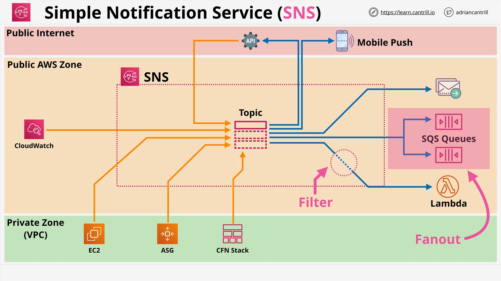

# Amazon SNS (Simple Notification Service)

## Overview

**Amazon SNS (Simple Notification Service)** is a **highly available, durable, and secure** publish-subscribe (pub/sub) messaging service. It plays a critical role in building event-driven, loosely coupled architectures in AWS.

## Key Characteristics

- **Type**: Pub/Sub Messaging Service
- **Accessibility**: Public AWS service (requires network access to AWS public endpoints)
- **Message Size Limit**: Up to 256 KB payloads
  - Not designed for large binary files (e.g., video files)
- **Availability**: Highly available and regionally resilient
- **Security**: Supports server-side encryption (SSE)

## Core Components

### 1. **Topic**

- Central resource in SNS.
- Messages are published to a topic.
- Topic configuration includes:
  - Access control (permissions)
  - Delivery options
  - Filters (optional)

### 2. **Publisher**

- Sends messages to the SNS topic.
- Can be AWS services (e.g., CloudWatch, EC2, Auto Scaling), external APIs, or custom apps.

### 3. **Subscriber**

- Receives messages from the topic.
- All subscribers receive all messages unless filters are configured.
- Supported subscriber types:
  - **HTTP / HTTPS endpoints**
  - **Email / Email-JSON**
  - **Amazon SQS queues**
  - **AWS Lambda functions**
  - **SMS / Mobile push notifications**

## Message Filtering

- Subscribers can apply **filters** to receive only messages matching specific criteria.
- Useful for reducing unnecessary traffic and triggering only relevant actions.

## SNS Fan-Out Architecture

**Fan-out** refers to publishing a single message to a topic, which then delivers the message to **multiple SQS queues (or other subscribers)**.

### Example Use Case:

A video processing app receives a new job:

- SNS topic receives a message.
- Message is sent to multiple SQS queues.
- Each SQS queue could trigger different Lambda functions to process different resolutions (e.g., 480p, 720p, 1080p).

This pattern allows for:

- **Parallel processing**
- **Decoupling of services**
- **Scalable, fault-tolerant workloads**

## Example Architecture Diagram (Described)

1. **SNS service** runs in AWS’s public zone.
2. Accessible from:
   - Public internet (with correct permissions)
   - AWS services within a VPC (if configured for internet access)
3. **Producers** (e.g., CloudWatch, EC2, Lambda, API Gateway) publish to the topic.
4. **Subscribers** (e.g., Lambda, SQS, mobile apps) receive messages.
5. **Optional filtering** on subscriber side.

## Reliability and Features

### Delivery Status:

- For supported protocols (HTTP/S, Lambda, SQS), SNS provides delivery status tracking.

### Delivery Retries:

- SNS automatically retries delivery if the initial attempt fails (up to a max threshold).

### Regional Resiliency:

- All message data remains within the AWS Region.
- SNS replicates data across **Availability Zones** for fault tolerance.

### Server-Side Encryption (SSE):

- Messages can be encrypted at rest using **AWS KMS keys**.
- Important for compliance and security needs.

## Cross-Account Access

- Like S3, SNS supports **resource-based policies**.
- **Topic Policies** control who can publish to or subscribe from a topic (across AWS accounts).
- Example Use Case: Allow another AWS account’s Lambda to subscribe to your topic.

## Integration with AWS Services

SNS integrates natively with many AWS services:

- **CloudWatch Alarms** – notify via SNS when an alarm state changes.
- **CloudFormation** – sends stack state change notifications.
- **Auto Scaling** – publishes scale events to a topic.

## Summary of Benefits

| Feature                   | Benefit                                             |
| ------------------------- | --------------------------------------------------- |
| Pub/Sub Messaging         | Decouples microservices and components              |
| Multiple Subscriber Types | Flexibility in handling different consumer systems  |
| Highly Scalable           | Handles low to extremely high throughput workloads  |
| Fault Tolerant            | Survives AZ failures via regional replication       |
| Secure                    | Supports encryption and fine-grained access control |
| Cost-Efficient            | No infrastructure to manage; pay per usage          |

## Conclusion

Amazon SNS is a foundational AWS service for building **scalable, event-driven applications**. Understanding its pub-sub model, subscriber types, and integration with other AWS services is crucial for passing the AWS SAA-C03 exam and for real-world solution architecture.

> You'll encounter SNS repeatedly in both the course and real-world AWS projects. Mastery of its configuration, filtering, fan-out patterns, and integration is essential.

Let me know if you'd like a visual diagram for this, or if you'd like this converted into a cheat sheet or flashcards!
