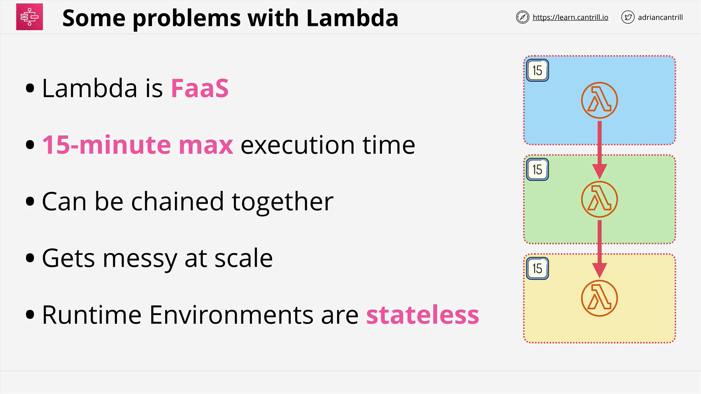
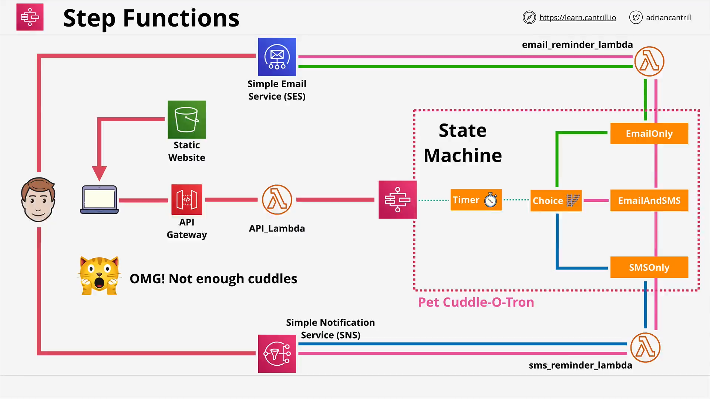

# AWS Step Functions

## Overview

AWS Step Functions is a serverless orchestration service that enables you to build complex workflows using a concept called **state machines**. This lesson explores why Step Functions were introduced, their advantages over AWS Lambda for certain use cases, the types of states available, and an example architecture (the "Pet Cuddle-a-tron").

## Why Use Step Functions?

### Limitations of Lambda for Complex Flows



- **Lambda Execution Time Limit**: Lambda functions have a hard timeout limit of **15 minutes**.
- **Statelessness**: Lambda functions are **stateless**, meaning data must be passed explicitly between function invocations.
- **Chaining Lambdas is Messy**: Trying to chain functions to build long workflows quickly becomes unmanageable.

### Use Case Example

Imagine a long-running order-processing system (e.g., uploading pet photos to print on various materials). It:

- Requires manual steps
- Exceeds Lambda's execution time
- Needs persistent state between steps

## Step Functions: Concept

### What is a State Machine?

A **state machine** is a workflow:

- Has a **start and end**
- Composed of **states** (actions, decisions, waits)
- Maintains and transfers **data** across states

Think of it like an Amazon order:

- Place an order → stock check → pack → ship → notify customer  
  This long-running flow needs a coordinated workflow with persistent state: perfect for Step Functions.

### Execution Duration

- **Standard Workflows**: Up to **1 year**
- **Express Workflows**: Up to **5 minutes**, optimized for **high-volume**, **event-driven** workloads like:
  - IoT
  - Streaming data
  - Mobile backends

## How to Start a State Machine

State machines can be started via:

- **API Gateway**
- **IoT Rules**
- **EventBridge**
- **Lambda**
- **Manual triggers**

## Permissions

State machines assume **IAM roles** during execution, which grant them permissions to interact with other AWS services.

## Amazon States Language (ASL)

Step Functions use **Amazon States Language**, which is **JSON-based**. This defines the structure of the state machine:

- States
- Transitions
- Input/Output
- Timeouts
- Error handling

You’ll use ASL in hands-on demos later in the course.

## Types of States

| State Type   | Description                                            |
| ------------ | ------------------------------------------------------ |
| **Succeed**  | Marks a successful end to a workflow                   |
| **Fail**     | Marks a failure and ends the workflow                  |
| **Wait**     | Waits for a duration or a specific timestamp           |
| **Choice**   | Implements conditional branching logic                 |
| **Parallel** | Runs multiple branches simultaneously                  |
| **Map**      | Iterates over a list, running actions per item         |
| **Task**     | Performs actual work via integration with AWS services |

### Task State: Deep Dive

A **task state** is how Step Functions perform real work. It integrates with services like:

- Lambda
- DynamoDB
- ECS
- SNS / SQS
- AWS Glue
- SageMaker
- EMR

> The state machine coordinates — the task state executes.

## Architecture Walkthrough: The Pet Cuddle-a-tron



### Scenario

Bob owns a cat named Whiskers. Whiskers wants cuddles at varying intervals and designed an app using Step Functions to **remind Bob** via:

- **Email**
- **SMS**
- **Or both**

### Why Step Functions?

- Cuddle reminders can occur hours apart, exceeding Lambda’s limit.
- Needs decision-making and multiple notification channels.
- Workflow is stateful and long-running.

### Workflow Breakdown

1. **Wait State**: Timer to delay until the next cuddle.
2. **Choice State**: Determine notification method (email, SMS, both).
3. **Task States**:
   - **Email Reminder**: Uses Lambda + SES
   - **SMS Reminder**: Uses Lambda + SNS
4. **Optional Parallel Path**: Send both notifications simultaneously.

## State Machine Visualization

```json
{
  "StartAt": "WaitForNextCuddle",
  "States": {
    "WaitForNextCuddle": {
      "Type": "Wait",
      "SecondsPath": "$.waitSeconds",
      "Next": "SelectNotificationMethod"
    },
    "SelectNotificationMethod": {
      "Type": "Choice",
      "Choices": [
        {
          "Variable": "$.notificationType",
          "StringEquals": "email",
          "Next": "SendEmail"
        },
        {
          "Variable": "$.notificationType",
          "StringEquals": "sms",
          "Next": "SendSMS"
        },
        {
          "Variable": "$.notificationType",
          "StringEquals": "both",
          "Next": "SendEmailAndSMS"
        }
      ]
    },
    "SendEmail": {
      "Type": "Task",
      "Resource": "arn:aws:lambda:region:account-id:function:SendEmailFunction",
      "End": true
    },
    "SendSMS": {
      "Type": "Task",
      "Resource": "arn:aws:lambda:region:account-id:function:SendSMSFunction",
      "End": true
    },
    "SendEmailAndSMS": {
      "Type": "Parallel",
      "Branches": [
        {
          "StartAt": "SendEmail",
          "States": {
            "SendEmail": {
              "Type": "Task",
              "Resource": "arn:aws:lambda:region:account-id:function:SendEmailFunction",
              "End": true
            }
          }
        },
        {
          "StartAt": "SendSMS",
          "States": {
            "SendSMS": {
              "Type": "Task",
              "Resource": "arn:aws:lambda:region:account-id:function:SendSMSFunction",
              "End": true
            }
          }
        }
      ],
      "End": true
    }
  }
}
```

### Code Explanation

- **StartAt**: Initial state — waits before sending notification.
- **Wait State**: Delays based on user input (`$.waitSeconds`).
- **Choice State**: Branches based on the chosen notification method.
- **SendEmail / SendSMS**: Task states invoking respective Lambda functions.
- **SendEmailAndSMS**: A parallel state with two branches, each invoking a Lambda.

## Serverless Frontend Integration

- **S3** hosts the static web app (HTML + JavaScript)
- **API Gateway**: Handles requests from the web app
- **Lambda**: Backend logic that triggers the Step Function
- **Step Function**: Orchestrates the entire reminder workflow

### Workflow Trigger

1. Bob opens the web app from S3.
2. Inputs:
   - Wait time (in seconds)
   - Message
   - Email and/or phone number
3. Chooses notification method (Email, SMS, Both).
4. Clicks a button.
5. API Gateway → Lambda → Step Function is invoked.

## Summary

- **Step Functions** solve the problem of orchestrating long-running, stateful workflows that Lambda alone can’t handle well.
- Workflows are built using **state machines** defined in **Amazon States Language (ASL)**.
- Each state performs a function: decisions, waits, or actual work.
- **Standard vs. Express** workflows differ in duration and use case.
- Integrated with many AWS services to build **serverless applications**.
