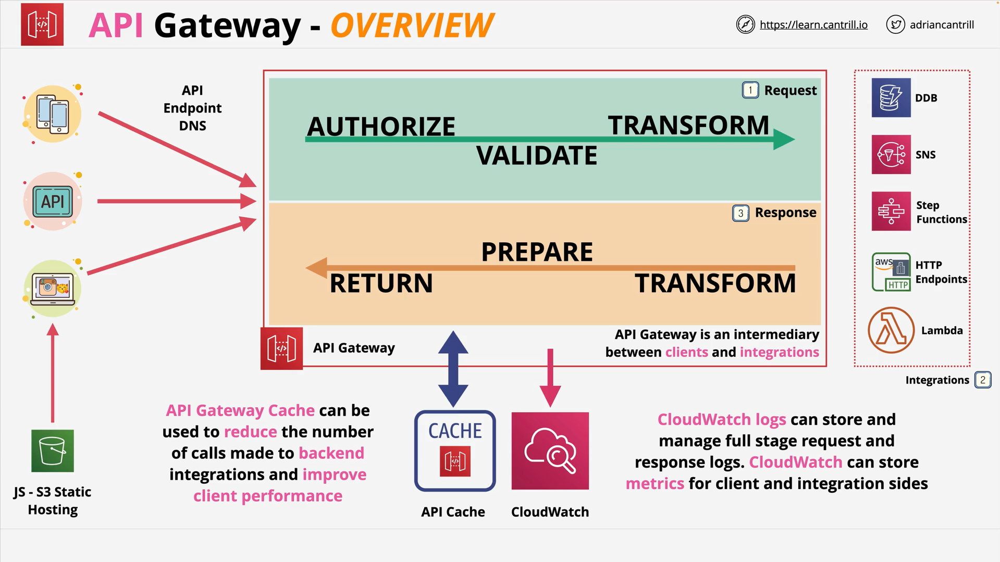
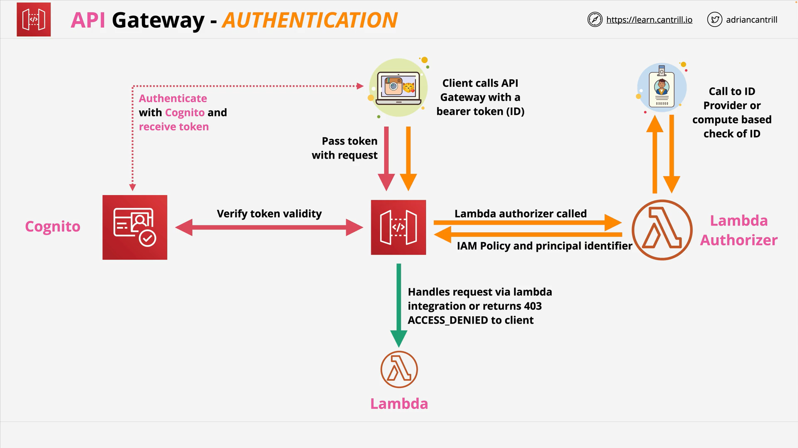
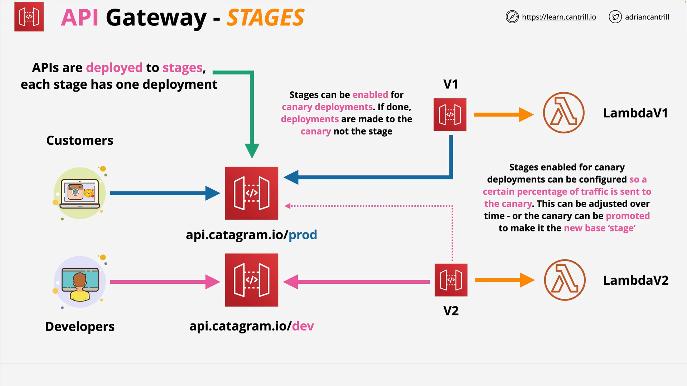
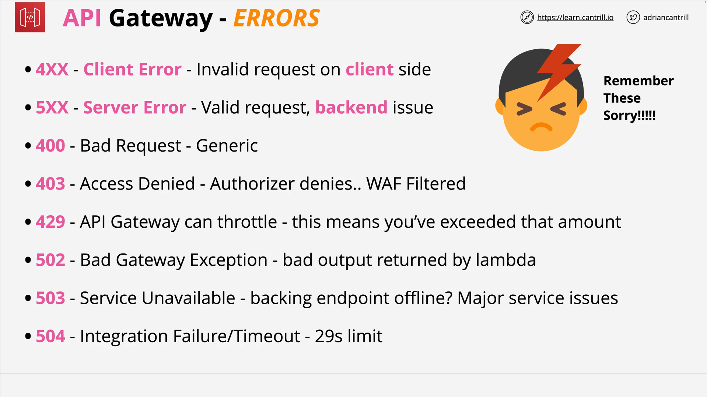
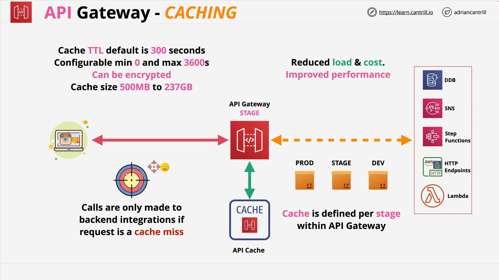

# AWS API Gateway

## Introduction

API Gateway is a fully managed AWS service that allows you to create and manage APIs. It serves as an entry point for applications to communicate with your backend services.

## Core Features

- Highly available and scalable managed service
- Handles authorization for API access control
- Configurable throttling capabilities
- Caching to reduce backend service calls
- Cross-Origin Resource Sharing (CORS) support
- Transformation capabilities
- OpenAPI spec support for defining APIs
- Direct integration with AWS services (DynamoDB, Step Functions, SNS)

## Architecture

API Gateway sits between client applications (mobile apps, web apps, other APIs) and backend integrations. It acts as an intermediary that processes requests, connects to backend services, and returns responses.

### Integration Types

- HTTP endpoints (AWS or on-premises)
- Lambda functions
- Direct AWS service integrations (DynamoDB, SNS, Step Functions)

### Processing Phases

1. **Request Phase**: Authorizes, validates, and transforms incoming requests
2. **Integration Processing**: Sends request to backend services
3. **Response Phase**: Transforms and prepares the output for clients

API Gateway also integrates with CloudWatch for logging and metrics, and provides caching functionality.

## Authentication Methods

API Gateway supports multiple authentication approaches:

1. **No Authentication**: Open access APIs
2. **Cognito User Pools**: Native validation of Cognito tokens
3. **Lambda Authorizers** (formerly Custom Authorizers): Validates bearer tokens through Lambda functions that return IAM policies and principal identifiers
4. **IAM Authentication**: Using AWS credentials in headers

## Endpoint Types

1. **Edge-Optimized**: Routes requests through the CloudFront global network to the nearest point of presence
2. **Regional**: Deployed in a specific region, suitable when clients are in the same region
3. **Private**: Only accessible within a VPC via interface endpoints

## Stages

API Gateway configurations are deployed to stages (e.g., prod, dev):

- Each stage has a unique endpoint URL and settings
- Enables independent deployment to different environments
- Supports rollback capabilities
- Enables Canary deployments:
  - New deployments go to a Canary sub-part of the stage
  - Traffic distribution between base stage and Canary can be adjusted
  - Canaries can be promoted to the base stage when ready

## Error Codes

### Common API Error Codes

| Error                 | Description                                                                                                                                                                                                                                               | HTTP Status Code |
| --------------------- | --------------------------------------------------------------------------------------------------------------------------------------------------------------------------------------------------------------------------------------------------------- | ---------------- |
| AccessDeniedException | You do not have sufficient access to perform this action.                                                                                                                                                                                                 | 400              |
| IncompleteSignature   | The request signature does not conform to AWS standards.                                                                                                                                                                                                  | 400              |
| InternalFailure       | The request processing has failed because of an unknown error, exception or failure.                                                                                                                                                                      | 500              |
| InvalidAction         | The action or operation requested is invalid. Verify that the action is typed correctly.                                                                                                                                                                  | 400              |
| InvalidClientTokenId  | The X.509 certificate or AWS access key ID provided does not exist in our records.                                                                                                                                                                        | 403              |
| NotAuthorized         | You do not have permission to perform this action.                                                                                                                                                                                                        | 400              |
| OptInRequired         | The AWS access key ID needs a subscription for the service.                                                                                                                                                                                               | 403              |
| RequestExpired        | The request reached the service more than 15 minutes after the date stamp on the request or more than 15 minutes after the request expiration date (such as for pre-signed URLs), or the date stamp on the request is more than 15 minutes in the future. | 400              |
| ServiceUnavailable    | The request has failed due to a temporary failure of the server.                                                                                                                                                                                          | 503              |
| ThrottlingException   | The request was denied due to request throttling.                                                                                                                                                                                                         | 400              |
| ValidationError       | The input fails to satisfy the constraints specified by an AWS service.                                                                                                                                                                                   | 400              |

### API Gateway Specific Error Codes

#### Client Errors (400 Series)

- **400**: Generic client-side error (multiple possible causes)
- **403**: Access denied (by authorizer or WAF)
- **429**: Throttling error (exceeded configured request limits)

#### Server Errors (500 Series)

- **502**: Bad Gateway Exception (invalid response from backend)
- **503**: Service Unavailable (backend endpoint offline or major service issues)
- **504**: Integration Failure (often when requests exceed the 29-second timeout limit)

## Caching

- Configured per stage
- Size ranges from 500MB to 237GB
- Default cache duration is 300 seconds (configurable from 0-3600 seconds)
- Can be encrypted
- Benefits: reduced load, lower costs, improved performance

## API Gateway Request Limits

- Maximum request time limit is 29 seconds
- Lambda functions used with API Gateway must respond within this timeframe despite Lambda's own 15-minute timeout

## Common Error Reference

A reference link to the common API Gateway errors is provided:
https://docs.aws.amazon.com/apigateway/latest/api/CommonErrors.html
