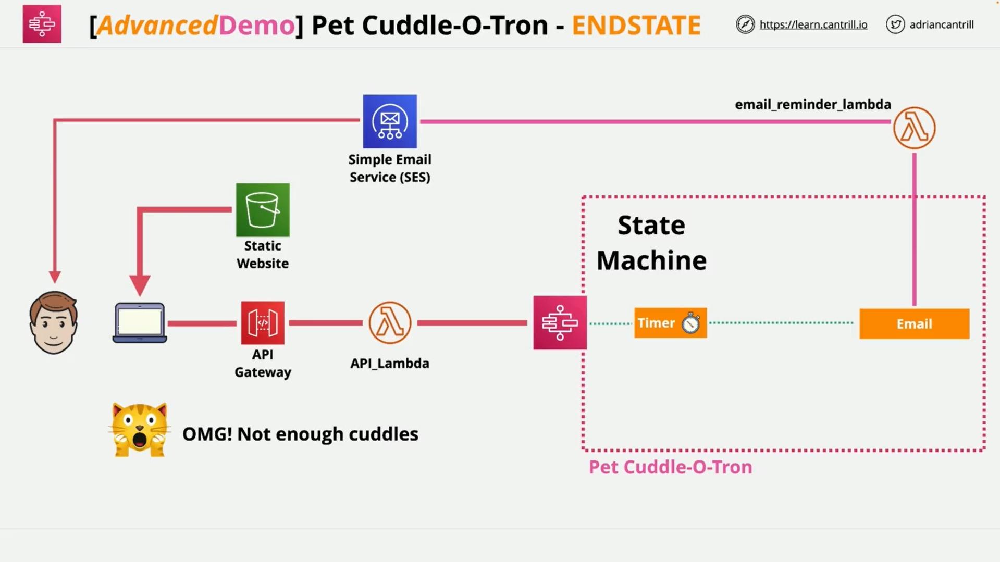
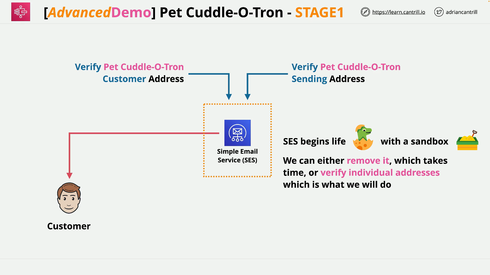

# PetCoddle-Atron Mini Project – Stage 1

## Overview

In Stage 1 of the PetCoddle-Atron mini project, you begin setting up a fully serverless application by configuring **AWS Simple Email Service (SES)**. The application will eventually integrate multiple AWS services, including:

- **AWS Step Functions**
- **AWS Lambda**
- **API Gateway**
- **Amazon S3** (for static website hosting)

This first stage focuses solely on configuring **email functionality** through SES.

## What Is AWS SES?

**Amazon Simple Email Service (SES)** is a managed AWS service that allows you to send and receive email within your application.

### Key Concepts:

- **Sandbox Mode**: By default, SES operates in sandbox mode, meaning:
  - You can only send email to and from verified addresses.
  - This helps prevent abuse and spam.
- **Production Mode**: You can request to move out of sandbox mode once testing is complete, allowing unrestricted sending (subject to SES sending limits).

## Goal of Stage 1

Configure **two verified email addresses** in SES:

1. **Sender Address**: The address from which your application will send emails.
2. **Recipient Address**: The address that receives notifications (like reminders).

## Recommended Setup

While it's possible to use one email for both sending and receiving, it's better to use two separate ones. This mirrors a more realistic production use case.

- Example Sender:  
  `adrian+coddlle-atron@cantrill.io`
- Example Receiver:  
  `adrian+coddlle-customer@cantrill.io`

These use the **Gmail "plus" trick**, which allows creating dynamic sub-addresses that route to your actual inbox.

## Step-by-Step Configuration

### 1. Sign in to AWS

- Use an AWS identity with **full admin permissions**.
- Set your region to **Northern Virginia (us-east-1)** for consistency with the demo.

### 2. Open the SES Console

- Search for `SES` in the AWS Console.
- Select **Simple Email Service**.

### 3. Add Verified Identities

You’ll need to verify both the sender and receiver email addresses.

#### For Sender Email:

- In the left menu, click **Verified identities** > **Create identity**.
- Choose **Email address**.
- Enter your chosen sender email (e.g., `adrian+coddlle-atron@cantrill.io`).
- Click **Create identity**.
- Check your inbox for a verification email and **click the verification link**.

#### For Receiver Email:

- Repeat the process with the recipient address (e.g., `adrian+coddlle-customer@cantrill.io`).
- Again, verify via the email link sent.

### 4. Confirm Verification

- Go back to **Verified identities**.
- Refresh the page.
- Make sure both addresses show a **"Verified"** status.

## What You've Accomplished in Stage 1

- Configured SES in **sandbox mode**.
- Verified one or two email addresses.
- Prepared your project to send and receive emails from your future serverless application.

This foundational setup allows your app to handle **notification emails** when triggered by future AWS components.

## Next Steps

You’re now ready to move into **Stage 2**, where you'll start building out the serverless functionality—integrating Lambda, Step Functions, etc.

Be sure both email addresses are verified before proceeding.
