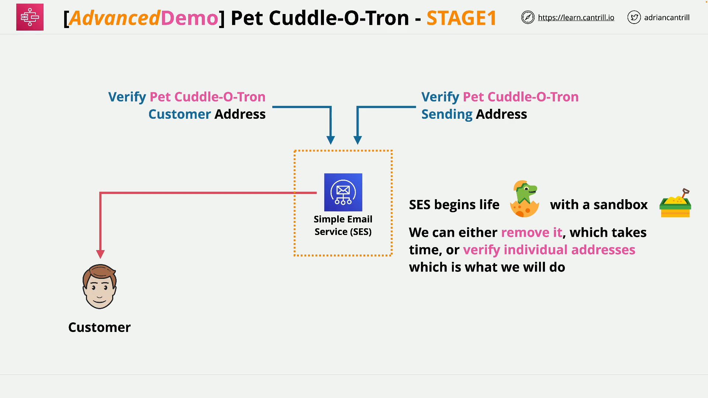
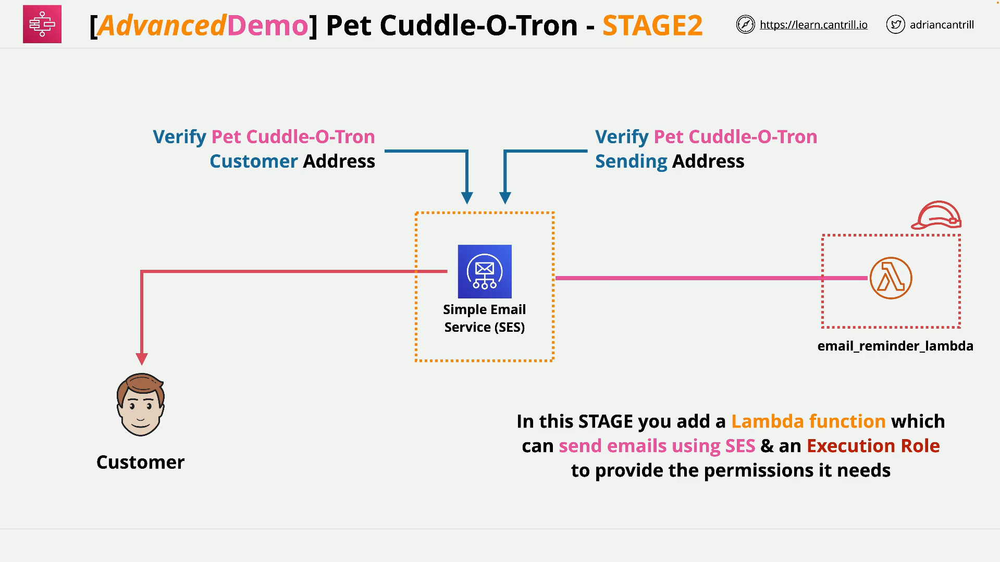

# Pet Cuddle-o-tron Mini Project – Stage 2: Lambda + SES Integration

## Overview



In Part 2 of the project, you integrate **AWS Lambda** with **Simple Email Service (SES)** to send reminder emails as part of a serverless application. This involves:

- Creating a Lambda execution role via CloudFormation
- Writing a Lambda function in Python
- Granting permissions to SES, CloudWatch, Step Functions
- Updating and deploying the Lambda function
- Capturing the Lambda function's **ARN** for future use

## Resources

**CloudFormation 1-Click Deploy Link (Lambda Execution Role):**  
[Deploy Lambda Role](https://console.aws.amazon.com/cloudformation/home?region=us-east-1#/stacks/quickcreate?templateURL=https://learn-cantrill-labs.s3.amazonaws.com/aws-serverless-pet-cuddle-o-tron/lambdarolecfn.yaml&stackName=LAMBDAROLE)

## Step-by-Step Summary



### 1. Create Lambda Execution Role

- Use the provided CloudFormation template to create the **IAM role** for Lambda.
- The role:
  - Can be assumed by the `lambda.amazonaws.com` service.
  - Has permissions for:
    - **SES** (sending emails)
    - **SNS**
    - **Step Functions (States)**
    - **CloudWatch Logs** (for diagnostics)

> Go to **IAM > Roles** and search for the newly created role (usually with “LambdaRole” in its name).

### 2. Create Lambda Function

1. Navigate to **AWS Lambda Console**.
2. Click **Create Function**.
   - Name: `email_reminder_lambda`
   - Runtime: **Python** (check lesson notes for version)
   - Permissions: Use the existing role created above (`LambdaRole`)
3. Click **Create Function**.

### 3. Replace Default Code with Custom Logic

- Delete the pre-filled skeleton code.
- Replace it with the code provided in the lesson.
- Remember to replace the placeholder `REPLACE_ME` with a **verified SES email address** (from Part 1).

## Lambda Function Code

```python
import boto3, os, json

FROM_EMAIL_ADDRESS = 'REPLACE_ME'

# Initialize SES client
ses = boto3.client('ses')

def lambda_handler(event, context):
    # Print the event object for debugging
    print("Received event: " + json.dumps(event))

    # Send an email using SES
    ses.send_email(
        Source=FROM_EMAIL_ADDRESS,
        Destination={
            'ToAddresses': [ event['Input']['email'] ]  # recipient email from event input
        },
        Message={
            'Subject': {'Data': 'Whiskers Commands You to attend!'},  # subject line
            'Body': {
                'Text': {
                    'Data': event['Input']['message']  # body text from event input
                }
            }
        }
    )

    # Return a success message
    return 'Success!'
```

### Code Explanation

#### `import boto3, os, json`

- **boto3**: AWS SDK for Python (used to interact with SES).
- **os**: Not used here, but commonly used to access environment variables.
- **json**: To pretty-print incoming event data.

#### `FROM_EMAIL_ADDRESS = 'REPLACE_ME'`

- Placeholder email to be replaced with a **verified SES sender email**.

#### `ses = boto3.client('ses')`

- Initializes the **SES client**.

#### `def lambda_handler(event, context):`

- Entry point for Lambda execution.

#### `print("Received event: " + json.dumps(event))`

- Logs the incoming event, useful for debugging.

#### `ses.send_email(...)`

- Sends an email using SES with:
  - **Source**: The verified sender email.
  - **Destination**: Taken from `event['Input']['email']`
  - **Subject**: Static string for this project.
  - **Body**: Taken from `event['Input']['message']`

#### `return 'Success!'`

- Simple string return for success confirmation.

## Final Steps

1. Replace `REPLACE_ME` with your **verified SES email address**.
2. Click **Deploy** in the Lambda console.
3. Scroll to the top and **copy the ARN** of the function for future use.

> Keep browser tabs open for:
>
> - IAM Role
> - Lambda Function
> - SES Console

## What You've Achieved in Part 2

- Deployed and configured a Lambda function.
- Connected it to SES with appropriate permissions.
- Validated sender address in SES.
- Prepared Lambda for invocation via Step Functions.

## Next Step

Proceed to **Part 3**, where you'll implement the **Step Functions state machine** that will invoke this Lambda function.
