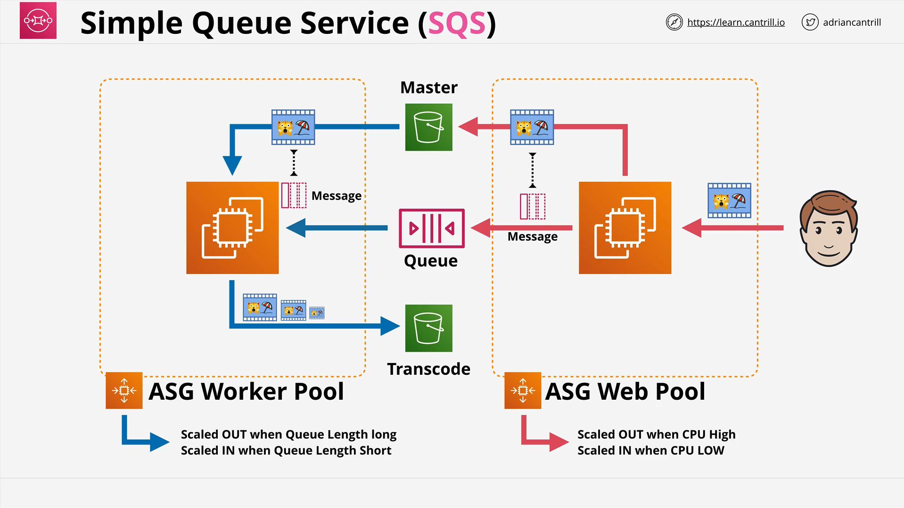
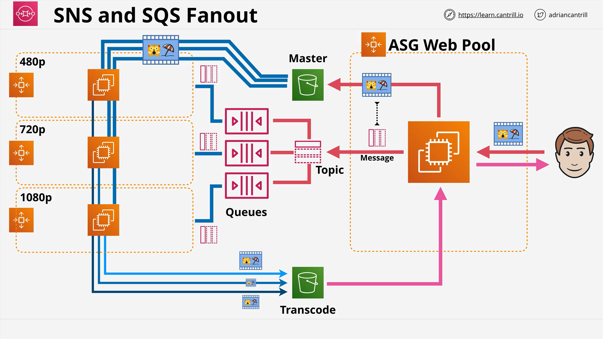

Here's a detailed and well-structured summary of the **AWS SQS (Simple Queue Service)** lesson from the LearnCantrill.io AWS SA-C03 course, formatted in Markdown for GitHub. This summary includes proper section headings, line-by-line code explanation where needed, and elaborates on concepts where useful.

# AWS SQS (Simple Queue Service)

## What is SQS?

**Amazon SQS (Simple Queue Service)** is a **fully managed, scalable message queuing service** that decouples and coordinates the components of a cloud application.

- **Public Service:** Accessible from any client with internet or AWS network access (e.g., VPC with internet/NAT gateway).
- **Fully Managed:** You create a queue, and AWS manages availability, durability, and scaling.
- **Resilient by Design:** High availability and replication within a region.

## SQS Queue Types

### 1. **Standard Queues**

- **Delivery Guarantee:** At-least-once delivery.
- **Ordering:** Best-effort ordering, not guaranteed.
- **Scalability:** Virtually unlimited throughput.
- **Use Case:** High throughput, non-sequential processing tasks.

### 2. **FIFO Queues (First-In-First-Out)**

- **Delivery Guarantee:** Exactly-once processing.
- **Ordering:** Guaranteed order preservation.
- **Throughput Limits:**
  - 300 messages/sec (no batching)
  - 3,000 messages/sec (with batching)
- **Use Case:** Banking, order systems—any workload that requires strict order.

## 📦 Message Handling in SQS

- **Message Size:** Up to **256 KB**.
- For larger payloads: Store the actual data in **S3**, and pass the object’s URL in the message.

## Message Lifecycle and Processing

1. **Sending Messages:** Clients send messages to a queue.
2. **Polling (Receiving):** Clients **poll** (short or long) to receive messages.
3. **Visibility Timeout:**
   - When a message is received, it is **hidden** from the queue for a set time (default: 30 seconds).
   - If not **deleted explicitly**, it reappears in the queue after timeout.
4. **Fault Tolerance:** If a client crashes or fails to delete the message, another client can process it after the visibility timeout.

## Dead-Letter Queues (DLQ)

- Messages that fail to be processed (e.g., received **>5 times**) are moved to a **DLQ**.
- Enables **special handling** of problem messages:
  - Logging
  - Debugging
  - Manual review
- DLQs help isolate and manage **corrupted** or **unhandled** messages.

## Decoupling Architecture with SQS

SQS enables separation of application concerns:

- **Producer:** Posts message (e.g., video uploaded).
- **Consumer:** Reads message, does processing (e.g., video transcoding).
- **Benefit:** Independent scaling, loose coupling.

## Example Architecture: Video Processing with Auto Scaling Groups

### Architecture Flow:

1. **User uploads video** → Web App.
2. **Web App (Auto Scaling Group):**
   - Stores video in **S3 (Master Bucket)**.
   - Adds message to **SQS** with a link to S3 object.
3. **Worker Pool (Auto Scaling Group):**
   - Scales based on **queue length**.
   - Polls SQS, fetches video from S3.
   - Transcodes video into multiple sizes.
   - Stores results in another S3 bucket.
   - Deletes message from SQS.

### Benefits:

- Web tier scales on **CPU**.
- Worker tier scales on **message count**.
- Decoupled & fault-tolerant.

## Fan-Out Architecture: SNS + SQS

When **multiple jobs** must be triggered from a **single event**, use a **fan-out pattern**:

### Design:

1. **S3 Upload → SNS Topic**
2. **SNS Topic → Multiple SQS Queues (Subscribers):**
   - Queue for 480p
   - Queue for 720p
   - Queue for 1080p
3. Each queue has an **independent Auto Scaling Group**.

### Benefits:

- Supports **multiple consumers**.
- Each worker pool can scale **independently**.
- **Best practice** when S3 only supports 1 event notification.

> **Exam Tip:** Fan-out architecture is heavily tested. Remember it!

## SQS Polling Types

### 1. **Short Polling**

- Immediate response (0–10 messages).
- May return **0 messages**, still incurs request cost.
- Less efficient and cost-effective.

### 2. **Long Polling**

- Waits up to **20 seconds** for messages.
- Fewer requests, more efficient.
- Should be **preferred** for cost and performance.

## Security & Access Control

### Encryption:

- **In-Transit:** Always encrypted by default (HTTPS).
- **At-Rest:** Optional using **KMS (SSE-KMS)**.

### Access Control:

- **Identity Policies (IAM):** Grant internal access.
- **Queue Policies:** Grant access to **external accounts**.
- Similar to **S3 bucket** or **SNS topic** policies.

## Performance & Cost Considerations

- **Billing is per request**, not per message.
- Each request can fetch:
  - Up to 10 messages
  - Totaling up to 64 KB

**Efficiency Tips:**

- Use **batching** to reduce request count.
- Use **long polling** to avoid frequent empty responses.

## FIFO vs Standard Summary Table

| Feature         | Standard Queue                    | FIFO Queue                                 |
| --------------- | --------------------------------- | ------------------------------------------ |
| Ordering        | Not guaranteed                    | Guaranteed                                 |
| Delivery        | At least once                     | Exactly once                               |
| Throughput      | Virtually unlimited               | 300/sec (no batching), 3,000/sec (batched) |
| Cost Efficiency | High with batching & long polling | Limited by design                          |
| Use Case        | Large-scale, unordered            | Order-sensitive apps                       |

## Key Takeaways

- **Use SQS to decouple services.**
- **Use DLQs** to handle failed messages.
- **Use long polling** for cost efficiency.
- **Choose the right queue type** based on ordering and throughput needs.
- **Use SNS fan-out** when multiple consumers must receive the same message.
- **Understand the difference** between encryption in transit and at rest.
- **Know access control options**: IAM vs queue policy.
