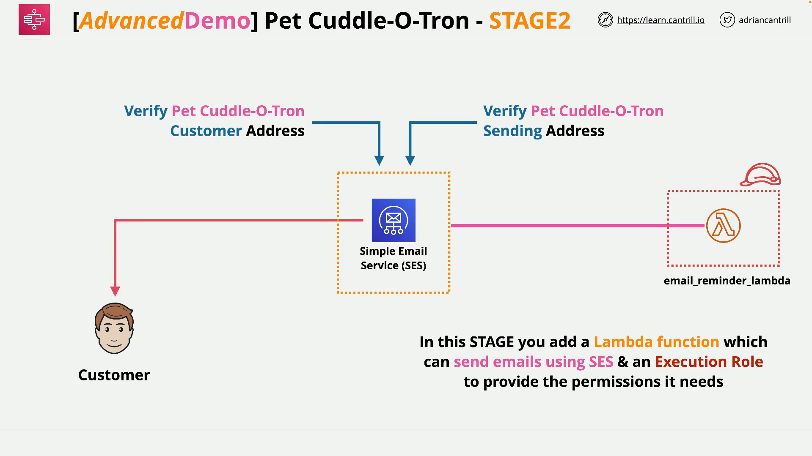
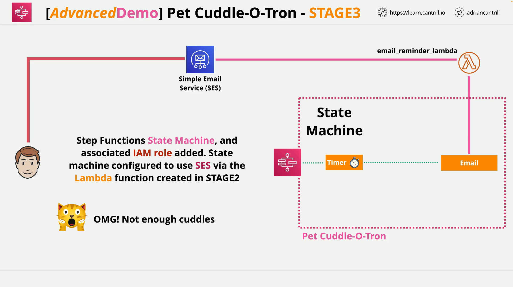

# Serverless Pet Cuddle-o-Tron - Stage 3: Creating the State Machine

This section of the demo covers how to implement a **Step Functions state machine** that integrates with a previously-created **Lambda email notification function**. The state machine introduces a wait period, then invokes the Lambda function to send a notification via email.

## Resources Used

- **State Machine IAM Role (1-click CloudFormation)**:  
  [Create State Machine Role](https://console.aws.amazon.com/cloudformation/home?region=us-east-1#/stacks/quickcreate?templateURL=https://learn-cantrill-labs.s3.amazonaws.com/aws-serverless-pet-cuddle-o-tron/statemachinerole.yaml&stackName=StateMachineRole)

- **ASL (Amazon States Language) JSON File**:  
  [Download pet-cuddle-o-tron.json](https://learn-cantrill-labs.s3.amazonaws.com/aws-serverless-pet-cuddle-o-tron/pet-cuddle-o-tron.json)

## Overview of the Workflow



1. The **state machine** is the main orchestrator in this serverless app.
2. It starts by **waiting for a specified duration**.
3. After the wait, it **invokes a Lambda function** (that sends an email).
4. Once the email is sent, it **terminates the process**.

This enables **time-based cuddle reminders** to users through a fully serverless AWS setup.

## Step-by-Step Instructions



### Step 1: Create IAM Role for the State Machine

1. Use the **one-click CloudFormation** link above.
2. Check the box to acknowledge IAM resource creation.
3. Click **Create Stack**.
4. After creation, confirm the role was made in the **IAM Console** under `Roles` > Search `state`.

#### Permissions in the Role

- **Trust Relationship**: Allows `states.amazonaws.com` (Step Functions) to assume the role.
- **Permissions**:
  - **CloudWatch Logs**: For logging state machine executions.
  - **Lambda:InvokeFunction**: To call the email Lambda.
  - **SNS Permissions** (optional for future use).

### Step 2: Define and Create the State Machine

1. Go to **Step Functions** service.
2. Choose **State Machines > Create State Machine**.
3. Select **Author with code snippets** > then go to **Code** tab.
4. Copy and paste the provided **ASL JSON**.

## ASL JSON Code Explained

```json
{
  "Comment": "Pet Cuddle-o-Tron - using Lambda for email.",
  "StartAt": "Timer",
  "States": {
    "Timer": {
      "Type": "Wait",
      "SecondsPath": "$.waitSeconds",
      "Next": "Email"
    },
    "Email": {
      "Type": "Task",
      "Resource": "arn:aws:states:::lambda:invoke",
      "Parameters": {
        "FunctionName": "EMAIL_LAMBDA_ARN",
        "Payload": {
          "Input.$": "$"
        }
      },
      "Next": "NextState"
    },
    "NextState": {
      "Type": "Pass",
      "End": true
    }
  }
}
```

### Line-by-Line Explanation

#### Top-Level Fields

- `"Comment"`: Describes the state machine's purpose.
- `"StartAt"`: The first state executed (`Timer`).

#### `Timer` State

```json
"Timer": {
  "Type": "Wait",
  "SecondsPath": "$.waitSeconds",
  "Next": "Email"
}
```

- **Type**: `Wait` — this pauses execution.
- **SecondsPath**: Retrieves wait time from the input (`$.waitSeconds`).
- **Next**: Transitions to the `Email` state.

#### `Email` State

```json
"Email": {
  "Type": "Task",
  "Resource": "arn:aws:states:::lambda:invoke",
  "Parameters": {
    "FunctionName": "EMAIL_LAMBDA_ARN",
    "Payload": {
      "Input.$": "$"
    }
  },
  "Next": "NextState"
}
```

- **Type**: `Task` — performs an external action.
- **Resource**: Tells Step Functions to invoke a Lambda.
- **FunctionName**: Replace `"EMAIL_LAMBDA_ARN"` with your Lambda’s ARN.
- **Payload**: Passes the entire input into the Lambda as `Input`.
- **Next**: Moves to `NextState`.

#### `NextState`

```json
"NextState": {
  "Type": "Pass",
  "End": true
}
```

- **Type**: `Pass` — does nothing but ends the execution.
- **End**: Marks this as the final state.

### Step 3: Update the Lambda ARN

1. In the `"FunctionName"` field, replace the placeholder with the actual **ARN** of your email Lambda function (copied from Lambda console).
2. Paste it between the quotes, like:

```json
"FunctionName": "arn:aws:lambda:us-east-1:123456789012:function:SendCuddleEmail"
```

### Step 4: Final Configuration

- Under **Config Tab**:
  - Name the state machine: `PetCuddleOTron`
  - Choose **Standard** type
  - Under **Execution Role**, select the IAM role created earlier
- Enable logging:
  - Set Log Level to `ALL`
  - Use default log group or create a new one
- Click **Create State Machine**

## Post-Creation Steps

- Copy the **ARN** of your state machine and store it securely (you’ll need it in the next part).
- Leave the tab open for reference.

## Summary of What Was Done

- Created an **IAM Role** with required permissions for Step Functions.
- Defined a **state machine** in ASL that:
  1. Waits for a configurable amount of time
  2. Invokes a Lambda function to send an email
  3. Terminates execution
- Integrated the state machine with the email Lambda.
- Enabled **CloudWatch Logs** for observability and debugging.

## Next Step

In the next part of the demo series, you will configure **API Gateway** to allow client applications to trigger the state machine.
