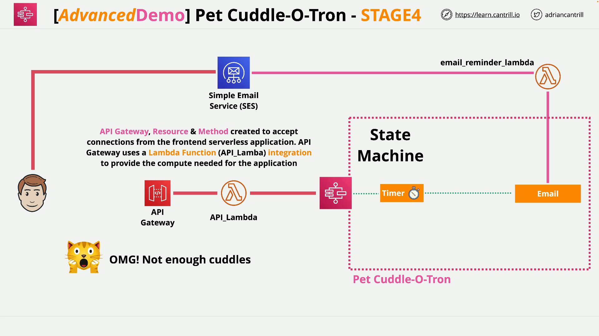

# Serverless Pet Cuddle-o-Tron - Stage 4

## Overview

In this part of the Cantrill SAA-C03 demo series, the goal is to create:

- A **Lambda function** that serves as the compute backend.
- An **API Gateway** to act as the entry point for client applications (like a web frontend).
- Integration between API Gateway and the Lambda function.
- Deployment of the API with a production stage.

## Lambda Function: `api_lambda`

### Purpose

- Serves as the **backend logic** for handling requests from the API Gateway.
- Validates incoming JSON data.
- Starts execution of a **Step Function** state machine with validated input.

## Lambda Python Code Breakdown (`api_lambda.py`)

```python
import boto3, json, os, decimal
```

- Imports the required libraries:
  - `boto3` – AWS SDK for Python
  - `json` – For parsing and generating JSON
  - `os` – (Imported but unused)
  - `decimal` – For handling Decimal objects that may appear in JSON

```python
SM_ARN = 'YOUR_STATEMACHINE_ARN'
```

- Placeholder: Replace this with the **actual ARN** of your Step Function state machine.

```python
sm = boto3.client('stepfunctions')
```

- Initializes a Step Functions client using `boto3`.

### Lambda Handler

```python
def lambda_handler(event, context):
```

- Standard Lambda entry point. Triggered by API Gateway.

```python
    print("Received event: " + json.dumps(event))
```

- Logs the incoming request for debugging.

```python
    data = json.loads(event['body'])
    data['waitSeconds'] = int(data['waitSeconds'])
```

- Parses the body from the API Gateway request.
- Converts `waitSeconds` to an integer (validation preparation).

```python
    checks = []
    checks.append('waitSeconds' in data)
    checks.append(type(data['waitSeconds']) == int)
    checks.append('message' in data)
```

- Runs a basic sanity check to validate input.
  - Ensures required fields (`waitSeconds`, `message`) are present and correctly typed.

```python
    if False in checks:
```

- If any check failed:

```python
        response = {
            "statusCode": 400,
            "headers": {"Access-Control-Allow-Origin":"*"},
            "body": json.dumps({
                "Status": "Success",
                "Reason": "Input failed validation"
            }, cls=DecimalEncoder)
        }
```

- Returns HTTP `400 Bad Request` with a JSON error message.
- Includes CORS header.

```python
    else:
        sm.start_execution(
            stateMachineArn=SM_ARN,
            input=json.dumps(data, cls=DecimalEncoder)
        )
        response = {
            "statusCode": 200,
            "headers": {"Access-Control-Allow-Origin":"*"},
            "body": json.dumps({"Status": "Success"}, cls=DecimalEncoder)
        }
```

- If validation passes:
  - Starts the Step Function execution with provided input.
  - Returns HTTP `200 OK` with success status.

```python
    return response
```

- Sends the response back to API Gateway.

### DecimalEncoder Workaround

```python
class DecimalEncoder(json.JSONEncoder):
    def default(self, obj):
        if isinstance(obj, decimal.Decimal):
            return int(obj)
        return super(DecimalEncoder, self).default(obj)
```

- Custom JSON encoder to handle `Decimal` values that may be returned from AWS (common in DynamoDB).
- Converts `Decimal` to `int` to avoid `TypeError` during `json.dumps`.

## API Gateway Setup



### Step-by-Step Summary

1. **Lambda Function Creation**

   - Create new function from scratch: `API_Lambda`
   - Use **Python runtime**
   - Attach **existing Lambda execution role**
   - Paste in `api_lambda.py` code
   - Replace placeholder ARN with actual Step Function ARN
   - Deploy the function and **note down the Lambda ARN**

2. **API Gateway Setup**

   - Open **API Gateway** service
   - Create a **REST API**
     - Not a private, HTTP, or WebSocket API
   - Create a **new API**
     - Name appropriately
     - Ensure **CORS is enabled**
     - **Do not enable proxy resource**

3. **Resource and Method**

   - Create a resource (e.g., `/petcuddles`)
   - Under this resource, create a **POST method**
     - Choose integration type: **Lambda Function**
     - Select the correct region (e.g., `us-east-1`)
     - Pick your Lambda function (`API_Lambda`)
     - Enable:
       - **Lambda proxy integration**
       - **Use default timeout**

4. **Deploy API**
   - Create a new stage: `prod`
   - Deploy to this stage
   - Copy the **Invoke URL** – this will be used by the frontend app

## What Happens End-to-End

1. Client app makes a `POST` request to API Gateway.
2. API Gateway invokes the `API_Lambda` function.
3. Lambda:
   - Parses and validates the incoming request.
   - Starts the state machine using Step Functions if valid.
   - Returns either a success or failure response.
4. Step Functions carry out the rest of the process asynchronously.

## Final Notes

- Ensure you replace the **Step Function ARN** with your own (copy from the Step Functions console).
- Also make sure that the correct IAM role is attached to Lambda with permission to invoke Step Functions.
- Save the API Gateway Invoke URL securely for use in frontend app or testing.
