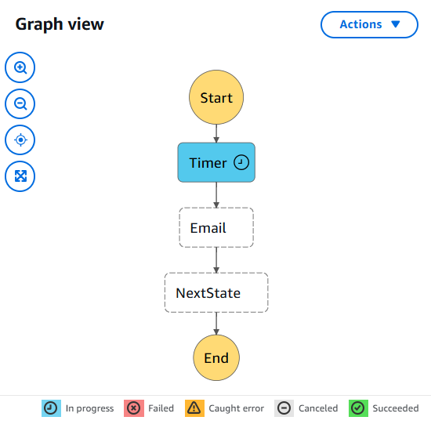

# Serverless Pet Cuddle-o-Tron - Stage 6


This guide details the final steps to set up a serverless application frontend using AWS S3 static website hosting. It covers bucket setup, policy editing, HTML/CSS deployment, and integration with previously created API Gateway and Step Functions.

## 🔧 Resources Used

- **Frontend Assets ZIP**  
  [Download Serverless_Frontend.zip](https://learn-cantrill-labs.s3.amazonaws.com/aws-serverless-pet-cuddle-o-tron/serverless_frontend.zip)

- **Bucket Policy Template**

```json
{
  "Version": "2012-10-17",
  "Statement": [
    {
      "Sid": "PublicRead",
      "Effect": "Allow",
      "Principal": "*",
      "Action": ["s3:GetObject"],
      "Resource": ["REPLACEME_PET_CUDDLE_O_TRON_BUCKET_ARN/*"]
    }
  ]
}
```

Replace the `REPLACEME_PET_CUDDLE_O_TRON_BUCKET_ARN` with your actual bucket ARN.

## 1. Create and Configure S3 Bucket for Static Hosting

1. Go to the **S3 Console** in AWS.
2. Click **Create Bucket**.
3. Enter a unique bucket name (e.g., `pet-cuddle-o-tron-1337`).
4. Set the region to **US East (N. Virginia)** – `us-east-1`.
5. **Disable "Block all public access"**.
6. Acknowledge the warning about making the bucket public.
7. Click **Create Bucket**.

## 2. Apply Bucket Policy for Public Access

1. Open the **Permissions** tab of the bucket.
2. Click **Edit Bucket Policy**.
3. Paste in the provided bucket policy JSON (see above).
4. Replace the `REPLACEME_PET_CUDDLE_O_TRON_BUCKET_ARN` with your actual bucket ARN, which you can copy from the bucket details.

### Important Note:

Do **not** include the `/*` in your replacement text. Only replace the string inside the quotes.

## 3. Confirm Account-Level Public Access Settings

1. In the S3 sidebar, click **Block Public Access Settings for this account**.
2. Ensure **all options are disabled (OFF)**.
3. Click **Save**.

## 4. Enable Static Website Hosting

1. Go to the **Properties** tab of the S3 bucket.
2. Scroll to **Static website hosting** and click **Edit**.
3. Enable it and choose **Host a static website**.
4. Enter:
   - **Index document**: `index.html`
   - **Error document**: `index.html`
5. Click **Save**.

## 5. Modify Frontend JavaScript to Point to Your API

### Unzip and Examine Files

From the ZIP file, you'll get the following:

| File            | Purpose                               |
| --------------- | ------------------------------------- |
| `index.html`    | Main HTML document                    |
| `main.css`      | Stylesheet for the frontend           |
| `whiskers.png`  | Image asset for the UI                |
| `serverless.js` | JavaScript logic that talks to API GW |

### Edit `serverless.js`

Open `serverless.js` in your code editor and find this placeholder:

```javascript
const endpoint = "REPLACEME_API_GATEWAY_INVOKE_URL";
```

### Replace it with:

```javascript
const endpoint = "https://abc123xyz.execute-api.us-east-1.amazonaws.com/prod/petcuddleotron";
```

Make sure:

- The value starts with `https://` and ends with `/prod/petcuddleotron`.
- The last part (`/petcuddleotron`) is added manually after copying the API Gateway Invoke URL.

### Explanation (Line by Line)

```javascript
const endpoint = "https://abc123xyz.execute-api.us-east-1.amazonaws.com/prod/petcuddleotron";
```

- **const endpoint**: Declares a constant variable `endpoint`.
- **= "..."**: Assigns the API Gateway's Invoke URL.
- **/petcuddleotron**: Appended path that matches the Lambda proxy integration route.

This `endpoint` is used in AJAX calls to communicate with the serverless backend.

## 6. Upload Files to S3

1. Go to the **Objects** tab in your S3 bucket.
2. Click **Upload > Add Files**.
3. Select all four files (`index.html`, `main.css`, `whiskers.png`, `serverless.js`).
4. Click **Upload**.

## 7. Test Your Static Website

1. Go to the **Properties** tab of your S3 bucket.
2. Scroll to **Static website hosting**, and click the link provided to open your frontend in a browser.

### Example Interaction

- Input a timer (e.g., `120` seconds).
- Type message (e.g., `HUMAN COME HOME NOW`).
- Enter the email (used during setup).
- Click **Email Minion**.

If successful:

- You'll see a "Submitted" message.
- In Step Functions, you’ll observe the execution progressing through states like Timer → Email → Next State → End.

## 8. Verify Step Function Execution



1. Go to **Step Functions** in the AWS Console.
2. Open the **PetCuddleOTron** state machine.
3. Check the **Executions** tab to view the current or completed execution.
4. Click into the execution to:
   - View the **Graph Inspector**
   - See input/output under **Execution Input**
   - View **Logs** for each state

## Summary of What You've Built

- An S3-hosted frontend using static site hosting.
- Customized JavaScript frontend for invoking API Gateway.
- Serverless backend with Lambda and Step Functions handling logic.
- Seamless communication from HTML form → JavaScript → API Gateway → Lambda → Step Function.

## 🧹 What's Next?

In the final video of the series, you’ll learn how to clean up all AWS resources to avoid unwanted charges.
