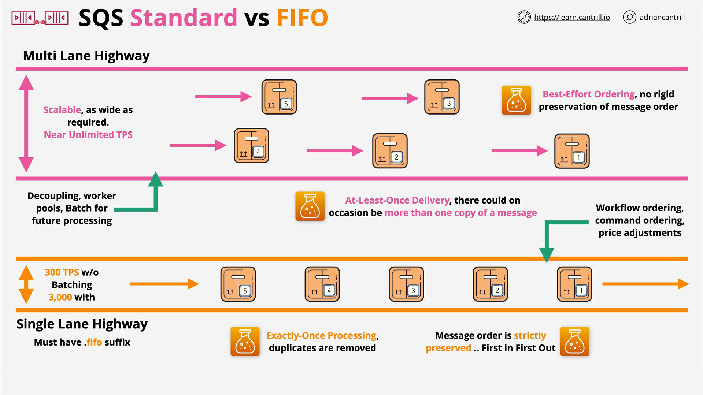

# Amazon SQS - Standard vs FIFO Queues

## Introduction

This lesson focuses on the **architectural differences** and **use cases** between **Standard Queues** and **FIFO (First-In-First-Out) Queues** in Amazon SQS. Understanding the trade-offs between these two types is essential for designing scalable and reliable distributed systems on AWS—and for success in the certification exam.

## Conceptual Analogy: Highways

To grasp the difference intuitively:

- **FIFO Queues** = **Single-lane highway**  
  → Maintains strict order, but limited throughput.

- **Standard Queues** = **Multi-lane highway**  
  → High throughput, but relaxed order.

## FIFO Queues

### Characteristics

- **Ordering**:  
  Guarantees **first-in, first-out** processing.

- **Delivery Guarantee**:  
  Ensures **exactly-once** message delivery—no duplicates.

- **Performance Limits**:

  - **300 messages/sec** without batching.
  - **3000 messages/sec** with batching (up to 10 messages per batch).
  - These are measured as **transactions per second to the SQS API**.

- **Queue Naming**:
  - Must end in `*.fifo`.
  - Example: `order-processing.fifo`.

### Exam Tip

> The `.fifo` suffix requirement is a **common exam question**.

### Ideal Use Cases

- **Workflow-driven systems** where the order is essential.
- **Command execution** systems (e.g., CLI task queues).
- **Sequential financial computations**, like price adjustments or processing step dependencies.

## Standard Queues

### Characteristics

- **Ordering**:

  - **Best-effort ordering** only.
  - No strict sequence guarantee.

- **Delivery Guarantee**:

  - **At-least-once delivery**.
  - Possibility of **duplicate messages**—application logic must handle deduplication.

- **Performance**:
  - Virtually **unlimited throughput**.
  - **Scales automatically** without specific configuration.

### Ideal Use Cases

- Decoupling **independent application components**.
- Creating **scalable worker pool architectures**.
- Batching messages for **asynchronous processing**.

## Trade-Off Summary

| Feature                    | FIFO Queues                     | Standard Queues                      |
| -------------------------- | ------------------------------- | ------------------------------------ |
| **Ordering**               | Guaranteed (First-In-First-Out) | Best effort only                     |
| **Delivery Guarantee**     | Exactly-once                    | At-least-once (duplicates possible)  |
| **Throughput**             | 300 TPS (3,000 with batching)   | Virtually unlimited                  |
| **Message Duplication**    | No                              | Yes (needs handling in app)          |
| **Queue Name Requirement** | Must end with `.fifo`           | No restriction                       |
| **Ideal For**              | Order-sensitive processing      | High-throughput, parallel processing |

## Developer Note on Message Batching

> **Batching** improves FIFO throughput by allowing up to 10 messages per transaction.  
> The actual API throughput remains at 300 TPS, but **each batch can hold up to 10 messages**, effectively boosting capacity to 3000 messages/sec.

## Final Thoughts

Understanding the **design trade-offs** between Standard and FIFO queues is critical:

- Use **FIFO** when **order and precision** matter more than speed.
- Use **Standard** when **speed and scale** matter more than order.

Both queue types are critical components in **decoupled**, **asynchronous**, and **resilient** AWS application architectures.
