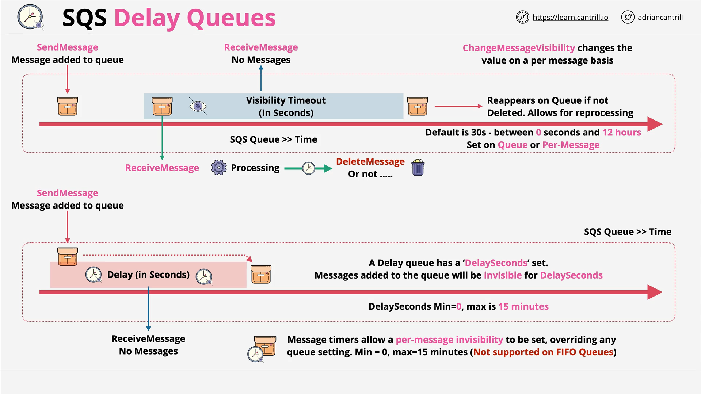

# AWS SQS: Delay Queues vs. Visibility Timeout



This guide summarizes the key concepts, differences, and use cases of **Delay Queues** and **Visibility Timeout** in **Amazon SQS**, based on the Learn Cantrill.io AWS SA-C03 course.

## Core Concepts

### What is a Delay Queue?

A **Delay Queue** is used to **postpone the delivery of messages** to consumers for a specific amount of time after they are sent to the queue.

- The message is **invisible** immediately upon arrival.
- It becomes available only **after the delay period expires**.
- Maximum delay: **15 minutes**.
- Configurable at:
  - **Queue level** (`DelaySeconds`)
  - **Per-message level** (`DelaySeconds`, via message timers)

> **Important**: FIFO queues **do not support** per-message delay (timers).

### What is Visibility Timeout?

**Visibility Timeout** is the time during which a message is **temporarily hidden** from other consumers **after it has been received**.

- Prevents **duplicate processing** during message handling.
- If a message is not deleted before the timeout expires, it becomes visible again.
- Default: **30 seconds**
- Range: **0 seconds to 12 hours**
- Used for:
  - Error handling
  - Automatic reprocessing
  - Coordinating distributed processing

## Feature Comparison

| Feature             | Delay Queue                            | Visibility Timeout                |
| ------------------- | -------------------------------------- | --------------------------------- |
| **When it applies** | When message is **sent**               | After message is **received**     |
| **Effect**          | Message is **delayed** from appearing  | Message is **hidden** temporarily |
| **Configurable**    | Queue-level and per-message (standard) | Queue-level and per-message       |
| **Max duration**    | 15 minutes                             | 12 hours                          |
| **FIFO support**    | Only queue-level delay supported       | Fully supported                   |
| **Use case**        | Delaying processing                    | Managing failures / retries       |

## Practical Use Cases

### Delay Queue Use Cases

- Add processing delay after a customer action (e.g., wait 5 mins before processing a cancellation).
- Space out message processing for **rate limiting** or **scheduling**.
- Perform preliminary tasks **before processing** main workload.

### Visibility Timeout Use Cases

- Retry failed messages after a crash or error.
- Prevent duplicate processing in **distributed systems**.
- Align processing windows for **sequential** or **parallel** operations.
- Adjust dynamically for **long-running tasks**.

## Technical Details

### Delay Queues

- Queue-level delay: `DelaySeconds` (0–900 seconds)
- Messages are **invisible** until the delay expires.
- ReceiveMessage returns nothing during the delay.
- Setting a delay on a message **overrides** the queue delay (Standard queues only).
- To schedule **beyond 15 minutes**, use **EventBridge Scheduler**.

### Visibility Timeout

- Starts **after message is received**.
- If not deleted before timeout, the message becomes **visible again**.
- Can be adjusted per-message using `ChangeMessageVisibility`.

```bash
# Example: Change visibility timeout via AWS CLI
aws sqs change-message-visibility \
  --queue-url https://sqs.us-east-1.amazonaws.com/123456789012/MyQueue \
  --receipt-handle AQEB...== \
  --visibility-timeout 120
```

#### Explanation of Code

```bash
aws sqs change-message-visibility \
```

- AWS CLI command to modify the visibility of a message in SQS.

```bash
--queue-url https://sqs.us-east-1.amazonaws.com/123456789012/MyQueue \
```

- The URL of the SQS queue where the message resides.

```bash
--receipt-handle AQEB...== \
```

- The unique identifier for the message received earlier, required to modify it.

```bash
--visibility-timeout 120
```

- Sets the new timeout to 120 seconds (2 minutes), during which the message will remain invisible.

> Use this to extend the time required for processing if needed.

## Message Flow Summary

### Visibility Timeout Flow

1. Message is added → **visible**
2. Consumer receives it → **becomes invisible**
3. If deleted → message gone
4. If not deleted → becomes visible again after timeout

### Delay Queue Flow

1. Message is added → **invisible for delay duration**
2. Delay expires → **message becomes visible**
3. Consumer can now process it

## In-Flight Messages & Quotas

- Messages in "invisible" state = **in-flight**
- Limit: ~120,000 in-flight messages (Standard queues)
- Exceeding limit returns `OverLimit` errors (for **short polling** only)

**Management Tips:**

- Delete messages promptly after processing.
- Monitor with CloudWatch alarms for high in-flight counts.
- Scale consumers or use multiple queues to distribute load.

## Best Practices

### For Visibility Timeout

- Set an initial timeout based on expected processing time.
- Use a **heartbeat** or extend timeout dynamically for long tasks.
- Use **Dead Letter Queues (DLQs)** for persistent failures.
- Avoid excessively long timeouts—can delay retries.

### For Delay Queues

- Use for **delayed task execution** or **rate control**.
- Don’t confuse with visibility timeout—delay happens **before** first visibility.
- Use **EventBridge Scheduler** for delays >15 minutes or recurring patterns.

## Tools and Alternatives

| Feature                 | Tool/Service                     |
| ----------------------- | -------------------------------- |
| Message delay (≤15 min) | SQS Delay Queue or Timers        |
| Advanced scheduling     | **Amazon EventBridge Scheduler** |
| Error retry logic       | Visibility Timeout + DLQs        |

## Notes & Exam Tips

- Delay queues and visibility timeout are **not interchangeable**.
- FIFO queues **do not support per-message timers**.
- To delay messages **after receiving**, use visibility timeout.
- To delay **before message becomes visible**, use delay queues or timers.
