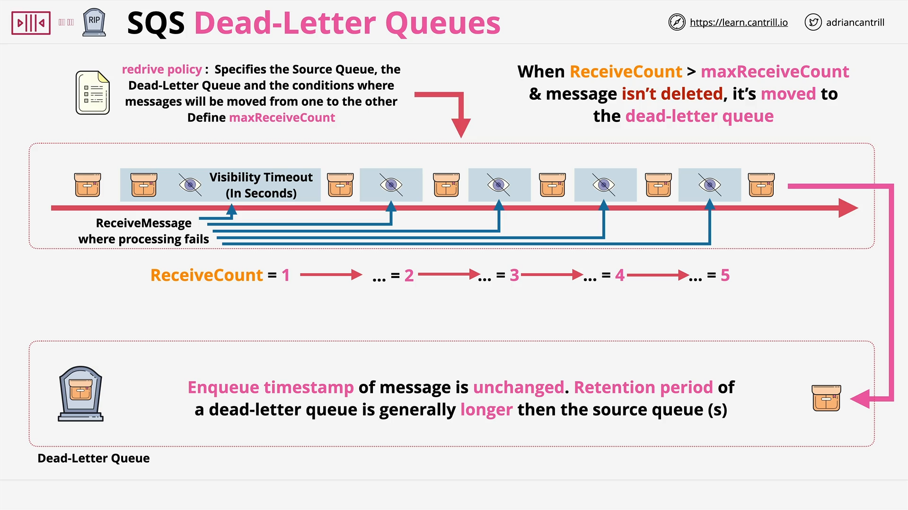

# Dead Letter Queues (DLQs) in SQS

## Introduction

This lesson focuses on the **Dead Letter Queue (DLQ)** feature in **Amazon SQS**. DLQs are crucial for managing **recurring message processing failures** in distributed systems.

## What is a Dead Letter Queue?

A **Dead Letter Queue** is a special SQS queue used to handle messages that **repeatedly fail processing**. Instead of allowing problematic messages to be retried indefinitely, DLQs isolate them for further inspection or alternative handling.

## Problem Scenario

1. A message in the SQS queue causes a **processing error**.
2. The message becomes **invisible** for the duration of the **visibility timeout**.
3. If not deleted after processing, it **reappears** in the queue.
4. This cycle may **repeat endlessly**, resulting in wasted compute cycles and inefficiency.

## How DLQs Solve the Problem

SQS tracks a `ReceiveCount` attribute for each message:

- Starts at 1 and increments each time the message is received but not deleted.

You can configure a **Redrive Policy** which includes:

- `sourceQueue`: the main queue.
- `deadLetterQueue`: the DLQ to send failed messages to.
- `maxReceiveCount`: the threshold after which a message is moved to the DLQ.

### Example Flow:

- If `maxReceiveCount = 3` and a message fails processing 3 times:
  - On the **4th failure**, it is **moved to the DLQ**.

## Benefits of Using a Dead Letter Queue

- **Alerting**: You can set up alarms to notify when messages arrive in the DLQ.
- **Diagnostics**: Analyze logs or contents of failed messages to identify issues.
- **Custom Processing**: Handle DLQ messages separately (e.g., retry, modify, escalate).
- **Isolation**: Keeps the primary queue clean and efficient.

## Important Notes on Message Retention

### Retention Period

- SQS queues have a **retention period** (default is 4 days, configurable up to 14 days).
- Messages exceeding this age are **automatically deleted**.

### The `ApproximateFirstReceiveTimestamp`

- When a message is moved from a source queue to a DLQ, its **original enqueue timestamp is preserved**.
- This means the **total age** of the message is **not reset** when moved to the DLQ.

#### Example:

- Message sits in the source queue for **1 day**.
- DLQ has a retention period of **2 days**.
- The message will **only remain in the DLQ for 1 more day**.

### Best Practice:

- **DLQ retention period should always be longer** than the source queue’s retention period.

## Design Considerations

- DLQs enhance **resilience** and **observability** of your system.
- You can implement **additional logic** (e.g., reprocessing pipeline, notifications) based on DLQ entries.
- **A single DLQ can be shared** across multiple source queues, allowing centralized error handling.

## Summary

Dead Letter Queues are:

- A **critical tool** for building fault-tolerant and debuggable systems using SQS.
- Useful for **detecting, analyzing, and responding** to message processing failures.
- Important to configure correctly to account for **message age** and **retention behavior**.
