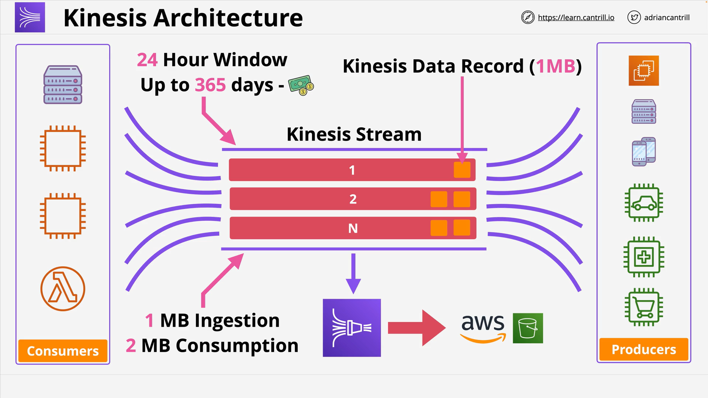

# Kinesis Data Streams

## Overview

**Amazon Kinesis Data Streams (KDS)** is a **highly scalable and durable** service designed for **real-time ingestion** and **processing of streaming data** from multiple producers. It is often confused with **Amazon SQS**, but the two serve different architectural purposes.

## Key Concepts

### What is Kinesis?

- **Kinesis** is a **managed streaming service** for collecting, processing, and analyzing real-time data.
- Unlike **SQS**, which handles discrete messages, Kinesis deals with **streams of data** that can be continuously ingested and consumed.

## Kinesis Data Streams (KDS)

### Functionality

- Accepts high-throughput data from **many producers**.
- Supports **multiple consumers**, each of which can process the same or different portions of the stream independently.

### Stream Durability

- Default retention period is **24 hours**.
- Retention can be extended up to **365 days** at an additional cost.
- Data is **persisted** for the entire window duration.

### Real-World Use Cases

- Real-time analytics
- Monitoring systems
- IoT data processing
- Application clickstream analysis

## Architecture Overview



```markdown
[ Producers ] → → → [ Kinesis Stream (Shards) ] → → → [ Consumers ]
```

### Producers

- Can include:
  - EC2 instances
  - On-premises servers
  - IoT devices
  - Mobile apps

### Consumers

- Can be:
  - EC2 instances
  - On-premises services
  - Lambda functions

Consumers can read data at varying granularities (e.g., once per second, minute, or hour).

## Shard-Based Scaling

A **Shard** is the basic unit of capacity in a Kinesis stream.

### Shard Characteristics:

- **Ingestion**: 1 MB/sec
- **Consumption**: 2 MB/sec

To increase performance:

- **Add more Shards**, scaling linearly.
- More Shards = More performance + Higher cost

## Data Records

- Data sent to Kinesis is organized into **records**.
- Each **record** can be up to **1 MB**.
- Data is **partitioned across Shards** to allow **parallel processing**.

## Storage and Cost Implications

- Cost is based on:
  - **Number of Shards**
  - **Data retention window**
- For longer retention (e.g., 365 days), Kinesis stores all data during that period.

## Related Service: Kinesis Data Firehose

- A fully managed service to **load streaming data** into destinations like:
  - **Amazon S3**
  - **Redshift**
  - **Elasticsearch**
  - **Splunk**

### Use Case

- Stream real-time data with Kinesis for immediate analytics
- Store long-term data using **Kinesis Firehose + S3**
- Perform **batch analytics** with tools like **EMR**

## Kinesis vs SQS: Key Differences

| Feature            | Kinesis Data Streams                       | Amazon SQS                               |
| ------------------ | ------------------------------------------ | ---------------------------------------- |
| Purpose            | Real-time data ingestion and analytics     | Decoupling application components        |
| Producers          | Many (e.g., sensors, apps, devices)        | Usually one or few                       |
| Consumers          | Many, parallel, independent consumption    | Usually one or one group (worker tier)   |
| Persistence        | Yes, up to 365 days                        | No (messages deleted after consumption)  |
| Use Case           | Data streaming, analytics, dashboards      | Async messaging, decoupling, queuing     |
| Message Retention  | Rolling window (24h–365d)                  | Configurable max 14 days, non-persistent |
| Access Granularity | Multiple consumers at different timeframes | FIFO or Standard (1-at-a-time delivery)  |

## Exam Tips

- Ask: **Is this question about ingesting large-scale, real-time data?**
  - If **yes**, it's likely **Kinesis**.
- Ask: **Is this about decoupling, async communication, or worker systems?**
  - If **yes**, it's likely **SQS**.
- Only switch choices if the question provides **clear clues**.

## Summary

- Kinesis is built for **high-throughput**, **real-time streaming**, and **multi-consumer** analytics.
- It differs from SQS in purpose, persistence, and scale.
- **Understand both services** well to make the right decision during AWS certification exams.

Let me know if you'd like this converted into a GitHub `README.md` file or if you'd like the next lesson summarized!
