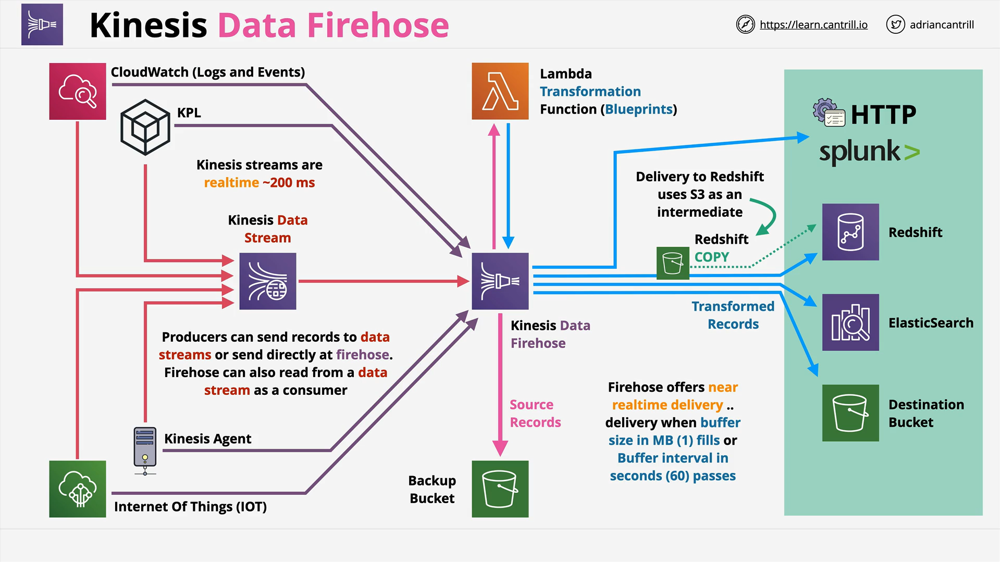

# Amazon Kinesis Data Firehose

## Overview

**Amazon Kinesis Data Firehose** is part of the broader **Kinesis family** of services designed for handling streaming data in AWS. Unlike **Kinesis Data Streams**, which requires you to manage consumers and storage windows, Firehose is a **fully managed**, **serverless**, and **auto-scaling** service that facilitates **near real-time data delivery** to several AWS and third-party destinations.

## Key Characteristics

- **Managed and Serverless**: No infrastructure to manage. Scales automatically.
- **Near Real-Time**: Has a slight delay (typically ~60 seconds) before delivering data.
- **Data Transformation**: Supports real-time data transformation using AWS Lambda.
- **Pay-As-You-Go**: Billing is based on the volume of data processed.
- **Persistent Storage**: Can persist data beyond the temporary storage window of Kinesis Streams by delivering it to services like S3.

## Use Case Comparison

| Feature                 | Kinesis Data Streams      | Kinesis Data Firehose           |
| ----------------------- | ------------------------- | ------------------------------- |
| Data Ingestion          | Real-time                 | Near real-time                  |
| Data Persistence        | Up to 365 days (optional) | Persistent via delivery         |
| Built-in Transformation | No                        | Yes (via Lambda)                |
| Delivery Destinations   | Requires manual setup     | Automated to S3, Redshift, etc. |
| Latency                 | Real-time (sub-second)    | ~60 seconds                     |
| Consumers Required      | Yes                       | No                              |

## Firehose Delivery Destinations

You must **remember these** for the exam:

- **Amazon S3**
- **Amazon Redshift** (via intermediate S3 + Redshift `COPY` command)
- **Amazon OpenSearch Service (formerly Elasticsearch)**
- **Splunk**
- **HTTP Endpoints** (for third-party integrations)

## Firehose Architecture



## Data Ingestion and Buffering Behavior

Firehose accepts **real-time data** but buffers it before delivery:

- **Buffer Conditions**:
  - Time-based: Default is 60 seconds
  - Size-based: Default is 1 MB
- These values can be configured based on needs.
- **For low-volume** producers, time buffer usually applies.
- **For high-volume** producers, size buffer often triggers delivery.

## Lambda Transformations with Firehose

You can attach a **Lambda function** to transform data in-flight.

### Transformation Flow

```text
Source Record --> Firehose --> Lambda (Transform) --> Firehose --> Destination
```

- **Transformation Options**:
  - JSON parsing
  - Data enrichment
  - Format conversion (e.g., CSV to JSON)
- **Backup Option**:
  - Store **original unmodified data** in a backup S3 bucket.

## Redshift Special Handling

When using Redshift as the destination:

- Data is first **delivered to an intermediate S3 bucket**.
- Then a **Redshift COPY command** imports the data into Redshift.
- All of this is handled transparently by Firehose.

## Exam Tips

### Key Points to Memorize:

- Firehose is **not a real-time** service — it is **near real-time** (~60 sec latency).
- Firehose supports **Lambda transformations** but adds latency.
- Redshift uses **intermediate S3 + COPY**, not direct ingestion.
- **Supported Destinations** must be known:
  - S3, Redshift, Elasticsearch/OpenSearch, Splunk, HTTP
- Firehose can:
  - Ingest data **directly** from producers.
  - Receive data **from Kinesis Data Streams**.

## Common Use Cases

- **Persisting Kinesis stream data** to avoid losing it after the window expires.
- **Transforming data format** using Lambda before delivery.
- **Delivering streaming data to supported destinations** without building custom consumers.

## Real-Time vs Near Real-Time

| Feature         | Real-Time               | Near Real-Time           |
| --------------- | ----------------------- | ------------------------ |
| Typical Latency | < 1 second              | ~60 seconds              |
| Product Example | Kinesis Data Streams    | Kinesis Data Firehose    |
| Suitable For    | Live dashboards, alerts | Storage, batch analytics |

## Conclusion

Amazon Kinesis Data Firehose is a powerful tool for **streaming data delivery**, **transformation**, and **persistence** — all without managing infrastructure. However, it is important to remember that it does **not support real-time** data delivery, making it suitable for analytics and storage scenarios where slight delivery delays are acceptable.
