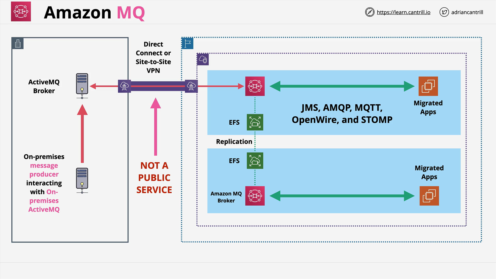

# Amazon MQ

## Overview

**Amazon MQ** is a **managed message broker service** designed to support **standard messaging protocols** and **APIs** such as:

- **JMS** (Java Message Service)
- **AMQP**
- **MQTT**
- **OpenWire**
- **STOMP**

It is particularly useful for organizations that are migrating **on-premises messaging systems** into AWS, especially when minimizing application changes is a priority.

## Amazon MQ vs SNS/SQS

| Feature             | Amazon MQ                   | SQS                         | SNS                         |
| ------------------- | --------------------------- | --------------------------- | --------------------------- |
| **Service Type**    | Managed message broker      | Fully managed queue service | Fully managed topic service |
| **Protocols**       | Open standards              | AWS-proprietary APIs        | AWS-proprietary APIs        |
| **Architecture**    | 1-to-1 and 1-to-many        | 1-to-1                      | 1-to-many                   |
| **Deployment**      | Inside VPC (private access) | Public endpoint             | Public endpoint             |
| **Use Case**        | Legacy system migration     | Decoupled microservices     | Fan-out notifications       |
| **AWS Integration** | Limited                     | Deep integration            | Deep integration            |

## Why Use Amazon MQ?

- **Migrate Legacy Systems**: Ideal for organizations with existing **on-premises message brokers** like **ActiveMQ** that want to migrate without rewriting applications.
- **Protocol Compatibility**: Supports **industry-standard protocols**—no need to rewrite messaging logic.
- **Hybrid Environments**: Perfect for **hybrid cloud architectures** where systems need to coexist across on-prem and AWS.

## Key Concepts

### Topics vs Queues

- **Topics (1-to-Many)**:

  - Similar to **SNS**
  - Messages sent to multiple subscribers

- **Queues (1-to-1)**:
  - Similar to **SQS**
  - Messages consumed by a single consumer from a group

### Network Architecture

- Amazon MQ **runs inside a VPC**
- Requires **private networking** such as:
  - **VPN**
  - **AWS Direct Connect**
- Not accessible via public internet by default
- Needs **firewall configuration** or **VPC peering** for access

## Deployment Architecture

### Example: Hybrid MQ Setup

- **ActiveMQ on-prem** connects to **Amazon MQ** over private networking
- Used for **coexistence** or full **migration**
- Brokers are deployed in **HA pairs** using **EFS** for storage replication

## Best Practices for the Exam

### When to Use SNS/SQS

Use **SNS or SQS** if:

- You are building a **new AWS-native application**
- You want **tight AWS integration** (e.g., CloudWatch, IAM, KMS)
- You need **public access** to queues or topics

### When to Use Amazon MQ

Use **Amazon MQ** if:

- You are **migrating** from an **existing system**
- You want to **reuse existing messaging protocols/APIs**
- You cannot **modify** the application logic
- You need **JMS, AMQP, MQTT, STOMP, or OpenWire**

**Important:**  
Always remember that **Amazon MQ is not public**. It must be accessed via **VPC networking**.

## Exam Tips

- **Default to SNS/SQS** unless:
  - Protocols like **JMS** or **AMQP** are mentioned
  - **No application modification** is allowed
- **Amazon MQ = Migration / Hybrid / Protocol Compatibility**
- **SQS/SNS = Native AWS / Scalability / Simplicity**

## Final Notes

Amazon MQ bridges the gap between **legacy enterprise messaging systems** and **modern AWS cloud infrastructure**. While not as integrated or scalable as SQS/SNS, it shines in **hybrid use cases** and **standards compliance**.
