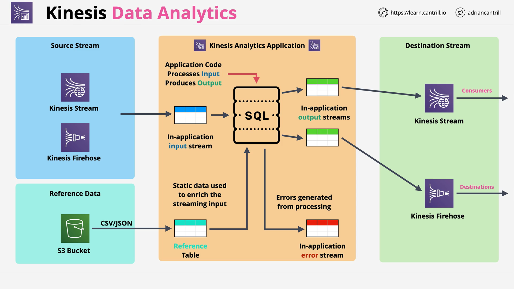

# Amazon Kinesis Data Analytics

## Overview

**Amazon Kinesis Data Analytics** is a **real-time stream processing service** in AWS that uses **SQL** to analyze and transform streaming data. It's crucial for **exam readiness** to understand its components, when to use it, and how it compares to other Kinesis services.

## Core Components of Kinesis

### 1. **Kinesis Data Streams**

- Used for large-scale ingestion of data.
- Allows real-time consumption by multiple compute services ("consumers").

### 2. **Kinesis Data Firehose**

- Provides delivery of streaming data to destinations.
- Supports **optional Lambda-based transformation** (non-real-time).
- Delivers to services like S3, Redshift, and Elasticsearch.

### 3. **Kinesis Data Analytics**

- Enables **real-time SQL-based processing** of streaming data.
- Accepts data from:
  - **Kinesis Data Streams**
  - **Kinesis Firehose**
- Can also include **reference data** from S3 for enrichment.
- Outputs to:
  - **Kinesis Data Streams** (real-time)
  - **Kinesis Firehose** (near real-time)
  - **AWS Lambda** (real-time)

## How Kinesis Data Analytics Works

### Data Flow Summary

```text
Kinesis Stream or Firehose (Input)
          ↓
Kinesis Analytics Application
(SQL processing)
          ↓
Kinesis Stream / Firehose / Lambda (Output)
```

- **Reference Data from S3** can enrich stream data.
- Data is processed via **in-application input streams**, **SQL logic**, and output to **in-application output streams**.

## Visual Breakdown of Architecture



### 1. **Inputs**

- External sources like Kinesis Streams or Firehose.
- Inside the application, these are modeled as **in-application input streams** (like real-time SQL tables).

### 2. **Reference Table (from S3)**

- Static enrichment data.
- Example: Player metadata for a game (name, items, awards) complements real-time score streams.

### 3. **SQL Processing Layer**

- Core logic is written in **SQL**.
- Operates on in-app input streams and reference tables.
- Outputs to:
  - **In-application output streams** → External streams (e.g., Firehose, Lambda, etc.)
  - **Error streams** for handling exceptions or invalid data.

### 4. **Outputs**

- Kinesis Stream: Real-time delivery.
- Firehose: Near real-time (due to buffering).
- Lambda: Real-time trigger.

## Real-Time vs Near Real-Time

| Destination          | Nature         |
| -------------------- | -------------- |
| Kinesis Data Streams | Real-time      |
| AWS Lambda           | Real-time      |
| Kinesis Firehose     | Near real-time |

## Cost Considerations

- **Only pay for processed data**, but it **can be expensive**.
- Use only when:
  - Real-time data processing is essential.
  - SQL-based transformations are needed.

## Ideal Use Cases

- **Time-series analytics**
- **Live dashboards** (e.g., games, e-sports leaderboards)
- **Election data**
- **Real-time metrics for security or operations**
- **Complex stream data transformations**

## Comparison: Kinesis Firehose vs Kinesis Data Analytics

| Feature                   | Kinesis Firehose     | Kinesis Data Analytics       |
| ------------------------- | -------------------- | ---------------------------- |
| Real-time processing      | ❌ (Near real-time)  | ✅ (Real-time)               |
| Transformation complexity | Limited (via Lambda) | Advanced (via SQL)           |
| Enrichment with S3 data   | ❌                   | ✅                           |
| Destination flexibility   | High                 | Moderate                     |
| Ideal for                 | Simple pipelines     | Complex, real-time analytics |

## SQL Code Processing Explanation (Conceptual)

```sql
SELECT
  s.player_id,
  s.score,
  r.player_name,
  r.team
FROM
  input_stream s
JOIN
  reference_table r
ON
  s.player_id = r.player_id
```

### Line-by-Line Breakdown

- `SELECT`: Chooses fields to return in the output.
- `s.player_id`, `s.score`: Pulls real-time values from the input stream.
- `r.player_name`, `r.team`: Enriches with metadata from the S3-based reference table.
- `FROM input_stream s`: Designates the source stream alias `s`.
- `JOIN reference_table r`: Combines streaming data with reference table `r`.
- `ON s.player_id = r.player_id`: Match condition for the join.

### Purpose:

Real-time enhancement of raw streaming data with static metadata, e.g., enriching live game score updates with player names and teams.

## Summary

Kinesis Data Analytics is a **powerful real-time data transformation tool** in AWS that:

- **Ingests streaming data**.
- **Enriches with reference data**.
- **Processes using SQL**.
- **Delivers real-time or near real-time results**.

Choose it over Firehose if your **exam scenario or solution architecture needs complex, real-time transformations** with SQL logic.
