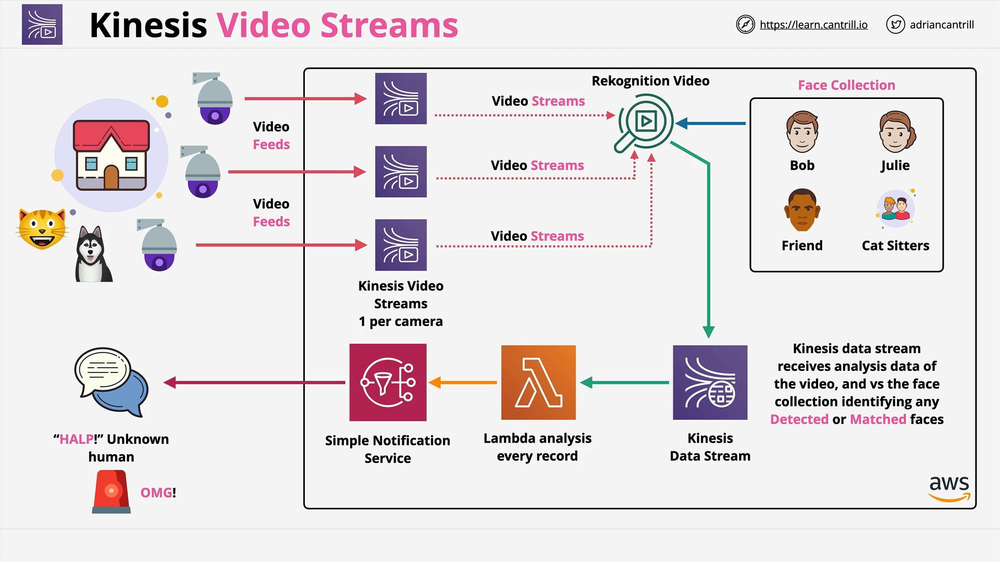

# AWS Certified Solutions Architect

## Overview: What is Kinesis Video Streams?

**Kinesis Video Streams (KVS)** is a managed AWS service designed to handle **live video streaming data** from producers like:

- Security cameras
- Smartphones
- Cars and drones
- Time-series devices (e.g., microphones, thermal sensors, radar)

### Key Capabilities

- **Ingest video and time-series media data**
- **Frame-by-frame access for analysis**
- **Storage and encryption in transit and at rest**
- **Integration with AWS AI/ML services like Rekognition**

## Core Features and Important Exam Points

### 1. **Data Ingestion**

- Producers (e.g., cameras, drones) stream data to Kinesis Video Streams.
- Supports both video and non-video time-encoded data (audio, thermal, depth).

### 2. **Data Storage**

- Media is **not** directly accessible in raw form.
- Stored in **structured and indexed** formats.
- Cannot access it through **S3, EBS, or EFS**.

> ❗ **Exam Tip**: Always remember you must go through **Kinesis Video Streams APIs** to access video—not via direct storage services.

### 3. **Security**

- **Data encryption** both at rest and in transit.
- Managed by AWS—no need to handle low-level infrastructure.

## Integration with Other AWS Services

### Common Integrations:

| Service            | Purpose                                            |
| ------------------ | -------------------------------------------------- |
| **Rekognition**    | Live video analytics (facial recognition, objects) |
| **Amazon Connect** | Audio streaming for contact center use cases       |

## Architecture Example: Smart Home Facial Recognition

### Scenario

You have a **smart home** setup with:

- A **cat, a dog**, and
- **Three video cameras**

Goal: Detect and notify on any **unknown faces** seen by the cameras.

### Architecture Components



### Step-by-Step Breakdown

1. **Three cameras** stream into **three Kinesis Video Streams**.
2. These streams are **integrated with Amazon Rekognition** for live analysis.
3. A **Face Collection** is created with known faces (e.g., Bob, Julie, Whiskers the cat-sitter).
4. Rekognition compares the faces in the stream with the collection.
5. Detected faces are sent to a **Kinesis Data Stream**.
6. A **Lambda function** processes the stream and makes decisions:
   - If an **unknown face** is detected, it triggers **Amazon SNS**.
7. SNS sends an **alert to Bob or Julie**.

### Logic in Lambda (Pseudocode)

```python
def handler(event, context):
    for record in event['Records']:
        face_info = json.loads(record['Data'])
        if face_info['Face'] not in known_faces:
            send_alert(face_info)
```

#### Explanation:

- **`event['Records']`**: Each Kinesis record received by the Lambda.
- **`face_info`**: Parsed JSON data about detected face.
- **`known_faces`**: List of known face IDs/names.
- **`send_alert`**: Function to trigger SNS notification.

## When to Use Kinesis Video Streams

### Ideal Scenarios

- Real-time **video analytics**
- Use cases requiring **live stream AI/ML inference**
- Any mention of:
  - **Live video**
  - **GStreamer**
  - **RTSP protocol**
  - **Event-driven analytics** on media

## Exam Tips

- KVS is **not likely to be tested in deep technical detail**, but you should:
  - Recognize its use case for live video analytics
  - Know that data isn't accessible via S3/EBS/EFS
  - Understand how it integrates with Rekognition and Lambda
- Look for **keywords**: "video stream", "RTSP", "live analytics", "GStreamer"

## Summary

Kinesis Video Streams enables **real-time ingestion and analysis** of video and time-series media. It integrates seamlessly with services like Rekognition for intelligent analytics and Lambda for event-driven architectures. It's a **managed, secure, and scalable** way to process live video without needing on-premise compute power.
