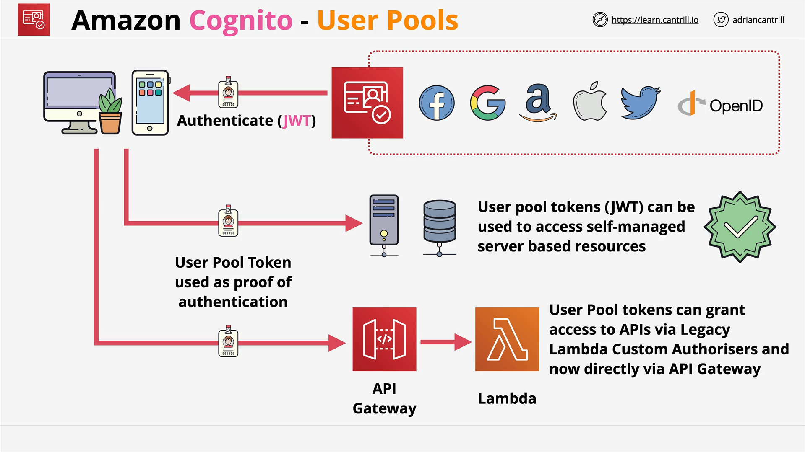
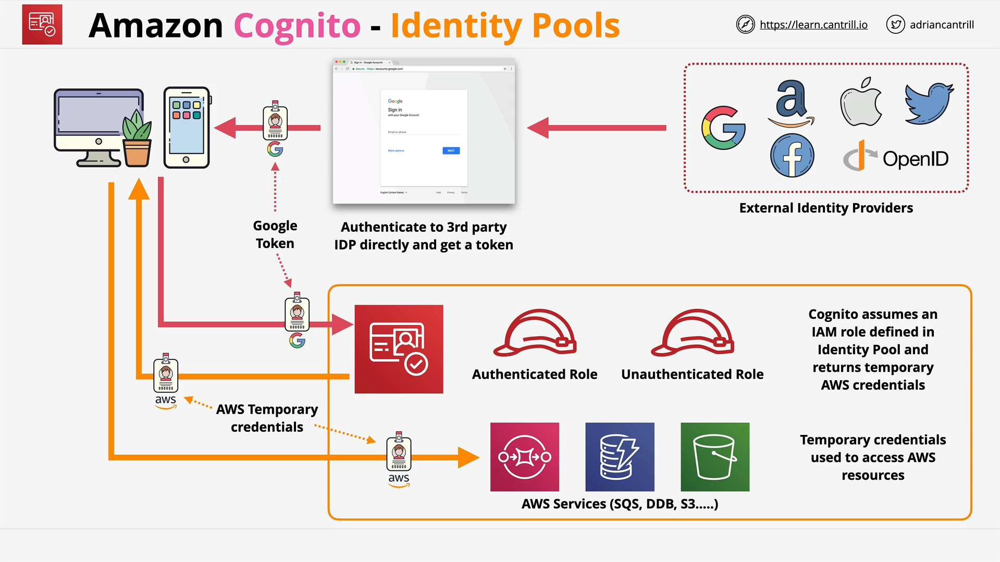
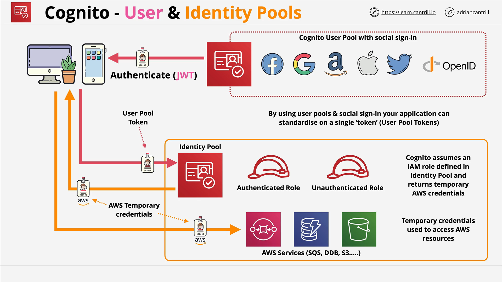

# Amazon Cognito

## Overview

Amazon Cognito is a key AWS identity product that handles:

- **Authentication** – Verifying a user's identity (login)
- **Authorization** – Granting access to services
- **User Management** – Managing user directories and profiles

Cognito has **two core components**, each serving distinct purposes:

1. **User Pools**
2. **Identity Pools**

## 1. Cognito User Pools

### Purpose

User Pools are used for:

- User **sign up/sign in**
- Managing a **user directory**
- Providing **authentication tokens** (JWTs)

### Output

Upon successful login, users receive a **JWT (JSON Web Token)**. This token:

- Can be used for **authentication**
- **Cannot** be used to access AWS services directly

### Features

User Pools offer:

- **Customizable sign-up/sign-in UI**
- **MFA** (Multi-Factor Authentication)
- **Email/phone verification**
- **Account takeover protection**
- Integration with **Lambda triggers** for custom flows
- **Social sign-in support** (Facebook, Google, Amazon, Apple)
- Support for **SAML** identity providers

> Think of a User Pool as a _user database_ that may include external identities. It authenticates users and issues JWTs.

### Limitations

JWTs from User Pools:

- Can be used for **API Gateway** authentication
- **Cannot be used** to access most AWS services directly (e.g., S3, DynamoDB)

## 2. Cognito Identity Pools

### Purpose

Identity Pools provide **temporary AWS credentials** by exchanging identities (authenticated or unauthenticated).

### Use Cases

- **Unauthenticated (guest) access**  
  E.g., storing scores in DynamoDB without requiring login
- **Authenticated access using external identities**
  - Google
  - Facebook
  - Twitter
  - SAML 2.0
  - **User Pool tokens**

### Key Mechanism

Identity Pools:

- Accept a valid token from an **external identity provider**
- Assume an **IAM role** based on identity type (authenticated or guest)
- Return **temporary AWS credentials** to the app

### Flow

1. User authenticates with external provider (e.g., Google)
2. App receives an identity token (e.g., Google token)
3. Token is passed to the Cognito **Identity Pool**
4. Identity Pool assumes an **IAM Role**
5. **Temporary AWS credentials** are returned to the app

> These credentials are short-lived and automatically rotated.

### Role Configuration

- **At least two roles** are typically configured:
  - One for **authenticated** identities
  - One for **unauthenticated** (guest) identities

## Combined Use: User Pools + Identity Pools

### Motivation

- Simplifies **user management**
- Consolidates multiple external identity providers into **one user directory**
- Enables **access to AWS resources** using Identity Pools

### Flow Summary

1. **User signs in** using User Pool (internal or via social sign-in)
2. **JWT token** (from User Pool) is generated
3. Token is passed to **Identity Pool**
4. Identity Pool assumes IAM role
5. **Temporary AWS credentials** are returned
6. App uses these credentials to access AWS services (e.g., S3, DynamoDB)

> This pattern is common in **mobile and web applications** where you need both authentication and AWS access.

## Concept: Web Identity Federation

**Definition:**  
Swapping an external identity token for AWS credentials.

- This is what happens when:
  - Google/Facebook token → AWS credentials
  - Cognito User Pool JWT → AWS credentials (via Identity Pool)

## Architecture Examples

### 1. Using User Pools Only

- Web/Mobile App → Cognito User Pool
- Returns JWT
- JWT used to authenticate **API Gateway** or **custom apps**
- **No access to AWS services** unless used with Identity Pool

### 2. Using Identity Pools Only

- App signs in via external identity provider (e.g., Google)
- Gets Google token → Passed to Cognito Identity Pool
- Identity Pool returns temporary AWS credentials
- App accesses AWS services (S3, DynamoDB)

### 3. Using Both Together

- App signs in via Cognito User Pool (including social login)
- User Pool returns JWT
- JWT is passed to Identity Pool
- Identity Pool assumes IAM Role
- App receives temporary AWS credentials
- App accesses AWS services

## Summary Table

| Feature              | User Pools                      | Identity Pools                        |
| -------------------- | ------------------------------- | ------------------------------------- |
| Purpose              | Sign-up, sign-in, manage users  | Grant AWS credentials                 |
| Returns              | JWT (JSON Web Token)            | Temporary AWS credentials             |
| Used For             | Authentication                  | Authorization to AWS services         |
| External Identities  | Social login (Google, Facebook) | External providers + User Pool tokens |
| IAM Role Integration | ❌                              | ✅ (assumes IAM role)                 |
| AWS Resource Access  | ❌                              | ✅                                    |

## Final Thoughts

- **User Pools**: Think **"authentication"** and **user management**
- **Identity Pools**: Think **"authorization"** to AWS services
- They can be **used together** for a seamless identity solution

> Mastering the difference between these two is essential for the **SAA-C03 exam** and real-world AWS architecture.
