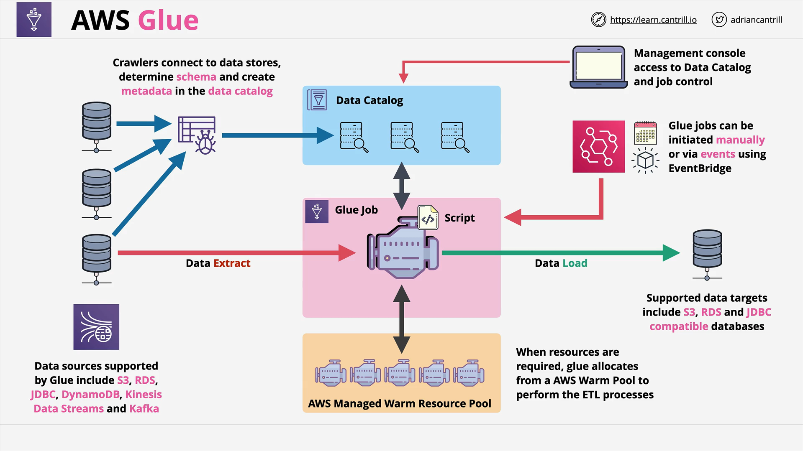

# AWS Glue

## Overview

**AWS Glue** is a **serverless ETL** (Extract, Transform, Load) service offered by AWS. It is increasingly featured in both certification exams and real-world data engineering projects.

Unlike traditional data processing solutions like **AWS Data Pipeline** (which uses compute resources within your account like EMR clusters), AWS Glue abstracts all infrastructure. AWS manages the underlying compute for you.

## What is AWS Glue?

### Key Characteristics:

- **Serverless**: No infrastructure to manage.
- **ETL Capabilities**: Extracts data from sources, transforms it, and loads it into targets.
- **Managed by AWS**: All resources are provisioned and maintained by AWS.
- **Integrates with a wide range of AWS data services**.

### Supported Data Sources:

- **Storage/Databases**:
  - Amazon S3
  - Amazon RDS
  - JDBC-compatible databases (e.g., Redshift, Aurora)
  - Amazon DynamoDB
- **Streaming Sources**:
  - Amazon Kinesis Data Streams
  - Apache Kafka

### Supported Data Targets:

- Amazon S3
- Amazon RDS
- JDBC-compatible databases

## AWS Glue Data Catalog

### What is it?

The **Glue Data Catalog** is a **centralized metadata repository**. It stores:

- Table schemas
- Data formats
- Source/destination metadata

### Benefits:

- **Reduces data silos**: Enables organization-wide data visibility.
- **Accessible across AWS services**: Services like Athena, Redshift Spectrum, EMR, and Lake Formation use the catalog.
- **Improves discoverability**: Allows teams across departments to find and utilize available data.

### Regional Scope:

Each AWS region in every AWS account gets a **unique Data Catalog**.

## How Glue Crawlers Work

Glue **Crawlers** are used to **scan data sources** and **populate the Data Catalog** with metadata.

### Workflow:

1. **Connect to data sources** (e.g., S3, RDS).
2. **Detect schemas** automatically.
3. **Create or update tables** in the Glue Data Catalog.

This process makes previously siloed data discoverable across the organization.

## AWS Glue Jobs

### What is a Glue Job?

A **Glue Job** performs the ETL process:

- **Extract** data from a source.
- **Transform** data using a user-defined script.
- **Load** the data to a target.

### Serverless Execution:

You do not provision servers. AWS manages a pool of compute resources that execute jobs on-demand. You are billed **only for the compute used**.

### Job Triggers:

Glue Jobs can be:

- **Manually started**
- **Scheduled**
- **Event-driven** (e.g., triggered by AWS EventBridge)

## Glue Architecture Overview

## Glue vs. Data Pipeline

| Feature          | AWS Glue                                                                                    | AWS Data Pipeline |
| ---------------- | ------------------------------------------------------------------------------------------- | ----------------- |
| **Serverless**   | Yes                                                                                         | No (uses EMR/EC2) |
| **Ease of use**  | High                                                                                        | Moderate          |
| **ETL Focus**    | Yes                                                                                         | Yes               |
| **Data Catalog** | Built-in                                                                                    | No                |
| **Event-Driven** | Yes                                                                                         | Limited           |
| **Exam Tip**     | Choose Glue when the question includes terms like: `serverless`, `ad hoc`, `cost effective` |

> **Note**: While Data Pipeline may have some additional capabilities, AWS is likely to continue evolving Glue as the preferred solution.

## Final Notes for the Exam

- Know that **Glue = Serverless ETL + Data Catalog**.
- Recognize scenarios that require **serverless, cost-effective, event-driven data processing** — these point to **Glue** over Data Pipeline.
- Understand the key Glue components:
  - Data Catalog
  - Crawlers
  - Jobs
- Be familiar with the Glue ecosystem integration with services like Athena, Redshift, EMR, and Lake Formation.
