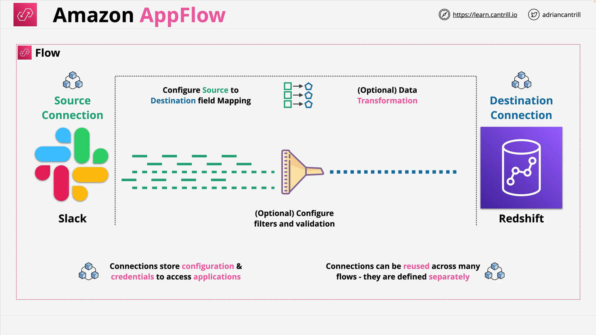

# Amazon AppFlow

## Overview

**Amazon AppFlow** is a **fully managed integration service** that enables secure, bidirectional data transfer between **SaaS applications** and **AWS services**—all without writing custom code or managing infrastructure.

Think of it as **middleware for data integration**, ideal for syncing data across systems or aggregating data from various sources to avoid data silos.

## Core Concepts

### 1. **Flows**

- The central configuration unit in AppFlow.
- Each **flow** has:
  - A **source connector**
  - A **destination connector**
  - Optional components like field mappings, transformations, validations, and filters

### 2. **Connectors**

- Connectors define how AppFlow interacts with external applications.
- AppFlow provides **built-in connectors** for many popular platforms such as:
  - Salesforce
  - Zendesk
  - Slack
  - Redshift
  - S3
- You can also create **custom connectors** using the **Connector SDK**.

### 3. **Connections**

- **Connections** store **credentials and configuration** for accessing each application.
- Created separately from flows, so they can be **reused** across multiple flows.
- Examples:
  - Slack connection uses an OAuth token
  - Redshift connection uses database credentials

## Architecture Example

### Visual Flow: Slack to Redshift

**Step-by-step Components:**

1. **Flow Configuration**:

   - Start with a **new flow**
   - Choose **Slack** as the source
   - Choose **Redshift** as the destination

2. **Connections**:

   - Use previously defined **Slack** connection
   - Use previously defined **Redshift** connection

3. **Field Mapping**:

   - Define what data to extract from Slack (e.g., user messages)
   - Map fields to Redshift columns (e.g., message → `msg_text`, user → `user_id`)

4. **Data Transformation (Optional)**:

   - Convert, format, or manipulate data during transfer
   - Example: Parse timestamps or extract user metadata

5. **Filtering & Validation (Optional)**:

   - Only copy records that meet specific criteria (e.g., only messages with attachments)
   - Apply validation rules (e.g., required fields must not be null)

6. **Flow Execution**:
   - Can be **scheduled**, **event-triggered**, or run **on-demand**

## Connectivity Options

| Type                    | Description                                                                           |
| ----------------------- | ------------------------------------------------------------------------------------- |
| **Public Endpoints**    | Default method. Allows connectivity to SaaS applications like Salesforce, Slack, etc. |
| **PrivateLink Support** | Enables private, secure connectivity to resources in your VPC or on-premises.         |

## Common Use Cases

- Sync **Salesforce contacts** to **Amazon Redshift** for analytics
- Export **Zendesk support tickets** to **Amazon S3** for archival
- Aggregate **Slack channel messages** into **Redshift** for sentiment analysis
- Integrate **Google Analytics** data with **Amazon QuickSight**

## Key Benefits

- **No code required**: Drag-and-drop field mapping and logic
- **Secure**: Data is encrypted in transit and at rest
- **Scalable**: Managed and serverless
- **Flexible**: Built-in support for many services with extensibility via SDK

## Exam Tips

- Know that **AppFlow = Managed data transfer between SaaS and AWS**.
- Understand:
  - Flow → Source + Destination + Transformations
  - Connections hold credentials and can be reused
- Default to **public endpoints**, but **PrivateLink** is available for secure/private needs.
- Used when **data needs to move regularly between applications** with minimal friction.

## Summary

Amazon AppFlow abstracts the complexity of integrating SaaS platforms with AWS services. It eliminates the need for custom ETL pipelines or manual data exports and is a go-to service when:

- You’re working with third-party apps like Salesforce, Zendesk, or Slack
- You want seamless and managed data transfer
- You want to build data lakes or run analytics without deep integration effort

This high-level understanding is sufficient for the AWS SA-C03 exam, unless diving deeper with optional videos.
