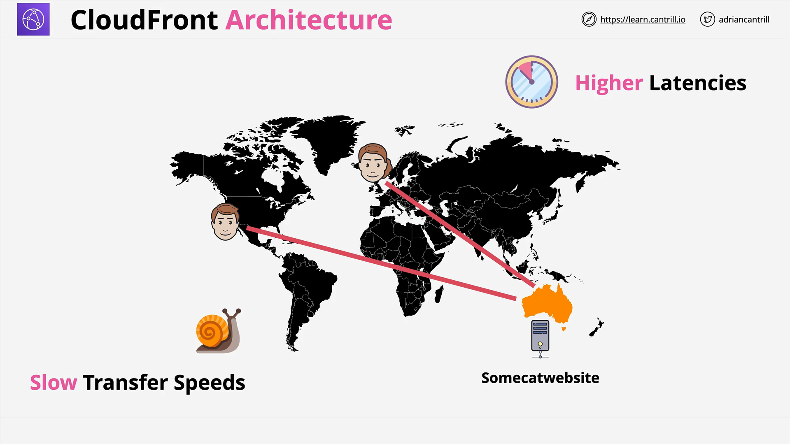
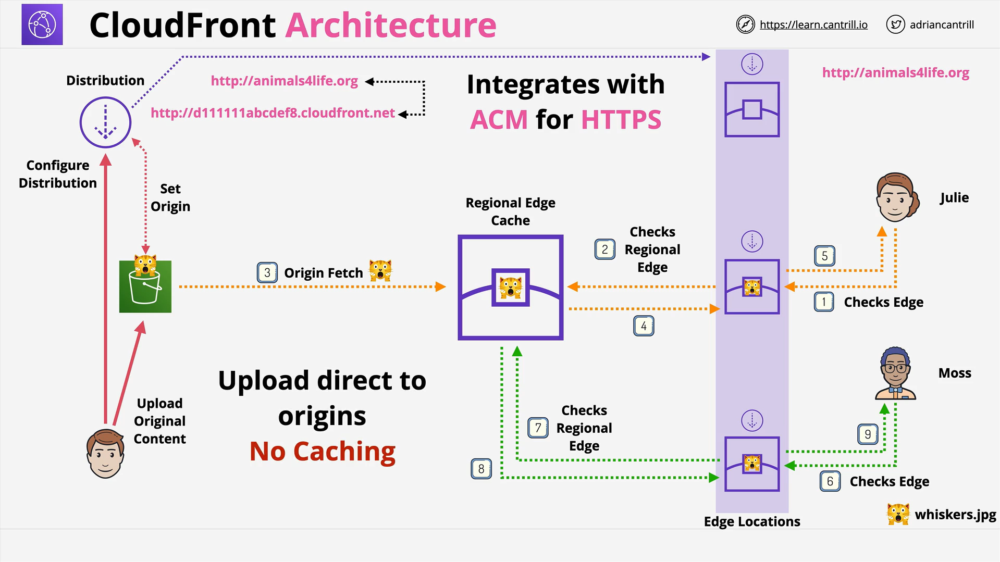
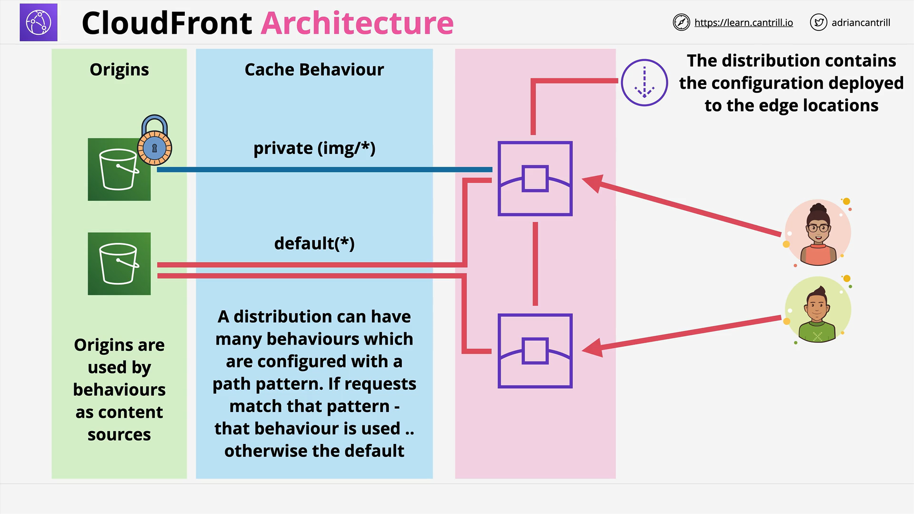

# Amazon CloudFront

## Introduction

This lesson introduces or refreshes your knowledge of **Amazon CloudFront**, a global content delivery network (CDN) service. It covers:

- What CloudFront is
- Key architectural components
- How it caches and delivers content
- Important terms and behaviors

## What is Amazon CloudFront?



**CloudFront** is a **Content Delivery Network (CDN)** designed to improve content delivery by:

- Caching content close to users
- Reducing latency
- Increasing transfer speeds
- Leveraging a global network of **edge locations**

It ensures efficient and performant content delivery from an **origin** (such as an S3 bucket or a web server) to **end users**.

## CloudFront Scenario Example



Imagine an application hosted in **Australia** gaining global users like Bob (US) and Julie (UK). Without CloudFront:

- Data travels long distances
- Latency and slower transfer speeds degrade user experience

CloudFront reduces these problems by **caching content** in edge locations **closer to the user**.

## Key Terminology

### 1. **Origin**

- The **source** of your content
- Can be:
  - **S3 Origin** (static content)
  - **Custom Origin** (any web server with a public IPv4 address)

> The content is fetched from the origin when it is not already cached.

### 2. **Distribution**

- A **configuration unit** in CloudFront.
- It defines:
  - Which origin to use
  - Caching rules
  - Behaviors, policies, and more
- Each distribution:
  - Is globally deployed
  - Gets a unique CloudFront URL (`xyz123.cloudfront.net`)
  - Can be mapped to a **custom domain name**

### 3. **Edge Locations**

- **Smaller** than AWS regions
- **Globally distributed** (200+ locations)
- Located in cities near end-users
- Cache content for low-latency access
- **Not** deployable targets for compute services like EC2

### 4. **Regional Edge Caches**

- **Larger** than edge locations, but fewer
- Sit **between** edge locations and origins
- Cache content that is less frequently accessed
- Serve multiple edge locations in the same region
- Provide performance benefits for global applications

## CloudFront Architecture Overview

### Content Retrieval Flow

1. **Client** requests content (e.g., `whiskers.jpg`)
2. Edge Location checks for the object:
   - If found → **Cache Hit**
   - If not → **Cache Miss**
3. On a cache miss:
   - EL checks the **Regional Edge Cache**
   - If not found, the content is fetched from the **origin**
4. After fetching:
   - The content is **cached** at both the **EL** and **Regional Cache**
   - Returned to the user
5. Subsequent users benefit from faster local cache hits

## Caching Behavior

- **Cache Hit**: Object is found locally → Fast response
- **Cache Miss**: Object is not found → Triggers further lookup
- **Origin Fetch**: Data is retrieved from the original source

## Distribution Domain Names

Each distribution receives a unique domain:

```
https://d12345.cloudfront.net
```

You can **map a custom domain** using an **alternate domain name (CNAME)**:

```
https://animalsforlife.org
```

## Behaviors in CloudFront



### What Are Behaviors?

- **Behaviors** are sub-configurations inside a distribution
- They link:
  - **Path patterns** (e.g., `/img/*`)
  - To **origins**
  - And specify settings like TTL, cache policies, access, etc.

### Example:

```text
Behavior 1 (Default): Path = "*"
Behavior 2 (Private Images): Path = "/img/*"
```

- Requests to `/img/*` use **Behavior 2** (stricter rules, more security)
- All other requests fall back to **default behavior**

### Behavior Matching

- Behaviors use **pattern matching**
- More specific patterns **take priority**
- Common use case: Split static assets, APIs, and private media into different behaviors

## SSL and HTTPS

CloudFront integrates with:

- **AWS Certificate Manager (ACM)** for HTTPS
- You can use **SSL certificates** for custom domains

## Read vs Write

- **CloudFront is Read-Only**:
  - Only supports **downloads**
  - **Uploads bypass CloudFront** and go directly to the origin
- No write caching is performed

## Key Takeaways

- **CloudFront is a global CDN** optimized for performance
- Content is delivered via a layered caching system:
  - Edge Location → Regional Cache → Origin
- **Behaviors** inside **distributions** control how content is served
- You can serve content under **custom domains** securely with HTTPS
- CloudFront supports **read-only** operations
