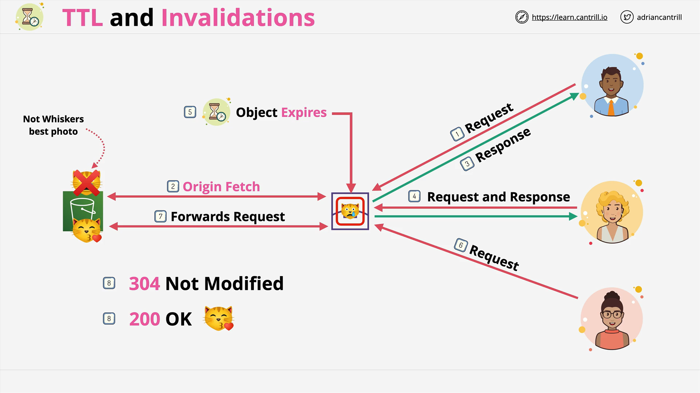

# AWS CloudFront TTL and Cache Invalidations

This document provides a comprehensive summary of the lesson covering **CloudFront Time-To-Live (TTL)** and **Cache Invalidation** mechanisms. It breaks down caching behavior, how to control cache lifetimes using headers, and strategies to optimize performance and cost.

## What This Lesson Covers

- CloudFront Edge Caching Mechanism
- TTL (Time-To-Live) behavior
- Controlling cache duration with headers
- Cache invalidations (manual and automated)
- Use of versioned filenames

## How CloudFront Caching Works



### **Basic Caching Workflow**

- Origin (e.g., an S3 bucket) provides the object.
- The object is cached at an edge location.
- All subsequent user requests to that edge location receive the cached version until it expires.

### **Problem Scenario**

1. A user requests an image (`whiskers.jpg`) from S3 → it's fetched and cached.
2. The image is updated in S3 (e.g., a new version of Whiskers).
3. Another user requests the image → still gets the **old** cached version.
4. CloudFront doesn't check the origin again **until TTL expires**.

## Object Expiry and Staleness

- After the TTL expires, the object is not immediately deleted.
- It's marked as **stale**.
- The next request triggers a revalidation with the origin.

### **Revalidation Outcomes**

- **304 Not Modified** → Origin confirms cache is up-to-date. The cached version is reused and marked as current.
- **200 OK with Updated Object** → A new object is downloaded and replaces the cached one.

## TTL Control and Behavior Settings

CloudFront behaviors in a distribution define default and limit values for TTLs:

### **Behavior-level TTL Settings**

- **Default TTL** (default is `86400` seconds = 24 hours)
- **Minimum TTL**
- **Maximum TTL**

These values:

- Apply globally unless overridden.
- Act as bounds when per-object TTLs are specified.

## TTL Control via HTTP Headers

You can define **per-object TTL** using HTTP headers, either via S3 metadata or through a custom origin (web server, API, etc.).

### **Key Headers**

```text
Cache-Control: max-age=<seconds>
Cache-Control: s-maxage=<seconds>
Expires: <date/time>
```

### **Behavior with Limits**

- If the specified TTL < Minimum TTL → **Minimum TTL is used**
- If the specified TTL > Maximum TTL → **Maximum TTL is used**

These headers **must respect the bounds** defined at the behavior level.

## Setting Headers

### **From S3**

- Set per-object metadata using:
  - AWS CLI
  - SDK/API
  - Console UI

### **From Custom Origin**

- Your web application/server can send headers dynamically.

## Cache Invalidations

### **What is It?**

A cache invalidation explicitly tells CloudFront to **expire cached content immediately**, regardless of TTL.

### **Scope**

- Invalidation applies to **all edge locations** in the distribution.

### **Examples**

| Pattern                  | Description                                            |
| ------------------------ | ------------------------------------------------------ |
| `/images/whiskers1.jpeg` | Invalidates a specific file                            |
| `/images/whiskers*`      | Invalidates all `whiskers*` images                     |
| `/images/*`              | Invalidates everything under `/images/`                |
| `/*`                     | Invalidates **all cached objects** in the distribution |

> ⚠️ Invalidations **cost money** and are applied per request, not per object matched.

## Better Practice: Versioned Filenames

Instead of relying on invalidations:

### **Use File Versioning**

Examples:

- `whiskers_v1.jpeg` → old version
- `whiskers_v2.jpeg` → new version

Then update your application to point to the new file name.

### **Benefits**

- **No need for invalidation**
- **Caches are guaranteed to be consistent** per version
- **No confusion between file states**
- **Improved browser caching behavior**
- **Better logging granularity**

> **Note:** This is **not** the same as **S3 Object Versioning**, which uses the same object name with internal version tracking. CloudFront only sees the latest version when S3 versioning is used.

## Key Takeaways for the Exam

- TTL default is 24 hours but can be changed per behavior.
- You can control TTL via headers like `Cache-Control` and `Expires`.
- Headers must obey min/max TTL limits set in behaviors.
- Cache invalidations should be used sparingly.
- **Versioned filenames** are the recommended approach for content updates.
- **CloudFront uses latest object version in S3 by default** (if using S3 versioning).
- **Versioned filenames** = different names for different versions → better caching control.
