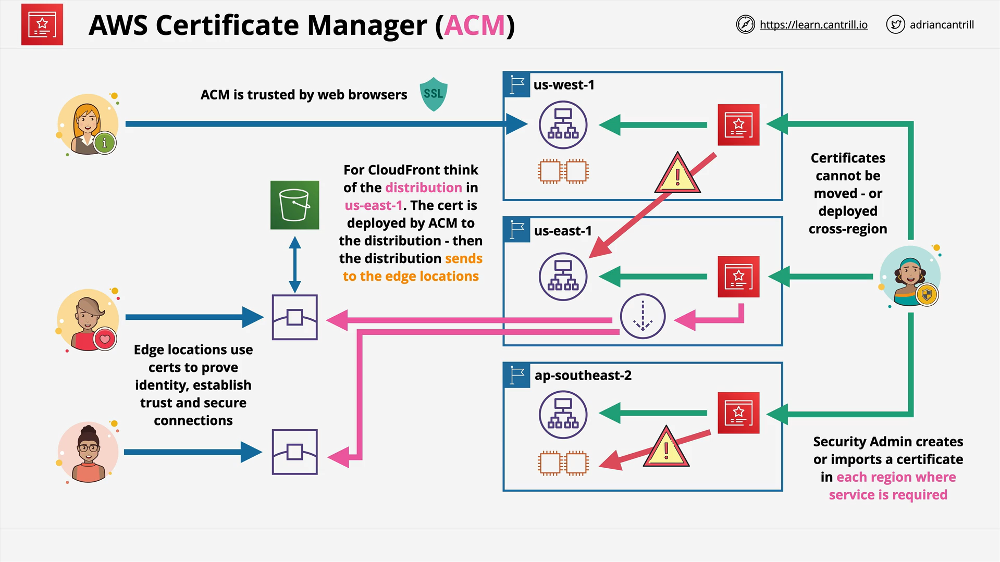

# AWS Certificate Manager (ACM)

## Overview

**AWS Certificate Manager (ACM)** is a managed AWS service that simplifies provisioning, managing, and deploying **SSL/TLS certificates** for use with AWS services and internal applications. This lesson highlights ACM’s importance in AWS certification and practical cloud architecture.

## Why HTTPS and Certificates Matter

- **HTTP** (HyperText Transfer Protocol) was designed without security—no encryption or identity verification.
- This led to issues like **DNS spoofing**, where users could be tricked into visiting malicious sites that look legitimate.
- **HTTPS** (HTTP Secure) solves this using:
  - **SSL/TLS protocols** for encrypted communication.
  - **Digital certificates** to verify the server's identity.

## How Certificate Trust Works

- A **Certificate Authority (CA)** digitally signs certificates.
- Browsers and operating systems maintain a list of **trusted CAs**.
- If a site presents a certificate signed by a trusted CA, the browser trusts the site.
- This links a **DNS name** (e.g., `example.com`) with a legitimate server.

## Key ACM Capabilities

### Public and Private CA Support

- **Public CA**:
  - ACM issues certificates trusted by most browsers/devices.
- **Private CA**:
  - Internal to an organization.
  - Requires client-side trust configuration (manual or policy-based).

### Certificate Lifecycle

- **Generate Certificates**:
  - ACM issues the certificate after **DNS or email verification**.
  - Certificates are **automatically renewed**.
- **Import Certificates**:
  - Use externally issued certificates.
  - **You are responsible** for manual renewal and re-importing.

## ACM in the AWS Exam

| Feature                | ACM-Generated | Imported |
| ---------------------- | ------------- | -------- |
| Auto Renewal           | Yes           | No       |
| DNS/Email Verification | Required      | No       |
| Manual Renewal         | No            | Yes      |

Key takeaway: **ACM-generated certificates are easier to manage** because they renew automatically.

## Service Support and Deployment

- ACM certificates can only be deployed to **supported AWS services**, such as:
  - **Application Load Balancers (ALB)**
  - **CloudFront**
- **Not supported**:
  - **EC2 instances** (due to manual access and security concerns).

ACM ensures certificates are **encrypted** and securely delivered to integrated services.

## ACM Is Regional

- Each AWS region has a **separate, isolated ACM** instance.
- Certificates are **locked to the region** in which they are created or imported.
- **Cannot share certificates between regions.**

### Example:

- A certificate created in `ap-southeast-2` can only be used in `ap-southeast-2`.

## Special Case: CloudFront

- **CloudFront is global**, but from an ACM perspective:
  - All certificates must be in **`us-east-1` (N. Virginia)**.
  - This is where CloudFront configurations are managed.
  - Certificates from other regions **cannot be used** with CloudFront.

## Visual Architecture Summary



- **ACM instances exist per region**:  
  Example: `us-west-1`, `us-east-1`, `ap-southeast-2`.

- **Certificates must reside in the same region as the AWS service** (except CloudFront).

- **Supported services** can fetch and use certificates from ACM within the same region.

- **EC2 is not supported** because ACM cannot securely deploy or manage certificates on manually accessed servers.

- For **CloudFront**, ACM certificates must always reside in `us-east-1`, regardless of the edge locations.

## Code Example: Requesting a Certificate

Here’s how to request a certificate using the AWS CLI:

```bash
aws acm request-certificate \
  --domain-name www.example.com \
  --validation-method DNS
```

### Explanation (Line by Line):

- `aws acm request-certificate`:  
  Calls the ACM API to begin a certificate request.

- `--domain-name www.example.com`:  
  Specifies the domain the certificate will be valid for.

- `--validation-method DNS`:  
  Specifies DNS as the method for verifying domain ownership.

### Follow-up:

After running this command:

- ACM provides a DNS record (CNAME).
- You must add it to your DNS settings.
- Once verified, ACM issues the certificate and manages renewal.

## Key Takeaways for Certification

1. **Certificates are regional**:
   - You can only use them in the region they were generated or imported in.
2. **CloudFront requires `us-east-1` certificates.**
3. **ACM cannot deploy certificates to EC2.**
4. **ACM-generated certificates auto-renew; imported ones do not.**
5. **Only supported services can use ACM certificates.**
