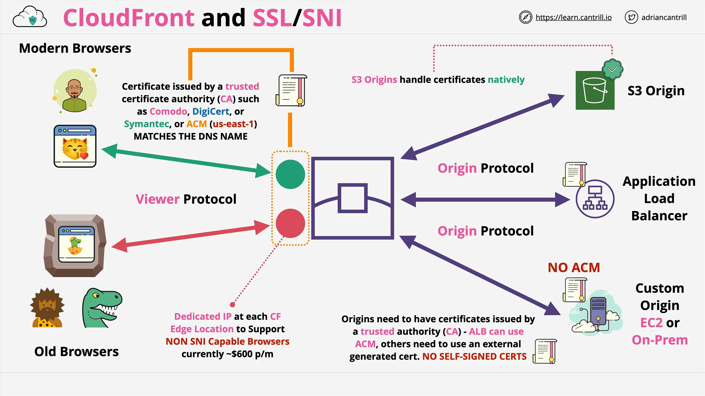

# CloudFront and SSL

## Default Domain and SSL Certificate

- Every **CloudFront distribution** comes with a **default domain name**.
  - Format: `randomstring.cloudfront.net`
  - This default domain has **HTTPS enabled by default** using CloudFront's **default SSL certificate**.
  - Certificate covers `*.cloudfront.net`.

### Custom Domain Names (Alternate Domain Names)

- You can set up **custom domains** (e.g., `cdn.example.com`) for your CloudFront distribution using:
  - **Alternate Domain Name (CNAME)** configuration.
  - DNS mapping via **Route 53** or another DNS provider.

### SSL Requirements for Custom Domains

- If you use **HTTPS** with a custom domain:
  - You must attach an **SSL certificate** matching that custom domain.
- Even if you don’t use HTTPS:
  - You still need to validate domain ownership using a certificate.

### Using AWS Certificate Manager (ACM)

- **ACM** is used to **generate or import** SSL certificates.
- **Important:**
  - CloudFront is a **global service**.
  - **All CloudFront certificates must be created/imported in `us-east-1` (N. Virginia)**.
  - This is **exam-critical knowledge**.

## HTTPS Behavior Options in CloudFront

You can configure CloudFront to handle HTTP/HTTPS traffic in three ways:

1. **Allow both HTTP and HTTPS**
2. **Redirect HTTP to HTTPS** (commonly used for better security)
3. **Only allow HTTPS** (blocks all non-secure requests)

## Viewer vs Origin Protocols

When using CloudFront, there are two SSL/TLS connections:

1. **Viewer Protocol** – Between client (browser) and CloudFront edge.
2. **Origin Protocol** – Between CloudFront and your origin server (e.g., S3, ALB, EC2).

### Key Rules for Both Connections

- **Both must use publicly trusted SSL certificates**.
- **Self-signed certificates are not allowed**.
- Intermediate certs must also be valid.

## Understanding SSL History and Server Name Indication (SNI)

### Why SSL Used to Require Dedicated IPs

- Pre-2003: Each SSL site needed a **dedicated IP address**.
- Reason:
  - **SSL handshake happens before the HTTP layer**.
  - Server didn’t know which site was requested before encryption, so it couldn’t choose the right cert.

### HTTP with Host Headers (No Encryption)

- With plain HTTP, **host headers** tell the server which site is being accessed:
  ```text
  GET / HTTP/1.1
  Host: catagram.com
  ```
  - Multiple websites could share one IP.

### TLS and Encryption

- In **TLS**, the **handshake occurs before HTTP**.
- No way for the server to know which cert to present.

### SNI (Server Name Indication)

- Introduced in **2003**.
- Allows the browser to tell the server **which domain it’s trying to access** during the handshake.
- Enables **multiple HTTPS sites on one IP**.
- But: **Older browsers don’t support SNI**.

## CloudFront SSL Modes and Costs

### SSL Modes

1. **SNI-only** (Free)
   - Supported by all modern browsers.
2. **Dedicated IP Custom SSL** ($600/month per distribution)
   - Required for compatibility with **legacy browsers**.

## Architecture of SSL in CloudFront

### Architecture Overview



### Viewer Connection (Customer → CloudFront)

- Requires:
  - **Publicly trusted certificate**
  - **Created in `us-east-1` if using ACM**
  - Must **match the custom domain name** used

### Origin Connection (CloudFront → Origin)

- Requires:
  - **Publicly trusted certificate**
  - Must **match the DNS name of the origin**
  - **No self-signed certificates**

#### Origin-specific Notes:

- **S3**:
  - Fully managed by AWS.
  - No need to attach or manage certs.
- **ALB**:
  - Can use ACM.
  - Supports managed certs.
- **Custom origin (EC2, on-prem)**:
  - Must manually install public certs.
  - ACM **cannot** manage certs on EC2/on-prem.

## Key Exam Takeaways

- **Always use ACM in `us-east-1` for CloudFront certs**.
- **Self-signed certs are never supported** in CloudFront.
- Viewer and origin protocols both require **publicly trusted certs**.
- Understand **SNI vs Dedicated IP** and **their pricing**.
- **DNS names in certs must match actual domain names** used.
