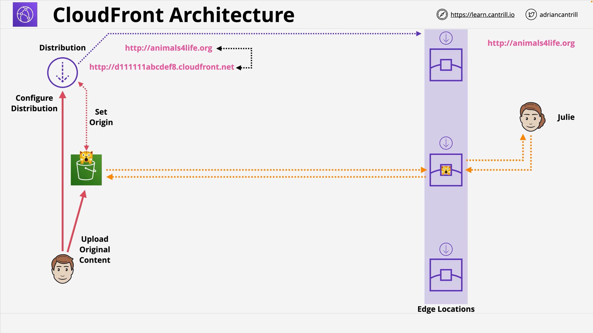

# VII. CloudFront (CF) - Adding a CDN to a static Website-PART1

## Overview

This lesson introduces you to Amazon CloudFront through a practical demo, where you improve the global delivery performance and security of a static website hosted on **Amazon S3**.

You simulate running a globally popular cat website, originally served directly from an S3 bucket in the **us-east-1** region, and enhance it using **CloudFront**, AWS's CDN (Content Delivery Network).

## Resources Used

- **CloudFormation 1-Click Deployment**  
  Deploy the initial S3-hosted static website:  
  [Launch Stack](https://console.aws.amazon.com/cloudformation/home?region=us-east-1#/stacks/create/review?templateURL=https://learn-cantrill-labs.s3.amazonaws.com/awscoursedemos/0026-aws-associate-cdn-cloudfront-and-s3/top10catsbucket.yaml&stackName=CFANDS3)

- **Static Image Example (whiskers.jpg)**  
  [Whiskers.jpg](https://learn-cantrill-labs.s3.amazonaws.com/awscoursedemos/0026-aws-associate-cdn-cloudfront-and-s3/whiskers.jpg)

## Initial Architecture: Static Website on S3



- A CloudFormation stack creates an S3 bucket named `top10cats` with:
  - Static website hosting enabled
  - Public read access (`GetObject` permission) for everyone
  - Preloaded objects, including a cat-themed HTML page
- This bucket is hosted in the **us-east-1 (N. Virginia)** region
- Accessed using a static website endpoint like:

  ```
  http://top10cats.s3-website-us-east-1.amazonaws.com
  ```

### Permissions Configuration

- **Block Public Access** is **disabled**
- **Bucket Policy** allows:

  ```json
  {
    "Effect": "Allow",
    "Principal": "*",
    "Action": "s3:GetObject",
    "Resource": "arn:aws:s3:::top10cats/*"
  }
  ```

  This allows public read access to all files.

### Static Website Configuration

- Configured via the S3 bucket properties section
- Displays the HTML page when accessed directly through the endpoint

## Problems Identified

1. **Performance Issues Globally**

   - Users far from the us-east-1 region will experience latency
   - Content is not geographically distributed

2. **No HTTPS Support**
   - Static website hosting in S3 supports only HTTP
   - Adding `https://` fails because S3 doesn’t offer HTTPS on its website endpoint

## Solution: Add CloudFront Distribution

To solve both problems, a **CloudFront Distribution** is configured.

### Steps to Set Up CloudFront

1. Navigate to the **CloudFront** service in the AWS Console
2. Click **Create Distribution**
3. Set the **origin** to the **S3 bucket** (`top10cats`)
   - **Important:** This uses the **S3 Origin**, not the static website endpoint (custom origin)

#### S3 Origin vs Custom Origin

| Type              | What You Use                                     | Capabilities                           |
| ----------------- | ------------------------------------------------ | -------------------------------------- |
| **S3 Origin**     | Choose the bucket from the dropdown              | Allows advanced CloudFront features    |
| **Custom Origin** | Use the static site URL (e.g., `s3-website-...`) | Less integration, limited capabilities |

### CloudFront Key Settings

#### 1. **Origin Path**

- Leave empty to serve content from the root of the S3 bucket

#### 2. **Viewer Protocol Policy**

Controls how users access content via CloudFront.

| Option                 | Behavior                                               |
| ---------------------- | ------------------------------------------------------ |
| HTTP and HTTPS         | Allows both                                            |
| Redirect HTTP to HTTPS | Redirects all HTTP to HTTPS (recommended for security) |
| HTTPS Only             | Enforces HTTPS only                                    |

**Selected:** `HTTP and HTTPS` for this demo (though HTTPS-only is best practice)

#### 3. **Caching**

CloudFront uses **Cache Policies** instead of manual TTL settings (new UI).

- **Cache Policy Selected:** `CachingOptimized`
- Controls how long objects are cached at edge locations
- Can override with object-specific headers

#### 4. **Origin Request Policy**

Controls what headers, cookies, and query strings CloudFront forwards to the origin.

#### 5. **Restrict Viewer Access**

(For private content — not enabled in this demo)

- Uses **Signed URLs** or **Signed Cookies**
- Requires **Trusted Key Groups** or **Trusted Signers**
- Once enabled, content is **private** and only accessible through these signed methods

#### 6. **Real-Time Logs**

- Optionally deliver logs to **Amazon Kinesis**
- Allows near-instant log analysis
- Useful for real-time traffic monitoring and troubleshooting

#### 7. **Price Class**

Choose the distribution of edge locations:

| Option                                        | Edge Locations Included            |
| --------------------------------------------- | ---------------------------------- |
| Use All Edge Locations                        | Best performance, highest cost     |
| US, Canada, Europe                            | Reduced cost, limited global reach |
| US, Canada, Europe, Asia, Middle East, Africa | Middle ground                      |

**Selected:** Use All Edge Locations

#### 8. **SSL Certificate**

- CloudFront provides a default wildcard SSL certificate:  
  `*.cloudfront.net`
- Enables **HTTPS** with encryption in transit

## Summary of Outcomes

| Feature                | Before (S3 Only)       | After (CloudFront)                       |
| ---------------------- | ---------------------- | ---------------------------------------- |
| **Global Performance** | Limited to `us-east-1` | Improved via distributed edge locations  |
| **HTTPS Support**      | Not supported          | Fully supported via SSL                  |
| **Caching**            | No edge caching        | Cached globally at edge locations        |
| **Security Options**   | Basic (public bucket)  | Can be enhanced (signed URLs, WAF, etc.) |
| **Logging**            | Not real-time          | Real-time logs via Kinesis optional      |

## Next Steps (Preview of Upcoming Lessons)

- **Secure the Origin Bucket**: Prevent users from bypassing CloudFront and accessing S3 directly
- **Use HTTPS only**
- **Configure WAF** for additional protection
- **Serve private content** using signed URLs/cookies
