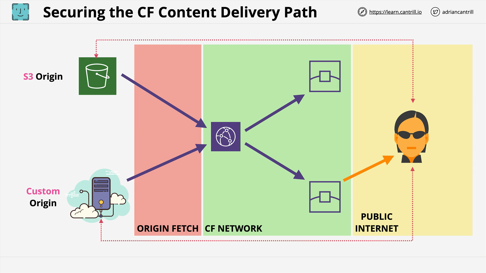
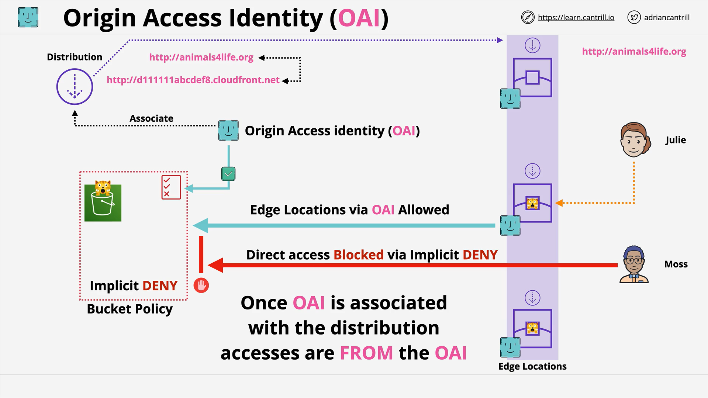
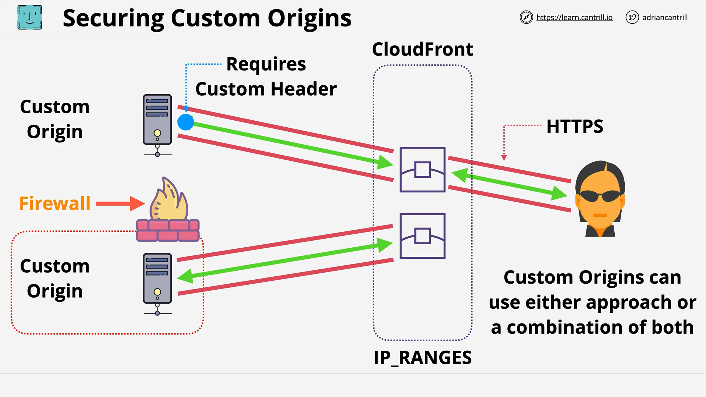

# Securing the Content Delivery Path with AWS CloudFront

## Overview

In global content delivery using Amazon CloudFront, there are three major zones involved:

1. **Origins** – where your content is stored (e.g., S3, EC2, on-prem servers).
2. **CloudFront Network** – including edge locations for caching and distribution.
3. **Public Internet and Consumers** – where end users access content.

This lesson focuses on securing the **first leg** of the delivery path: from the **origin to CloudFront**.

## Securing the Origin Fetch Side



The goal here is to ensure **only CloudFront can access your origin**, preventing end users from bypassing CloudFront to fetch content directly.

### S3 Origins vs Custom Origins

| Type              | Description                                                                                                  |
| ----------------- | ------------------------------------------------------------------------------------------------------------ |
| **S3 Origin**     | Standard S3 bucket used as origin. Can use **Origin Access Identity (OAI)**.                                 |
| **Custom Origin** | Any other origin (e.g., EC2, ALB, external services, or S3 with static web hosting). OAI **not applicable**. |

> **Note:** OAI is **only applicable** for S3 origins (not for static website hosting S3 or other types).

## Using Origin Access Identity (OAI) for S3

### What is OAI?

- A special identity type that acts like a **virtual IAM user**, created and managed by CloudFront.
- It is used to restrict **S3 bucket access** to only CloudFront.

### Key Concepts

- OAI is associated with a CloudFront distribution.
- S3 bucket policies are configured to **explicitly allow** access to the OAI.
- All other access is **implicitly denied**.

### Architecture Flow



1. Create CloudFront Distribution.
2. Use an **S3 bucket as origin**.
3. Create and attach an **OAI** to the distribution.
4. Update **S3 bucket policy**:
   - Explicitly allow OAI access.
   - Deny all other access (default deny).

### Visual Representation (Described)

- **CloudFront Distribution** connects to **S3 Origin**.
- Users (e.g., Julie and Moss) send requests via CloudFront.
- Direct access from users is blocked because only the OAI is allowed in the bucket policy.

### Example Bucket Policy for OAI

```json
{
  "Version": "2012-10-17",
  "Statement": [
    {
      "Effect": "Allow",
      "Principal": {
        "AWS": "arn:aws:iam::cloudfront:user/CloudFront Origin Access Identity EXAMPLE"
      },
      "Action": "s3:GetObject",
      "Resource": "arn:aws:s3:::your-bucket-name/*"
    }
  ]
}
```

#### Explanation:

- `Principal` is the OAI.
- `s3:GetObject` is the read permission.
- Access is granted only to objects inside the bucket.
- No other users or roles are allowed, hence securing the bucket from direct access.

### Best Practice

Use **one OAI per CloudFront distribution** for better manageability.

## Securing Custom Origins (Non-S3)



Since OAI doesn't work with custom origins, use the following methods:

### Method 1: Custom Headers

1. Configure CloudFront to add **custom headers** to origin requests.
2. Origin server validates incoming requests by checking the custom header.
3. If the header is missing, the request is **rejected**.

#### Benefits

- Secures requests over **HTTPS**.
- Ensures only CloudFront requests are accepted.

#### Example (Conceptual)

```plaintext
CloudFront --> Origin
Header: X-Custom-Header: mySecretValue
```

- Edge locations inject the secret header.
- Origin verifies the presence and correctness of this header.

### Method 2: IP Whitelisting

1. AWS publishes CloudFront **IP ranges**.
2. Configure your firewall to **allow only CloudFront IPs**.
3. All other traffic is denied.

#### Benefits

- Traditional security approach.
- Can be used alongside custom headers.

## Combined Approach

For maximum security:

- Use **OAI** for S3 origins.
- Use **Custom Headers + IP Whitelisting** for Custom origins.

This ensures **end-to-end protection** of your content delivery path from origin to CloudFront.
