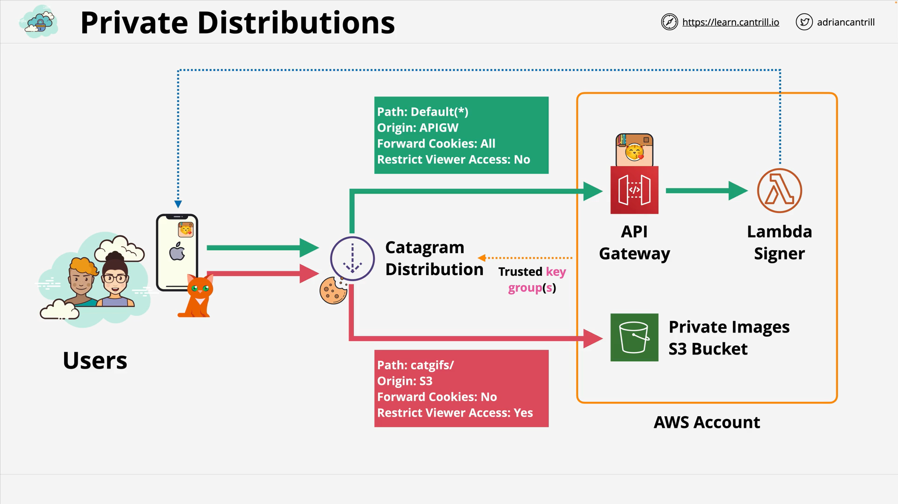

# CloudFront Private Content Delivery via Behaviors

This section covers how to **securely deliver private content** through **CloudFront** using **behaviors**, including an explanation of **signed URLs**, **signed cookies**, and how to control access using **signers**, **key groups**, and **origin access identities** (OAI).

## CloudFront Security Modes

CloudFront can operate in **two modes**:

- **Public (default)**:  
  All content is accessible to any user.

- **Private**:  
  Requests must include a **signed URL** or a **signed cookie**, or they will be **denied**.

> Distributions begin with one behavior. With multiple behaviors, you can make parts of the application public and others private. This can redirect unauthorized requests to public pages, such as a login screen.

## Signers: Who Can Create Signed URLs/Cookies

To configure private access, CloudFront uses a **signer**—an entity authorized to generate signed URLs or cookies.

There are two methods:

### 1. Legacy Method – _Trusted Signer_

- Requires a **CloudFront Key** created by the **account root user**.
- This key is tied to the **AWS account** (not a specific identity).
- The account becomes a **trusted signer** on the distribution.

> **Exam Tip**: Recognize the term "trusted signer" as referring to the legacy method.

### 2. Modern Method – _Trusted Key Groups_ (Preferred)

- Define **key groups** that include **public keys**.
- Can be managed flexibly via the **CloudFront API**.
- Avoids the need for root user management.
- Allows higher number of public keys and better scalability.

> Use **trusted key groups** for all **new deployments**.

## Signed URLs vs. Signed Cookies

| Feature          | Signed URL                            | Signed Cookie                           |
| ---------------- | ------------------------------------- | --------------------------------------- |
| Scope            | Grants access to **one object only**  | Grants access to **multiple objects**   |
| Use Case         | If client **doesn't support cookies** | To give access to **file groups/types** |
| Application URLs | URL must be **custom/signed**         | URLs remain **unchanged** (cookie sent) |

## Example Use Case Architecture

### Scenario

- **Application**: Categoram (web + iPhone app)
- **Sensitive Content**: Private cat GIFs
- **Backend**: API Gateway (origin), Lambda, and S3

### Flow

1. **CloudFront distribution** has:

   - A **default public behavior** (API Gateway origin).
   - A **private behavior** (S3 origin with cat images).

2. App uses **ID federation** (e.g., Google, Twitter) to log in.

3. The user accesses an image request:

   - Lambda checks access rights.
   - Generates a **signed cookie** if authorized.
   - Returns cookie + access URLs to the app.

4. App includes cookie in subsequent requests.

5. CloudFront verifies the cookie:

   - If valid, fetches content from the **S3 origin**.

6. S3 bucket is locked down using an **Origin Access Identity (OAI)**:
   - Only CloudFront (via OAI) can access it.
   - Prevents direct bypass of CloudFront.

## Best Practices Summary

- Use **multiple behaviors** to separate public/private content.
- Prefer **trusted key groups** over **trusted signers**.
- Choose **signed URLs** for single-file, cookie-less access.
- Choose **signed cookies** for groups of files or maintaining clean URLs.
- Secure origins (especially S3) using **Origin Access Identities (OAI)**.

Let me know if you'd like me to turn this into a GitHub `README.md` file or want the next lesson summarized too.
