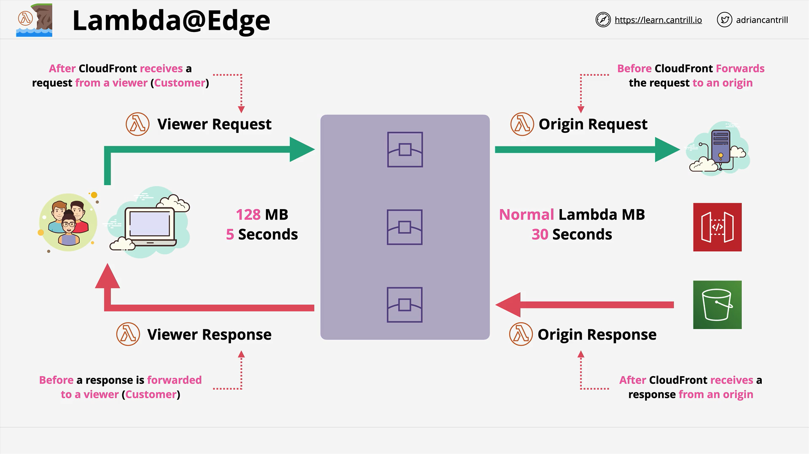

# CloudFront Lambda@Edge

## Introduction

Lambda@Edge is a feature of CloudFront that allows running lightweight Lambda functions at CloudFront edge locations. These functions can modify traffic between viewers and origins in various ways, providing flexibility and customization options without modifying the CloudFront distribution itself.

## Architecture



Lambda@Edge operates within the traditional CloudFront architecture, consisting of:

- Customers/viewers on the left
- CloudFront edge locations in the middle
- Origins (S3, custom servers, etc.) on the right

The communication flow consists of four key components where Lambda functions can be inserted:

1. **Viewer Request**: Connection between the customer and the edge location
2. **Origin Request**: Connection between the edge location and the origin
3. **Origin Response**: Connection between the origin and the CloudFront edge
4. **Viewer Response**: Connection between the edge location and the customer

## Function Limitations and Constraints

### Runtime Limitations

- Only Node.js and Python runtimes are supported
- No access to VPC-based resources (functions run in AWS public zone)
- Lambda layers are not supported

### Resource Limitations

- **Viewer Side**: 128MB memory limit, 5-second function timeout
- **Origin Side**: Standard Lambda memory limits, 30-second function timeout

## Common Use Cases

### A/B Testing

- Function runs on viewer request
- Modifies request URL based on cookie values or random chance
- Presents different versions of content without creating redirects or changing URLs

#### Python Implementation Example

```python
import json
import random

def lambda_handler(event, context):
    request = event['Records'][0]['cf']['request']
    headers = request['headers']

    if request['uri'] != '/experiment-pixel.jpg':
        # Not an A/B Test
        return request

    cookieExperimentA, cookieExperimentB = 'X-Experiment-Name=A', 'X-Experiment-Name=B'
    pathExperimentA, pathExperimentB = '/experiment-group/control-pixel.jpg', '/experiment-group/treatment-pixel.jpg'

    experimentUri = ""

    for cookie in headers.get('cookie', []):
        if cookieExperimentA in cookie['value']:
            print("Experiment A cookie found")
            experimentUri = pathExperimentA
            break
        elif cookieExperimentB in cookie['value']:
            print("Experiment B cookie found")
            experimentUri = pathExperimentB
            break

    if not experimentUri:
        print("Experiment cookie has not been found. Throwing dice...")
        if random.random() < 0.75:
            experimentUri = pathExperimentA
        else:
            experimentUri = pathExperimentB

    request['uri'] = experimentUri
    print(f"Request uri set to {experimentUri}")
    return request
```

This code:

1. Checks if the requested URI is the experiment target
2. Looks for experiment cookies to determine which version to show
3. If no cookies found, makes a random selection with weighted probability (75% A, 25% B)
4. Changes the URI to either control or treatment path

### Response Header Override Example

```python
import json

def lambda_handler(event, context):
    response = event["Records"][0]["cf"]["response"]
    headers = response["headers"]

    headerNameSrc = "X-Amz-Meta-Last-Modified"
    headerNameDst = "Last-Modified"

    if headers.get(headerNameSrc.lower(), None):
        headers[headerNameDst.lower()] = [headers[headerNameSrc.lower()][0]]
        print(f"Response header {headerNameDst.lower()} was set to {headers[headerNameSrc.lower()][0]}")

    return response
```

This code copies a value from one header (X-Amz-Meta-Last-Modified) to a standard header (Last-Modified), which can be useful for carrying metadata from S3 to standard HTTP headers.

### Serving Static Content from Edge

```python
import json

CONTENT = """
<\!DOCTYPE html>
<html lang="en">
<head>
    <meta charset="utf-8">
    <title>Simple Lambda@Edge Static Content Response</title>
</head>
<body>
    <p>Hello from Lambda@Edge!</p>
</body>
</html>
"""

def lambda_handler(event, context):
    # Generate HTTP OK response using 200 status code with HTML body.
    response = {
        'status': '200',
        'statusDescription': 'OK',
        'headers': {
            'cache-control': [
                {
                    'key': 'Cache-Control',
                    'value': 'max-age=100'
                }
            ],
            "content-type": [
                {
                    'key': 'Content-Type',
                    'value': 'text/html'
                }
            ]
        },
        'body': CONTENT
    }
    return response
```

This code directly serves static HTML content from the edge without contacting the origin, reducing latency and origin load.

### HTTP Redirect Generation

```python
def lambda_handler(event, context):
    # Generate HTTP redirect response with 302 status code and Location header.
    response = {
        'status': '302',
        'statusDescription': 'Found',
        'headers': {
            'location': [{
                'key': 'Location',
                'value': 'https://docs.aws.amazon.com/lambda/latest/dg/lambda-edge.html'
            }]
        }
    }
    return response
```

This function generates a redirect response that sends users to another URL.

## Query String Manipulation

### Adding a Header Based on Query Parameters

```python
from urllib.parse import parse_qs, urlencode

def lambda_handler(event, context):
    request = event['Records'][0]['cf']['request']

    # Parse request querystring to get dictionary/json
    params = {k : v[0] for k, v in parse_qs(request['querystring']).items()}

    # Move auth param from querystring to headers
    headerName = 'Auth-Header'
    request['headers'][headerName.lower()] = [{'key': headerName, 'value': params['auth']}]
    del params['auth']

    # Update request querystring
    request['querystring'] = urlencode(params)

    return request
```

This function:

1. Extracts key-value pairs from the query string
2. Takes a parameter named "auth" and moves it to a header
3. Updates the query string without the auth parameter

### Normalizing Query String Parameters

```python
from urllib.parse import parse_qs, urlencode

def lambda_handler(event, context):
    request = event['Records'][0]['cf']['request']
    print("Query string: ", request["querystring"])

    # Parse request query string to get js object
    params = {k : v[0] for k, v in parse_qs(request['querystring'].lower()).items()}

    # Sort param keys
    sortedParams = sorted(params.items(), key=lambda x: x[0])

    # Update request querystring with normalized
    request['querystring'] = urlencode(sortedParams)

    return request
```

This function improves cache hit ratios by:

1. Converting all query parameters to lowercase
2. Sorting parameters alphabetically
3. Ensuring consistent parameter ordering

### Redirecting Unauthenticated Users

```python
import urllib

def parseCookies(headers):
    parsedCookie = {}
    if headers.get('cookie'):
        for cookie in headers['cookie'][0]['value'].split(';'):
            if cookie:
                parts = cookie.split('=')
                parsedCookie[parts[0].strip()] = parts[1].strip()
    return parsedCookie

def lambda_handler(event, context):
    request = event['Records'][0]['cf']['request']
    headers = request['headers']

    # Check for session-id in cookie, if present, then proceed with request
    parsedCookies = parseCookies(headers)

    if parsedCookies and parsedCookies['session-id']:
        return request

    # URI encode the original request to be sent as redirect_url in query params
    redirectUrl = "https://%s%s?%s" % (headers['host'][0]['value'], request['uri'], request['querystring'])
    encodedRedirectUrl = urllib.parse.quote_plus(redirectUrl.encode('utf-8'))

    response = {
        'status': '302',
        'statusDescription': 'Found',
        'headers': {
            'location': [{
                'key': 'Location',
                'value': 'https://www.example.com/signin?redirect_url=%s' % encodedRedirectUrl
            }]
        }
    }
    return response
```

This function:

1. Checks for a "session-id" cookie
2. If found, allows the request to proceed normally
3. If not found, redirects the user to a sign-in page
4. Includes the original URL as a parameter for post-login redirect

## Geographic and Device-Based Content Personalization

### Country-Specific Redirects

```python
# This is an origin request function
def lambda_handler(event, context):
    request = event['Records'][0]['cf']['request']
    headers = request['headers']

    url = 'https://example.com/'
    viewerCountry = headers.get('cloudfront-viewer-country')
    if viewerCountry:
        countryCode = viewerCountry[0]['value']
        if countryCode == 'TW':
            url = 'https://tw.example.com/'
        elif countryCode == 'US':
            url = 'https://us.example.com/'

    response = {
        'status': '302',
        'statusDescription': 'Found',
        'headers': {
            'location': [{
                'key': 'Location',
                'value': url
            }]
        }
    }

    return response
```

This function:

1. Reads the CloudFront-Viewer-Country header
2. Redirects to country-specific domains based on the country code
3. Falls back to a default URL if no country match is found

### Device-Type-Based Content Delivery

```python
# This is an origin request function
def lambda_handler(event, context):
    request = event['Records'][0]['cf']['request']
    headers = request['headers']

    desktopPath = '/desktop'
    mobilePath = '/mobile'
    tabletPath = '/tablet'
    smarttvPath = '/smarttv'

    if 'cloudfront-is-desktop-viewer' in headers and headers['cloudfront-is-desktop-viewer'][0]['value'] == 'true':
        request['uri'] = desktopPath + request['uri']
    elif 'cloudfront-is-mobile-viewer' in headers and headers['cloudfront-is-mobile-viewer'][0]['value'] == 'true':
        request['uri'] = mobilePath + request['uri']
    elif 'cloudfront-is-tablet-viewer' in headers and headers['cloudfront-is-tablet-viewer'][0]['value'] == 'true':
        request['uri'] = tabletPath + request['uri']
    elif 'cloudfront-is-smarttv-viewer' in headers and headers['cloudfront-is-smarttv-viewer'][0]['value'] == 'true':
        request['uri'] = smarttvPath + request['uri']

    print("Request uri set to %s" % request['uri'])

    return request
```

This function:

1. Checks CloudFront viewer device headers
2. Modifies the request URI to include a device-specific path prefix
3. Allows serving different content for desktop, mobile, tablet, and smart TV viewers

## Dynamic Origin Selection

### Switching to S3 Origin Based on Query Parameter

```python
from urllib.parse import parse_qs

def lambda_handler(event, context):
    request = event['Records'][0]['cf']['request']
    '''
    Reads query string to check if S3 origin should be used, and
    if true, sets S3 origin properties
    '''
    params = {k: v[0] for k, v in parse_qs(request['querystring']).items()}
    if params.get('useS3Origin') == 'true':
        s3DomainName = 'amzn-s3-demo-bucket.s3.amazonaws.com'

        # Set S3 origin fields
        request['origin'] = {
            's3': {
                'domainName': s3DomainName,
                'region': '',
                'authMethod': 'none',
                'path': '',
                'customHeaders': {}
            }
        }
        request['headers']['host'] = [{'key': 'host', 'value': s3DomainName}]
    return request
```

This function:

1. Checks if the query string contains useS3Origin=true
2. If true, changes the origin to an S3 bucket
3. Updates the host header to match the S3 domain name

### Regional S3 Bucket Selection Based on Viewer Country

```python
def lambda_handler(event, context):
    request = event['Records'][0]['cf']['request']

    countryToRegion = {
        'DE': 'eu-central-1',
        'IE': 'eu-west-1',
        'GB': 'eu-west-2',
        'FR': 'eu-west-3',
        'JP': 'ap-northeast-1',
        'IN': 'ap-south-1'
    }

    viewerCountry = request['headers'].get('cloudfront-viewer-country')
    if viewerCountry:
        countryCode = viewerCountry[0]['value']
        region = countryToRegion.get(countryCode)

        # If the viewer's country in not in the list you specify, the request
        # goes to the default S3 bucket you've configured
        if region:
            '''
            If you've set up OAI, the bucket policy in the destination bucket
            should allow the OAI GetObject operation, as configured by default
            for an S3 origin with OAI. Another requirement with OAI is to provide
            the Region so it can be used for the SIGV4 signature. Otherwise, the
            Region is not required.
            '''
            request['origin']['s3']['region'] = region
            domainName = 'amzn-s3-demo-bucket-in-{0}.s3.{0}.amazonaws.com'.format(region)
            request['origin']['s3']['domainName'] = domainName
            request['headers']['host'] = [{'key': 'host', 'value': domainName}]

    return request
```

This function:

1. Maps viewer countries to AWS regions
2. Changes the S3 bucket to a region-specific one based on viewer location
3. Updates the region and domain name in the origin configuration
4. Falls back to the default bucket if no country match is found

### Gradual Traffic Migration Between S3 Buckets

```python
import math
import random

def getRandomInt(min, max):
    # Random number is inclusive of min and max
    return math.floor(random.random() * (max - min + 1)) + min

def lambda_handler(event, context):
    request = event['Records'][0]['cf']['request']
    BLUE_TRAFFIC_PERCENTAGE = 80

    randomNumber = getRandomInt(1, 100)

    if randomNumber <= BLUE_TRAFFIC_PERCENTAGE:
        domainName = 'blue-bucket.s3.amazonaws.com'
        request['origin']['s3']['domainName'] = domainName
        request['headers']['host'] = [{'key': 'host', 'value': domainName}]

    return request
```

This function:

1. Defines a percentage for traffic to be sent to a new bucket (80%)
2. Generates a random number between 1-100
3. If the number is within the percentage threshold, routes to the new bucket
4. Otherwise, lets the request continue to the default bucket

## Error Handling

### Changing Error Status to 200 with Custom Content

```python
def lambda_handler(event, context):
    response = event['Records'][0]['cf']['response']

    if int(response['status']) >= 400 and int(response['status']) <= 599:
        response['status'] = 200
        response['statusDescription'] = 'OK'
        response['body'] = 'Body generation example'
    return response
```

This function:

1. Intercepts any 4xx or 5xx error response from the origin
2. Changes the status code to 200 OK
3. Provides a custom body response

### Redirecting on Error

```python
def lambda_handler(event, context):
    response = event['Records'][0]['cf']['response']
    request = event['Records'][0]['cf']['request']

    if int(response['status']) >= 400 and int(response['status']) <= 599:
        redirect_path = '/plan-b/path?%s' % request['querystring']

        response['status'] = 302
        response['statusDescription'] = 'Found'

        # Drop the body as it is not required for redirects
        response['body'] = ''
        response['headers']['location'] = [{'key': 'Location', 'value': redirect_path}]

    return response
```

This function:

1. Intercepts any 4xx or 5xx error response
2. Changes the status to 302 (redirect)
3. Sets the location header to a fallback path
4. Preserves the original query string parameters

## Form Processing

### Reading HTML Form Data

```python
import base64
from urllib.parse import parse_qs

def lambda_handler(event, context):
    request = event['Records'][0]['cf']['request']

    if request['method'] == 'POST':
        # HTTP body is always passed as base64-encoded string. Decode it
        body = base64.b64decode(request['body']['data'])

        # HTML forms send the data in query string format. Parse it
        params = {k: v[0] for k, v in parse_qs(body).items()}

        # For demonstration purposes, we only log the form fields here
        for key, value in params.items():
            print("For %s use submitted %s" % (key, value))

    return request
```

This function:

1. Checks if the request is a POST
2. Decodes the base64-encoded request body
3. Parses the form data as query string parameters
4. Logs the submitted form fields for demonstration

### Modifying Form Data

```python
import base64
from urllib.parse import parse_qs, urlencode

def lambda_handler(event, context):
    request = event['Records'][0]['cf']['request']
    if request['method'] == 'POST':
        request['body']['action'] = 'replace'
        request['body']['encoding'] = 'text'
        request['body']['data'] = getUpdatedBody(request)
    return request

def getUpdatedBody(request):
    # HTTP body is always passed as base64-encoded string. Decode it
    body = base64.b64decode(request['body']['data'])

    # HTML forms send data in query string format. Parse it
    params = {k: v[0] for k, v in parse_qs(body).items()}

    # For demonstration purposes, we're adding one more param
    params['new-param-name'] = 'new-param-value'
    return urlencode(params)
```

This function:

1. Checks if the request is a POST
2. Sets the body action to 'replace'
3. Decodes and parses the form data
4. Modifies the form data by adding a new parameter
5. Re-encodes the modified data

## Important Configuration Notes

1. For country-based functions:

   - Must configure CloudFront to cache based on CloudFront-Viewer-Country header
   - Must use origin request triggers (not viewer request) as country headers are added after viewer request

2. For accessing request bodies:

   - Must enable the "Include Body" option in the Lambda function association

3. For device-based customization:
   - Must configure CloudFront to cache based on CloudFront-Is-\*-Viewer headers

These examples demonstrate the flexibility and power of Lambda@Edge for customizing CloudFront behavior without modifying the CloudFront distribution itself.
