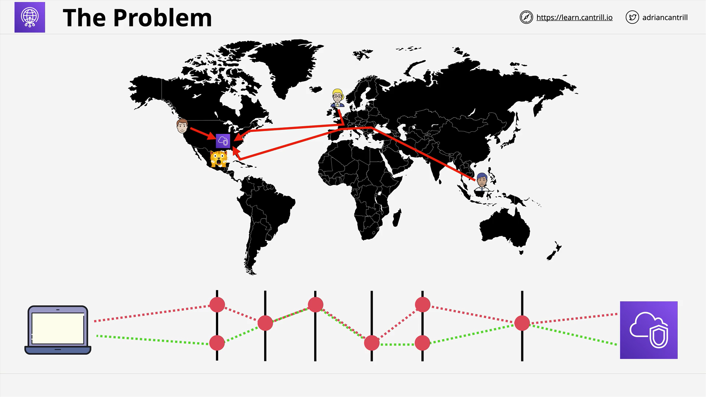

# AWS Global Accelerator

## Overview

**AWS Global Accelerator** is a networking service designed to **optimize the flow of data from users to AWS infrastructure**. It improves the **availability and performance** of your applications with global users.

## Why Is It Needed?



A common problem in global applications is **performance degradation for users located far from the application’s hosted region**. For example:

- An app hosted in the **US** may offer great experience to local users.
- However, **global users (e.g., in London or Australia)** may experience:
  - High latency
  - Inconsistent routing
  - Suboptimal user experience

This happens due to:

- The **variable nature of internet routing**
- **Multiple hops** through different routers
- Delay, packet loss, and variability in paths

## Internet Routing Limitations

When users access an application:

- Their data travels across **multiple internet hops**.
- Each hop introduces **latency and potential for failure**.
- The path is not deterministic and varies even for the same user between requests.

This is where **Global Accelerator** helps.

## Global Accelerator Architecture


Global Accelerator works similarly in **principle** to CloudFront, but it is **not the same**. The architecture is relatively simple but powerful.

### Key Components

1. **Anycast IP Addresses**:

   - When you create a Global Accelerator, AWS assigns you **two static Anycast IPs**.
   - These IPs are used by **all Global Accelerator edge locations**.

2. **Edge Locations**:

   - User traffic is routed to the **nearest edge location** based on geographical proximity.
   - This **first hop still uses the public internet**, but it's limited to the user-to-edge distance.

3. **AWS Global Network**:
   - From the edge location, the traffic is then **routed over the AWS internal global network**.
   - This ensures **lower latency, reduced variability**, and **higher reliability**.

## What Is Anycast?

- **Unicast IP**: Traditional IP addresses pointing to a single device.
- **Anycast IP**: A single IP address that **multiple devices advertise**. The router automatically sends traffic to the **closest device**.

**Example**:

```text
Anycast IPs: 1.2.3.4 and 4.3.2.1
Used by edge locations: London, Australia, etc.
```

- A user in **London** and one in **Australia** connecting to `1.2.3.4` will each be routed to **their nearest edge location**.

## Traffic Flow Summary

```text
User --> Public Internet --> Nearest Global Accelerator Edge Location
     --> AWS Global Network --> AWS Infrastructure (Region/Application)
```

- The **first segment** uses the public internet.
- The **core transfer** occurs over **AWS-managed infrastructure**, which is **optimized** for:
  - Fewer hops
  - Higher capacity
  - Consistent performance

## When to Use Global Accelerator vs CloudFront

| Feature            | **Global Accelerator**                             | **CloudFront**                             |
| ------------------ | -------------------------------------------------- | ------------------------------------------ |
| Protocols          | TCP, UDP                                           | HTTP, HTTPS                                |
| Caching            | ❌ No caching                                      | ✅ Caching supported                       |
| Use Case           | Optimizing **network traffic** for any application | **Content delivery**, web app acceleration |
| Static IPs         | ✅ Provided                                        | ❌ Not provided                            |
| Protocol Awareness | ❌ Not aware of HTTP/HTTPS                         | ✅ Fully aware                             |

### Example Scenarios

- **Global TCP/UDP optimization** → Use **Global Accelerator**
- **Web content caching** (e.g., images, videos) → Use **CloudFront**

## Exam Tips

- If the question includes:

  - **Caching**, **Web content**, **Signed URLs** → **CloudFront**
  - **Low latency**, **TCP/UDP traffic**, **Static IPs**, **Global performance** → **Global Accelerator**

- Global Accelerator **does not**:
  - Understand HTTP/HTTPS protocols
  - Cache any data
  - Modify or manipulate web content

## Final Notes

- Global Accelerator:
  - Is a **networking product**, not a content delivery product.
  - Is perfect for **real-time**, **non-HTTP applications** (e.g., gaming, VoIP).
  - Helps reduce latency by **entering AWS’s private network earlier**.
