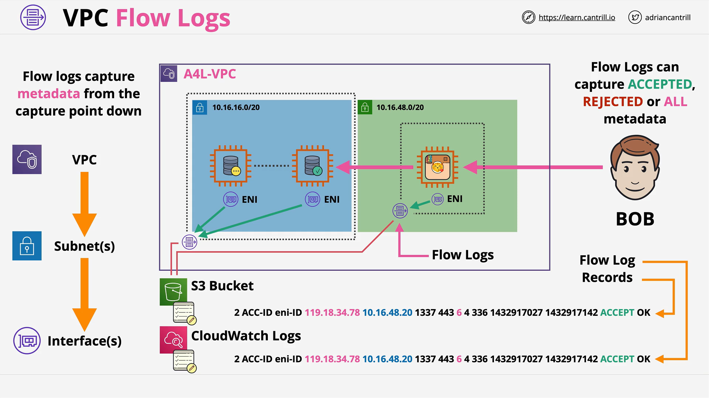
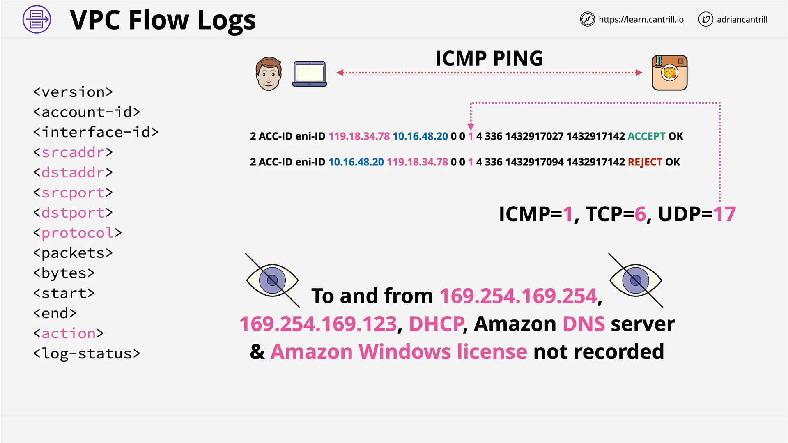

# AWS VPC Flow Logs

## Overview

**VPC Flow Logs** are a powerful AWS feature that allows you to capture information about the **IP traffic going to and from network interfaces** in your VPC. This tool provides **network visibility and operational insight** without capturing the actual content of the packets.

## Key Concepts

### What Do VPC Flow Logs Capture?

- **Only metadata**, not the content of packets.
- Metadata includes:
  - Source IP address
  - Destination IP address
  - Source and destination ports
  - Protocol
  - Packet size
  - Action (accepted or rejected)

To capture the **actual content** of network packets, you would need to use tools like **packet sniffers (e.g., tcpdump)** installed on EC2 instances.

## Use Case Example: Application Architecture

A typical architecture example:

- A user named **Bob** accesses an application.
- The application is deployed in a **public subnet**.
- The app communicates with a **database** in a **private subnet**, which consists of:
  - A **primary** DB instance
  - A **standby/replicated** DB instance

## Where Can Flow Logs Be Enabled?

Flow logs can be created at different levels within a VPC:

| Level                               | Captures Metadata From...            |
| ----------------------------------- | ------------------------------------ |
| **VPC Level**                       | All ENIs in all subnets in that VPC  |
| **Subnet Level**                    | All ENIs in that specific subnet     |
| **Elastic Network Interface (ENI)** | That specific network interface only |

> Enabling a flow log at a higher level (e.g., VPC) includes everything below it.

## Traffic Capture Options

When configuring flow logs, you can choose to capture:

- **Accepted traffic only**
- **Rejected traffic only**
- **All traffic**

## Flow Log Record Format

Each **VPC Flow Log record** is a **row** of log data with specific fields. Important fields include:

| Field        | Description                                 |
| ------------ | ------------------------------------------- |
| `srcaddr`    | Source IP address                           |
| `dstaddr`    | Destination IP address                      |
| `srcport`    | Source port                                 |
| `dstport`    | Destination port                            |
| `protocol`   | Network protocol used (e.g., TCP/ICMP)      |
| `action`     | Whether the packet was accepted or rejected |
| `log-status` | Logging status (e.g., OK, NODATA)           |

### Example Use Case

- **Bob** pings an EC2 instance.
- The instance responds.
- The flow log records the source and destination metadata.

This is useful for:

- **Testing connectivity**
- **Measuring latency**
- **Troubleshooting network issues**

## Publishing Flow Logs

### Option 1: CloudWatch Logs

#### Benefits:

- Real-time monitoring
- Powerful querying and visualization tools
- Integration with alarms and metrics

#### Structure:

- Flow log data is published to a **log group**.
- Each ENI has a **unique log stream**.
- Multiple flow logs can send to the same log group.
  - If the same ENI appears in multiple flow logs, it will be **combined into one log stream**.
  - Supports combined capture (e.g., one log for `accepted`, one for `rejected`).

#### Fields:

- `timestamp`: Start time of the connection.
- `ingestionTime`: Time when CloudWatch Logs ingested the record (later than the `timestamp`).

#### Pricing:

- Based on **data ingestion and archival** under **Vended Logs** pricing.
- See [Amazon CloudWatch Pricing](https://aws.amazon.com/cloudwatch/pricing/) → Logs → Vended Logs.

### Option 2: Amazon S3

#### Benefits:

- Long-term archival
- Easy integration with analytics services like **Athena**, **OpenSearch**, or **EMR**
- Ideal for batch processing

#### Structure:

- Flow logs are stored in **log file objects** in a specified **S3 bucket**.
- Each object contains records for **monitored ENIs**.
- Compatible with both individual and consolidated interfaces (e.g., per VPC).

#### Setup Notes:

- Ensure proper **S3 bucket permissions**.
- **SSE-KMS** encryption requires a valid **key policy**.
- Permissions must allow the **flow logs service** to write to the bucket.

#### Pricing:

- Charged as **Vended Logs** under **CloudWatch pricing**, even though published to S3.
- Visit [Amazon CloudWatch Pricing](https://aws.amazon.com/cloudwatch/pricing/) for more info.

## Summary of Practical Flow

1. **Enable flow logs** at the appropriate level (VPC, subnet, or ENI).
2. Choose where to **publish the logs** (CloudWatch or S3).
3. Decide the **type of traffic** to monitor (accepted, rejected, or all).
4. Use the **log data** for:
   - Monitoring
   - Debugging
   - Compliance/auditing
   - Performance tuning

## Practical Note

While VPC flow logs offer great insight into **network behavior**, they are **not sufficient** for detailed payload inspection. For full packet capture and content inspection, **dedicated tools** like **Wireshark**, **tcpdump**, or **third-party NIDS** (e.g., Suricata) must be used.
