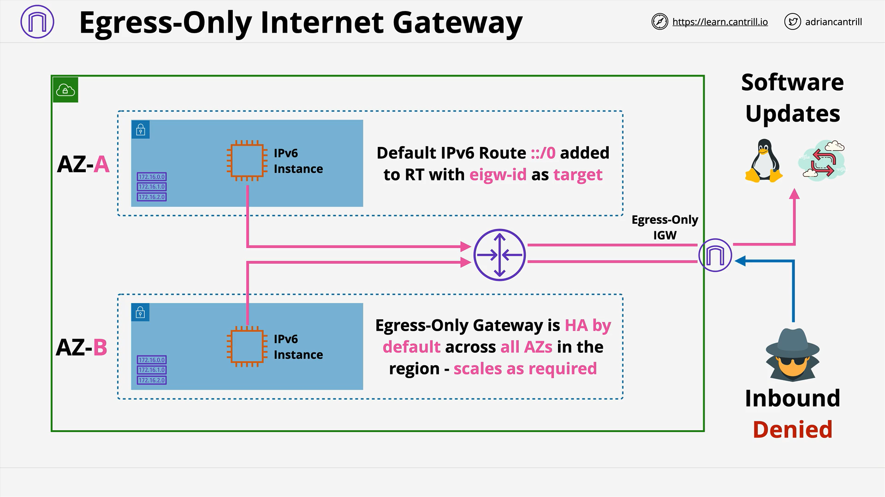

# AWS VPC: Egress-Only Internet Gateway (EOIGW)

## Overview

An **Egress-Only Internet Gateway (EOIGW)** is a specialized VPC component designed to support **IPv6 traffic**, allowing instances to **initiate outbound connections** to the internet, but **blocking all inbound traffic** that’s initiated from outside.

This component is essential because **NAT Gateways**, which serve this function for **IPv4**, **do not support IPv6**.

## Why Do We Need an Egress-Only Internet Gateway?

### Key Differences Between IPv4 and IPv6 in AWS

- **IPv4**

  - Has both **private** and **public** addresses.
  - Private instances cannot directly connect to the public internet.
  - Public instances with a public IP are routable and can send/receive traffic from the internet.
  - To provide outbound internet access to private instances, a **NAT Gateway** is used.

- **IPv6**
  - All IPv6 addresses in AWS are **publicly routable by default**.
  - There’s **no concept of private IPv6 addresses** like in IPv4.
  - As a result, **NAT Gateways do not work with IPv6**, creating a gap in outbound-only access.

## What is an Egress-Only Internet Gateway?

An **EOIGW** is a gateway that:

- **Allows outbound traffic only** from IPv6-enabled instances to the internet or AWS services.
- **Blocks any inbound connections** initiated from the internet.
- Effectively **emulates NAT-like behavior** for IPv6 without allowing unsolicited access from outside.

## Architecture and Behavior



### Typical Architecture

- **Two Subnets** across **two Availability Zones (AZs)**.
- Each subnet contains **IPv6-enabled EC2 instances**.
- An **EOIGW** is attached to the VPC.

### Key Points

- EOIGW is **highly available** and **scales automatically** like a normal Internet Gateway.
- From an architectural standpoint, EOIGW is **identical** to a standard Internet Gateway, but with **restricted functionality** (outbound-only).

## Routing Configuration

To make use of the EOIGW, you must:

1. **Create and attach the EOIGW** to the VPC.
2. **Update subnet route tables** to direct IPv6 traffic:

```plaintext
Destination: ::/0
Target: egress-only internet gateway (eoigw-xxxxxxxx)
```

> `::/0` is the **default IPv6 route**, equivalent to `0.0.0.0/0` in IPv4.

### Traffic Flow Example

- **Outbound:** IPv6 traffic from EC2 → VPC Router → EOIGW → Internet (e.g., software update server).
- **Inbound Response:** The return traffic from that destination is allowed because EOIGW is **stateful**.
- **Unsolicited Inbound:** Direct connection attempts from the internet will **fail**—they are **not permitted** through the EOIGW.

## Visual Summary of Behavior

| Feature                          | Internet Gateway (IGW) | Egress-Only Internet Gateway (EOIGW) |
| -------------------------------- | ---------------------- | ------------------------------------ |
| IPv6 Support                     | Yes                    | Yes                                  |
| Allows Outbound IPv6 Connections | Yes                    | Yes                                  |
| Allows Inbound IPv6 Connections  | Yes                    | **No**                               |
| Supports IPv4 NAT                | No                     | No                                   |
| Stateful                         | Yes                    | Yes                                  |

## When Should You Use EOIGW?

Use an **EOIGW** when:

- You have **IPv6-enabled instances**.
- You **only want them to initiate traffic** (e.g., downloading updates, calling APIs).
- You **do not want those instances to be exposed** to inbound IPv6 connections.

## Summary

- EOIGW acts like a **NAT Gateway** for **IPv6**, but it is its own construct.
- It’s crucial for ensuring **outbound-only** communication for public IPv6-enabled instances.
- Architecturally identical to an IGW, but with **connection restrictions**.
- Best used in environments where **security and restricted access** are priorities for IPv6 traffic.

## Next Steps

You'll get a chance to **implement** this setup in a **demo lesson**. This hands-on practice will reinforce the theoretical concepts and give you experience configuring EOIGWs in a real AWS environment.
