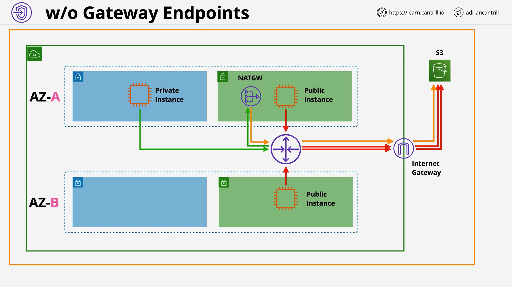
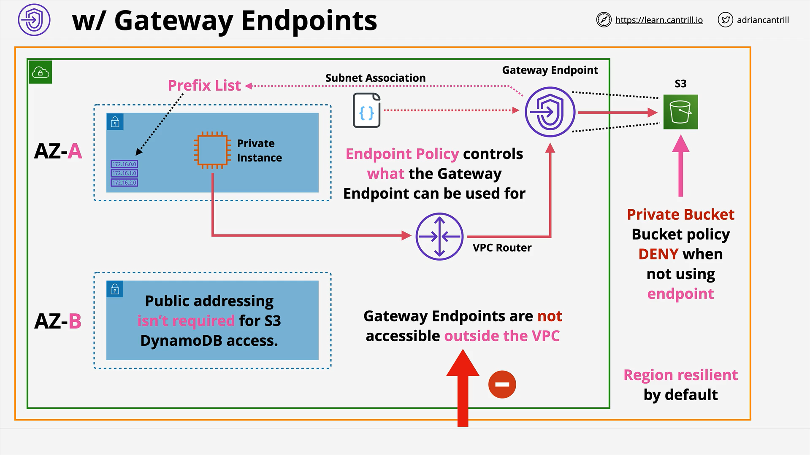

# AWS VPC Gateway Endpoints

## Overview

This lesson introduces **Gateway Endpoints** in AWS and explains how they provide **private access** from your VPC to certain AWS services—specifically **S3** and **DynamoDB**—without requiring public internet access. These endpoints help secure your architecture and are essential for compliance-heavy environments.

## What Are Gateway Endpoints?

Gateway Endpoints allow **resources within a VPC** (particularly **private subnets**) to connect to **supported AWS services** **without needing**:

- Public IP addresses
- Internet Gateway
- NAT Gateway

### Supported Services:

- **Amazon S3**
- **Amazon DynamoDB**

## Why Use Gateway Endpoints?

### Traditional Setup (Without Gateway Endpoints)



To access services like S3 from a private subnet:

- You normally need a **NAT Gateway** (for private instances)
- Or a **public IP** and an **Internet Gateway** (for public instances)

These expose your resources to the public internet.

### Gateway Endpoints Solve This:

They allow **direct private access** to the services **within AWS’s internal network**, improving security and removing the need for internet-facing infrastructure.

## How Gateway Endpoints Work

### Key Concepts:

- **Created Per Service, Per Region**  
  For example:  
  `S3 Gateway Endpoint in us-east-1`

- **Associated with Specific Subnets**  
  Adds routing rules to **subnet route tables** to send traffic destined for the service through the endpoint.

- **Uses AWS Prefix Lists**  
  A **prefix list** is a **managed list of IP address ranges** for a service (like S3). It updates automatically and is used in route tables.

## Routing with Gateway Endpoints



### Example:

1. You create a gateway endpoint for **S3** in **us-east-1**.
2. Associate it with **subnet A** in your VPC.
3. AWS updates the **route table** of subnet A:

   ```text
   Destination: com.amazonaws.us-east-1.s3
   Target: vpce-123456abcdefg (Gateway Endpoint ID)
   ```

4. Now, any traffic from subnet A to S3 is routed **privately** via the endpoint, not over the public internet.

## Availability and Resilience

- **Highly available** across **all Availability Zones** in the region.
- No need to manage or place in specific AZs.
- **Does not reside** in a subnet (unlike interface endpoints).

## Endpoint Policies

You can attach **policies** to restrict access via the endpoint:

### Example Policy Use Case:

Allow access only to:

- A specific set of **S3 buckets**
- Specific **S3 actions** (e.g., `GetObject`, `PutObject`)

This is useful in:

- **High-security environments**
- **Least-privilege architectures**

## Region Constraints

- Gateway endpoints **only work within the same region**.
- You **cannot access** a bucket in `ap-southeast-1` using a gateway endpoint from `us-east-1`.

## Security Use Cases

### 1. Private-Only VPC Access

Allows **private subnets** in a VPC to access:

- S3 buckets containing app code, configs, assets, etc.
- DynamoDB for internal data stores

All **without** public internet exposure.

### 2. Secure S3 Buckets ("Private-Only Buckets")

Prevent **leaky buckets** by:

- Applying a **bucket policy** that allows access **only** from the VPC’s **gateway endpoint**.
- This implicitly denies all other access by default.

#### Example S3 Bucket Policy Snippet:

```json
{
  "Effect": "Deny",
  "Principal": "*",
  "Action": "*",
  "Resource": "arn:aws:s3:::your-bucket-name/*",
  "Condition": {
    "StringNotEquals": {
      "aws:sourceVpce": "vpce-123456abcdefg"
    }
  }
}
```

**Explanation:**

- Denies all actions unless requests come from the specified Gateway Endpoint (`sourceVpce`).

## Architecture Comparison

### Without Gateway Endpoints:

- Private subnets → NAT Gateway → Internet Gateway → S3
- Public subnets → Direct via public IP → Internet Gateway → S3
- **Public IPs/NAT required**

### With Gateway Endpoints:

- Private subnets → Gateway Endpoint → S3
- **No public infrastructure**
- No NAT Gateway or Internet Gateway needed
- **Compliant, locked-down environments**

## Important Exam Points

- **Gateway Endpoints are highly available** by default
- **Can only be accessed from within the VPC** they are created in
- Use **Endpoint Policies** for granular access control
- Only support **S3 and DynamoDB**
- Only allow access to services **in the same region**

## Visualized Architecture (Described)

```
Without Gateway Endpoint:
[Private Subnet] -> [NAT GW] -> [Internet GW] -> [S3]

With Gateway Endpoint:
[Private Subnet] -> [Gateway Endpoint] -> [S3]
```

- **No internet gateway**
- **No NAT gateway**
- Only S3 is reachable—others are not

## Conclusion

Gateway endpoints are critical when:

- You need to **maintain privacy**
- Meet **compliance** or **security** standards
- Avoid any **public internet exposure**

They offer a simple and secure way to allow your private VPC resources to communicate with S3 and DynamoDB without needing a NAT or Internet Gateway.
