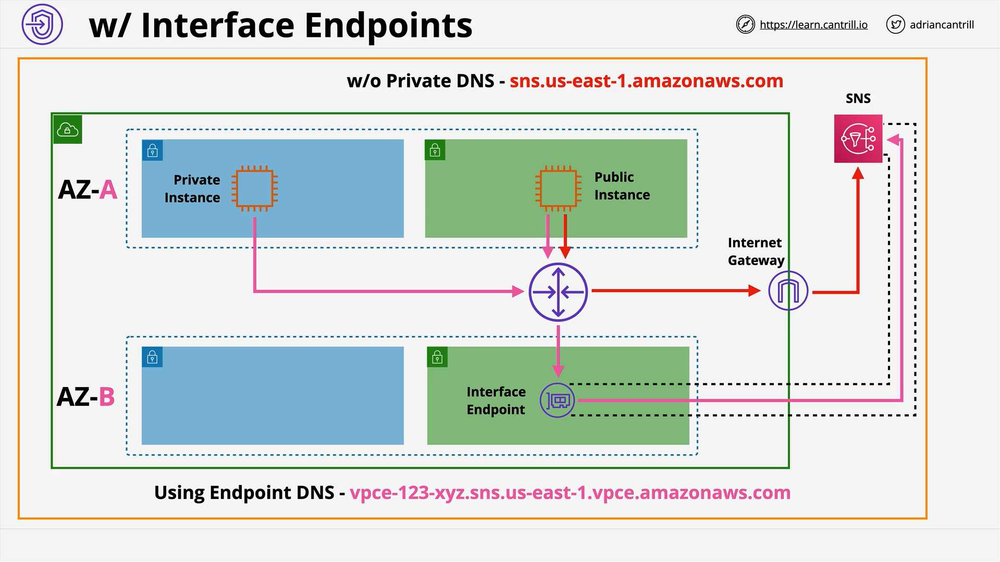
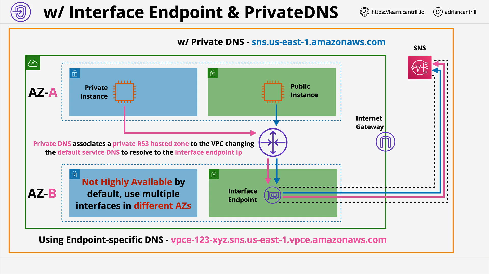

# Interface Endpoints

## Overview

This lesson focuses on **Interface Endpoints**, a type of VPC endpoint in AWS. These endpoints allow private instances within a VPC to connect to AWS services without using public IP addresses or traversing the public internet.

## Key Concepts

### 1. **Interface Endpoints vs Gateway Endpoints**

| Feature            | Interface Endpoint                             | Gateway Endpoint               |
| ------------------ | ---------------------------------------------- | ------------------------------ |
| Services Supported | Most AWS services (SNS, SQS, etc.)             | Limited (Only S3 and DynamoDB) |
| Access Method      | DNS and Private IP                             | Route Tables and Prefix Lists  |
| Availability       | Not highly available by default                | Highly available               |
| IP Protocols       | TCP, IPv4 only                                 | N/A                            |
| Security Controls  | Supports Security Groups and Endpoint Policies | Only Endpoint Policies         |

### 2. **Availability and Redundancy**

- Interface endpoints are created **inside specific subnets**, which means they exist **in one Availability Zone (AZ)**.
- **To achieve high availability**, you must:
  - Create **one endpoint per AZ** you wish to support.
  - E.g., 2 AZs → 2 Interface Endpoints.

### 3. **Security**

- **Security Groups** can be attached to interface endpoints for fine-grained control.
- **Endpoint Policies** (same as Gateway Endpoints) can also be used to restrict access to AWS services.

### 4. **Underlying Technology: AWS PrivateLink**

- Interface Endpoints use **PrivateLink**, which:
  - Injects AWS or 3rd-party services directly into your VPC.
  - Allows secure, private connectivity without needing NAT or Internet Gateway.

### 5. **Networking & DNS Behavior**

#### Key Points:

- Interface endpoints **use DNS** (not routing tables) to connect.
- When created, an interface endpoint generates **endpoint-specific DNS names**.
- These DNS names resolve to the **private IP** of the interface in the VPC.

#### Example:

```plaintext
Service: SNS
Region: us-east-1

Generated DNS:
vpce-abc123-sns.us-east-1.vpce.amazonaws.com
```

- This DNS name resolves to the **private IP of the interface endpoint** in your VPC.
- You can configure your applications to use this DNS directly.

### 6. **Types of DNS Names**

| DNS Type         | Description                                                     |
| ---------------- | --------------------------------------------------------------- |
| **Regional DNS** | Works across all AZs; good for simplicity and high availability |
| **Zonal DNS**    | Specific to a particular AZ; resolves to that AZ’s interface    |

### 7. **Private DNS Feature**

- **Private DNS** is a setting that:
  - Overrides the **default public service DNS** (e.g., `sns.us-east-1.amazonaws.com`)
  - Redirects to your **interface endpoint’s private IP**
  - Allows applications that **aren’t DNS-aware** to connect via the private path without modification

#### Behavior Without Private DNS:

- Instance resolves `sns.us-east-1.amazonaws.com` → **public IP**
- Route goes through the **Internet Gateway** → fails for private instances

#### Behavior With Private DNS:

- DNS name is overridden to resolve to **private IP**
- All traffic flows **privately via the interface endpoint**

## Architecture Comparison

### Without Interface Endpoint:

```plaintext
Private Instance → SNS Public DNS → Public IP → Internet Gateway → SNS
```

- Private instance fails if no Internet access or public IP.

### With Interface Endpoint (no private DNS):



```plaintext
Private Instance → SNS Custom DNS → Interface Endpoint IP → SNS
```

- Application must be modified to use the custom DNS name.

### With Interface Endpoint + Private DNS:



```plaintext
Private Instance → Default SNS DNS → Private IP (overridden) → Interface Endpoint → SNS
```

- No application changes required. Seamless integration.

## Summary & Exam Tips

| Concept                     | Key Details                                                         |
| --------------------------- | ------------------------------------------------------------------- |
| **Gateway Endpoints**       | Use **prefix lists** and **route tables**                           |
| **Interface Endpoints**     | Use **DNS** and **private IPs**; more flexible but need extra setup |
| **Highly Available Design** | Must deploy an endpoint in **each AZ** used by your workload        |
| **Private DNS**             | Enabled by default; overrides service DNS for seamless connectivity |
| **Security**                | Interface Endpoints allow **Security Groups** for traffic control   |

## Final Thoughts

Interface Endpoints are a flexible and secure way to access AWS services privately within a VPC. Understanding their architecture, differences from gateway endpoints, and how DNS plays a role is crucial for designing highly available and secure cloud systems.
