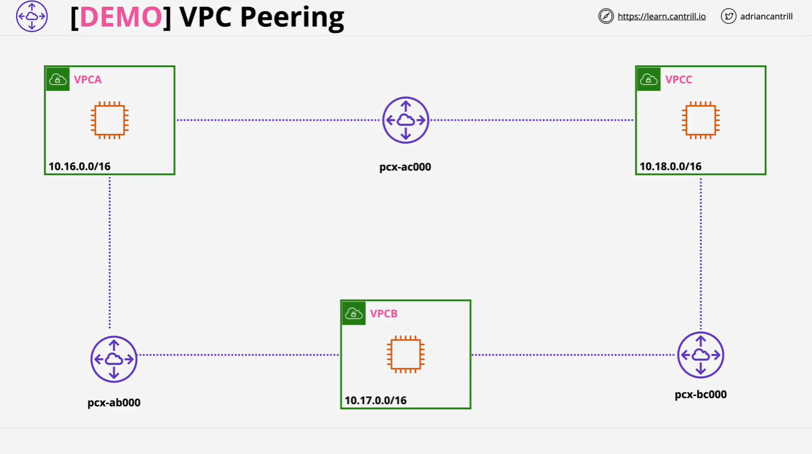

# AWS VPC Peering Between Three VPCs (A, B, C)

## Overview



This demo walks through creating and configuring VPC peering connections between three different Virtual Private Clouds (VPCs): `VPCA`, `VPCB`, and `VPCC`. The setup is automated via a CloudFormation template and involves:

- Deploying VPCs and EC2 instances.
- Establishing VPC Peering Connections.
- Configuring route tables.
- Adjusting security groups for ICMP (ping) communication.
- Demonstrating non-transitive nature of VPC Peering.

## Prerequisites

- Logged in as the **IAM user** in the **management account**.
- **Region**: `us-east-1` (Northern Virginia).
- Use the following **1-click deployment link** to apply the CloudFormation stack:

```text
https://console.aws.amazon.com/cloudformation/home?region=us-east-1#/stacks/create/review?templateURL=https://learn-cantrill-labs.s3.amazonaws.com/awscoursedemos/0023-aws-associate-vpc-vpcpeering/threevpcs.yaml&stackName=A4LPEERING
```

## CloudFormation Stack Deployment

1. Open the deployment link.
2. Scroll down, acknowledge the capabilities checkbox.
3. Click **Create Stack**.
4. Wait for the stack to reach **`CREATE_COMPLETE`**.

## Instance Verification

- Navigate to the **EC2 Console**.
- Confirm creation of three EC2 instances:
  - `EC2-VPCA` (in VPCA)
  - `EC2-VPCB` (in VPCB)
  - `EC2-VPCC` (in VPCC)

> Note: All VPCs are **private**—no public IPs. Use **Session Manager** to connect.

## Step 1: Initial Connectivity Test

Connect to **EC2-VPCA** via **Session Manager**, then attempt to ping **EC2-VPCB**:

```bash
ping <Private-IP-of-EC2-VPCB>
```

> Expected: No response — because VPCs are isolated by default.

## Step 2: VPC Peering - VPCA ↔ VPCB

### Create Peering Connection

1. Open the **VPC Console**.
2. Go to **Peering Connections**.
3. Click **Create Peering Connection**:
   - **Name tag**: `VPCA-VPCB`
   - **Requester VPC**: VPCA
   - **Accepter VPC**: VPCB (same account, same region)

### Accept Peering Request

- After creation, select the connection.
- Click **Actions > Accept Request**.

> Now the peering connection is active but not yet functional due to missing routes.

## Step 3: Configure Routing Tables

### For VPCA's Route Table

1. Go to **Route Tables**.
2. Select **VPCA's route table**.
3. Add a route:
   - **Destination**: `10.17.0.0/16` (VPCB)
   - **Target**: `Peering Connection (VPCA-VPCB)`

### For VPCB's Route Table

1. Select **VPCB's route table**.
2. Add a route:
   - **Destination**: `10.16.0.0/16` (VPCA)
   - **Target**: `Peering Connection (VPCA-VPCB)`

## Step 4: Configure Security Groups

### Security Group Behavior

- **Security Groups are stateful**.
- Outbound rules on VPCA allow all traffic.
- Must configure **inbound** rule on VPCB to allow ICMP.

### Allow ICMP from VPCA to VPCB

1. Copy **Security Group ID** of VPCA instance.
2. Edit **Inbound Rules** of VPCB's security group:
   - **Type**: `All ICMP - IPv4`
   - **Source**: VPCA Security Group ID

> Now `ping` from EC2-VPCA to EC2-VPCB should succeed.

## Step 5: Non-Transitive Peering (B ↔ C)

Even with A ↔ B and B ↔ C peering, A cannot talk to C without a direct connection.

### Create Peering: VPCB ↔ VPCC

1. **Create Peering Connection**:

   - **Name tag**: `VPCB-VPCC`
   - **Requester**: VPCB
   - **Accepter**: VPCC

2. **Accept the request**.

### Update Route Tables

#### For VPCB

- Add route to: `10.18.0.0/16` → Peering: VPCB-VPCC

#### For VPCC

- Add route to: `10.17.0.0/16` → Peering: VPCB-VPCC

## Step 6: Security Group Configuration (B ↔ C)

### Allow ICMP from VPCB to VPCC

1. Copy **Security Group ID** of VPCB.
2. Add to **VPCC’s** security group:
   - **Type**: `All ICMP - IPv4`
   - **Source**: VPCB Security Group ID

### (Optional) Allow ICMP from VPCA to VPCC

1. Copy **Security Group ID** of VPCA.
2. Add to **VPCC’s** security group:
   - **Type**: `All ICMP - IPv4`
   - **Source**: VPCA Security Group ID

## Code Explanation (CloudFormation URL)

```yaml
# Template URL:
# https://learn-cantrill-labs.s3.amazonaws.com/awscoursedemos/0023-aws-associate-vpc-vpcpeering/threevpcs.yaml
```

> This CloudFormation template automates:

- Creation of 3 VPCs.
- One EC2 instance per VPC.
- Proper subnet and route table association.
- Default security groups and necessary IAM roles for SSM access.

## Key Takeaways

- **VPC Peering** enables communication between VPCs but is **not transitive**.
- Peering must be manually configured between **each pair** of VPCs.
- Routing and security group configuration is essential.
- Use **security group referencing** in same-region peering for tighter control.
