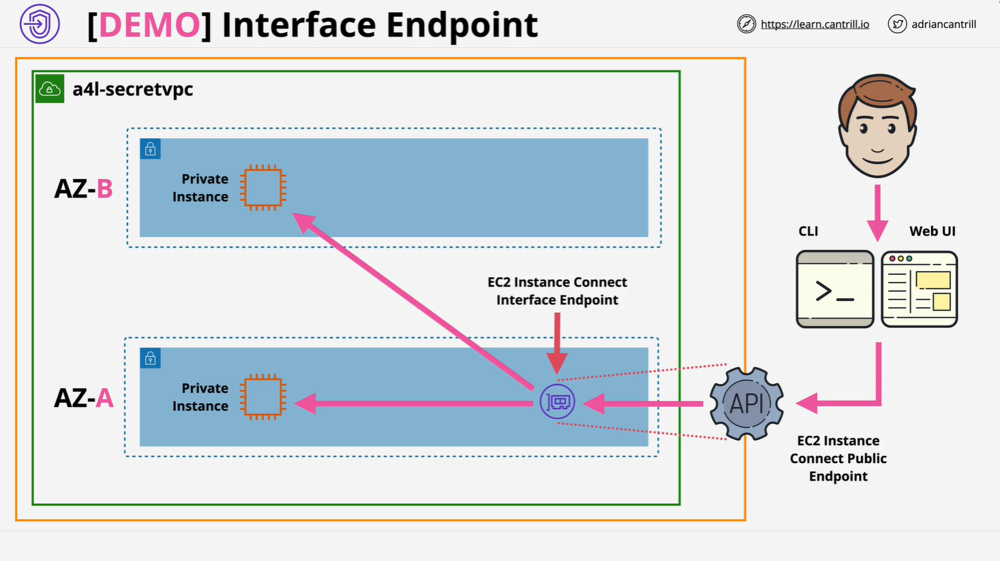

# VPC Interface Endpoints

## Overview



This is the first of a three-part demo series from Cantrill.io focusing on VPC endpoints in AWS. The lesson covers:

- Interface Endpoints (this part)
- Gateway Endpoints (next part)
- Egress-Only Internet Gateways (final part)

### Prerequisites

Before starting the demo:

- Be logged in as **IAM Admin user** in the **management AWS account**
- Ensure **Northern Virginia (us-east-1)** region is selected
- Open/download the following:
  - [One-Click Deployment CloudFormation Template](https://console.aws.amazon.com/cloudformation/home?region=us-east-1#/stacks/create/review?templateURL=https://learn-cantrill-labs.s3.amazonaws.com/awscoursedemos/0025-aws-associate-vpc-vpcendpoints/privatevpc_AL2023.yaml&stackName=A4LSECRETVPC)
  - [SuperSecret.txt](https://learn-cantrill-labs.s3.amazonaws.com/awscoursedemos/0025-aws-associate-vpc-vpcendpoints/supersecret.txt)
  - [Lesson Commands](https://learn-cantrill-labs.s3.amazonaws.com/awscoursedemos/0025-aws-associate-vpc-vpcendpoints/lesson_commands_AL2023.txt)

## Part 1: Interface Endpoints

### Goal

Set up an **Interface Endpoint** for **EC2 Instance Connect**, allowing secure SSH access to a **private EC2 instance** without a public IP address.

## Architecture Overview

### Without Interface Endpoint:

- EC2 Instance Connect requires a public IP.

### With Interface Endpoint:

- The AWS EC2 Instance Connect public endpoint connects via an **interface endpoint** to the EC2 instance inside a private VPC.
- Allows **console access** to EC2s with only **private IPs**.

## Step-by-Step Guide

### Step 1: Launch the CloudFormation Stack

Use the [One-Click CloudFormation Deployment](#prerequisites) to deploy the VPC and instance.

- VPC: **No internet gateway** (private-only)
- EC2: **No public IPv4 address**

Wait until the **stack reaches `CREATE_COMPLETE`**.

### Step 2: View the Instance

- Go to the **EC2 Console**
- Under **Instances**, locate the deployed EC2
- Note: it has **no public IP**, only a private IP

### Step 3: Attempt Connection via EC2 Instance Connect (Fails)

- Try connecting via **Instance Connect**
- It fails due to the lack of public IP

### Step 4: Create Interface Endpoint for EC2 Instance Connect

From the EC2 Connect UI:

- Select `Connect using EC2 Instance Connect Endpoint`
- Click the **link** to create a new interface endpoint

#### Create Endpoint Steps:

1. **Name**: `private-vpc-ec2-instance-connect`
2. **Service Category**: EC2 Instance Connect Endpoint
3. **VPC**: Select `A4L-SECRET-VPC`
4. **Preserve Client IP**: **Unchecked** (default)
   - This means EC2 will see the IP of the **interface endpoint**, not the client
5. **Security Group**: `A4L-secret-VPC-default-instance-sg`
6. **Subnet**: Choose a **private subnet** like `SN-app-A`
7. Click **Create Endpoint**

Wait until the status changes to **Available**.

### Step 5: Connect to the Instance

1. Return to the **EC2 Console**
2. Choose **Connect using EC2 Instance Connect Endpoint**
3. Select the **newly created endpoint**
4. Click **Connect**

You should now be connected to the EC2 instance despite it having **no public IP**.

## Internal Mechanics Explained

### How the Connection Works:

```plaintext
Your Router
   ↓
EC2 Instance Connect Public Endpoint (managed by AWS)
   ↓
VPC Interface Endpoint (your VPC)
   ↓
Private EC2 Instance
```

- Since **"Preserve Client IP"** was not selected:
  - EC2 instance sees incoming traffic from **interface endpoint's IP**

#### How to Verify:

- Inside EC2, run:

```bash
who
# or
last
# or
echo $SSH_CLIENT
```

- You’ll see the IP of the **interface endpoint**, not your personal IP.

- Go to **VPC Console > Endpoints > Network Interface**
  - Look at the **private IP** of the interface endpoint (e.g., `10.16.44.176`)
  - It matches the IP seen from within the instance

## Key Concepts Recap

| Concept                      | Details                                     |
| ---------------------------- | ------------------------------------------- |
| **Interface Endpoint**       | ENI in a subnet, powered by **PrivateLink** |
| **Used Service**             | EC2 Instance Connect                        |
| **Traffic Source (default)** | Interface Endpoint's IP                     |
| **Security Group**           | Controls access to the interface endpoint   |
| **Availability**             | One per AZ for HA (optional)                |
| **Subnet Location**          | Private Subnet (`SN-app-A`)                 |

## Next Up: Gateway Endpoints

In the next part of this series, we'll configure a **Gateway Endpoint** to enable access to **S3** from the same **private-only EC2 instance**.
