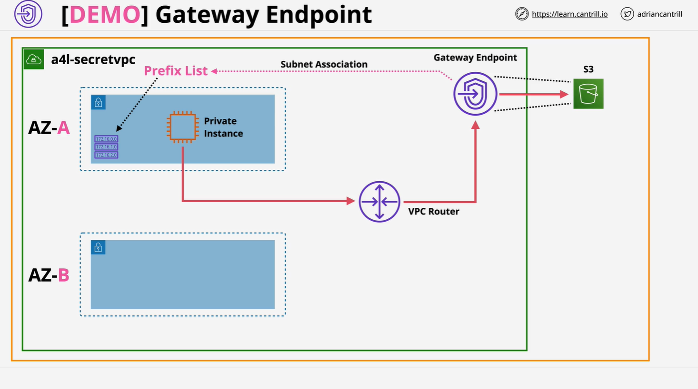

# Gateway Endpoints

## Overview

This lesson focuses on implementing and testing **S3 Gateway Endpoints** within a **private-only VPC** (no internet gateway, no NAT gateway). It demonstrates how to:

- Upload a file to an S3 bucket
- Access it from a private EC2 instance
- Configure a **gateway VPC endpoint**
- Validate S3 connectivity without public internet access

## 1. Architecture Recap



- **Private VPC** (no IGW/NAT)
- EC2 instance in private subnet
- No public IP/DNS
- S3 Gateway Endpoint allows access to AWS services like S3 **without needing internet access**

## 2. Stack Setup

### Deployment Template

Launch the environment using CloudFormation:

```bash
# 1-click deployment link:
https://console.aws.amazon.com/cloudformation/home?region=us-east-1#/stacks/create/review?templateURL=https://learn-cantrill-labs.s3.amazonaws.com/awscoursedemos/0025-aws-associate-vpc-vpcendpoints/privatevpc_AL2023.yaml&stackName=A4LSECRETVPC
```

### Upload File to S3 Bucket

**Steps:**

1. Navigate to CloudFormation > Stacks > `A4LSECRETVPC` > Resources
2. Open the S3 bucket via its **Physical ID**
3. Upload the file [supersecret.txt](https://learn-cantrill-labs.s3.amazonaws.com/awscoursedemos/0025-aws-associate-vpc-vpcendpoints/supersecret.txt)

## 3. Instance Access

### Connecting to Private EC2 Instance

Use **EC2 Instance Connect**:

- Locate `A4L-private-ec2`
- Choose **Connect > EC2 Instance Connect**
- Select the **Instance Connect Endpoint** (from previous lesson)
- Connect successfully into private EC2 (no public IP or DNS)

## 4. Verifying Lack of Internet Access

### Run Basic Network Tests

```bash
ping 1.1.1.1       # Test internet - should timeout
aws s3 ls          # List S3 buckets - should hang
```

- These commands verify that the instance cannot access internet or S3 without a gateway endpoint.

## 5. Creating the Gateway Endpoint

### Navigate to VPC Console > Endpoints > Create Endpoint

**Settings:**

- **Name**: `private-vpc-s3`
- **Service**: Search for `s3` (should be `com.amazonaws.us-east-1.s3`)
- **Type**: Gateway
- **VPC**: Select `A4L-secret-vpc`
- **Route Table**: Select the route table associated with `sn-app-a`, `sn-app-b`, `sn-app-c`

> **Important**: Gateway endpoints must be attached to route tables for subnet routing to work.

### Review and Create

After creation:

- Check **Route Tables > Routes** to verify a **Prefix List** was added.
  - e.g. `pl-xxxxxxx (com.amazonaws.us-east-1.s3) => vpce-xxxxxx`

## 6. Re-Testing S3 Access

### Validate Connection Again

```bash
aws s3 ls    # Should now list buckets
```

### Downloading File from S3

Use this command (after replacing `bucketname`):

```bash
aws s3 cp s3://<your-bucket-name>/supersecret.txt supersecret.txt
```

#### Breakdown:

```bash
aws s3 cp \
  s3://<your-bucket-name>/supersecret.txt \  # S3 URI
  supersecret.txt                            # Destination filename
```

> This copies `supersecret.txt` from the S3 bucket to your local EC2 instance.

### View File Content

```bash
ls -la                     # Confirm file exists
cat supersecret.txt        # Output: "cats are the best"
```

## 7. Lesson Commands Recap

```bash
ping 1.1.1.1
aws s3 ls
aws s3 cp s3://<bucket-name>/supersecret.txt supersecret.txt
```

## 8. Key Concepts Recap

| Concept                           | Description                                                                               |
| --------------------------------- | ----------------------------------------------------------------------------------------- |
| **Gateway Endpoint**              | Lets private resources access AWS services like S3 via internal AWS network (no internet) |
| **Prefix List**                   | Auto-added to route tables to route traffic to gateway endpoint                           |
| **EC2 Instance Connect Endpoint** | Allows connection into private-only EC2 instances                                         |
| **S3 Bucket Access**              | Achieved from private VPC via gateway endpoint after correct setup                        |

## 9. What's Next?

In the following lesson, you’ll explore working with an **Egress-only Internet Gateway** for IPv6-only access from private instances.
