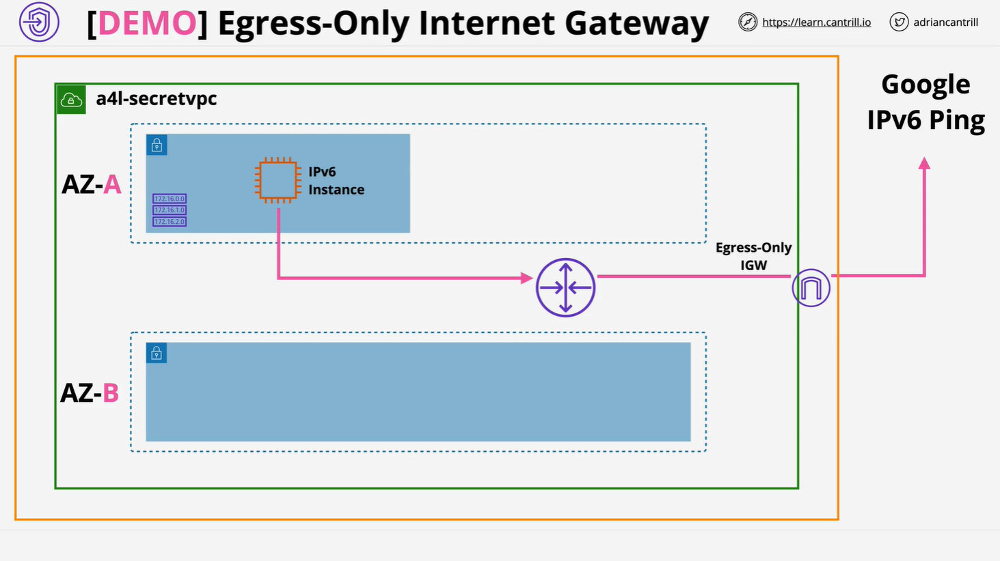

# VPC Egress-Only Internet Gateway Demo

This lesson is the final part of a multi-step lab series, focused on enabling secure **IPv6 outbound-only access** from a **private EC2 instance** using an **Egress-Only Internet Gateway (EIGW)**. The walkthrough also includes cleanup of AWS resources at the end.

## Objective



Configure a **private EC2 instance** with IPv6 addressing to communicate with the public IPv6 internet, while ensuring:

- The instance **cannot be reached** from the outside.
- Outbound-only access is allowed via **Egress-Only Internet Gateway**.
- All associated **route tables** are correctly configured.
- AWS environment is **cleaned up** at the end.

## Prerequisites

Ensure the following are completed:

- Stack deployed using CloudFormation:  
  [One-Click Deployment](https://console.aws.amazon.com/cloudformation/home?region=us-east-1#/stacks/create/review?templateURL=https://learn-cantrill-labs.s3.amazonaws.com/awscoursedemos/0025-aws-associate-vpc-vpcendpoints/privatevpc_AL2023.yaml&stackName=A4LSECRETVPC)

- Access to the **EC2 instance** in a private subnet
- Files referenced in the lesson:
  - [supersecret.txt](https://learn-cantrill-labs.s3.amazonaws.com/awscoursedemos/0025-aws-associate-vpc-vpcendpoints/supersecret.txt)
  - [lesson_commands_AL2023.txt](https://learn-cantrill-labs.s3.amazonaws.com/awscoursedemos/0025-aws-associate-vpc-vpcendpoints/lesson_commands_AL2023.txt)

## Step-by-Step Lab Guide

### 1. Test IPv6 Connectivity (Before Gateway Creation)

Run the following command on the private EC2 instance:

```bash
ping -6 ipv6.google.com
```

- This should fail, since there's **no IPv6 gateway** configured yet.

### 2. Create an Egress-Only Internet Gateway

In the AWS Console:

1. Navigate to: `VPC > Egress-only Internet Gateways`
2. Click **Create egress-only internet gateway**
   - Name: `a4l-ipv6`
   - Select VPC: `a4l-secret-vpc`
3. Click **Create**

This gateway allows **IPv6 traffic out** to the internet, but **blocks unsolicited inbound traffic**.

### 3. Update VPC Route Table

1. Go to: `VPC > Route Tables`
2. Locate the **main route table** for `a4l-secret-vpc`
3. Click on the **Routes** tab
4. Click **Edit routes**
5. Add a new route:
   - Destination: `::/0` (default for all IPv6 addresses)
   - Target: Select the **egress-only internet gateway**
6. Save the route

### 4. Re-Test IPv6 Connectivity

Run the ping again on the EC2 instance:

```bash
ping -6 ipv6.google.com
```

This time, you should receive successful responses.

**Why it works:**

- EC2 instance has an IPv6 address
- The route table now forwards traffic to the **egress-only internet gateway**
- The EIGW allows the traffic out and tracks the state
- Response traffic is allowed back in because it's **part of an existing connection**

## How It Works: Traffic Flow Overview

1. EC2 instance initiates traffic using its **IPv6 address**
2. Route table matches `::/0` and forwards the traffic
3. Egress-Only Internet Gateway **permits the outbound** flow
4. The response is allowed back only if it’s part of a **tracked stateful session**

This setup is crucial for secure IPv6 outbound access without making the instance publicly accessible.

## Cleanup Tasks

### 1. Delete VPC Endpoints

Go to: `VPC > Endpoints`  
Delete both:

- S3 private endpoint
- EC2 endpoint

### 2. Empty the S3 Bucket

Go to: `S3 > a4l-secret-vpc-[unique-id]`

1. Click **Empty**
2. Type `permanently delete` to confirm
3. This step is required to allow CloudFormation to delete the bucket later

### 3. Delete Egress-Only Internet Gateway

In the VPC console:

1. Go to: `VPC > Egress-only Internet Gateways`
2. Select the gateway you created
3. Click **Delete**
4. Confirm by typing `delete`

### 4. Delete the CloudFormation Stack

Go to: `CloudFormation`

1. Select the stack: `A4LSECRETVPC`
2. Click **Delete**
3. Confirm deletion

The stack will remove all associated resources, assuming S3 was emptied.

## Key Concepts

| Feature                      | Description                                                           |
| ---------------------------- | --------------------------------------------------------------------- |
| Egress-Only Internet Gateway | An IPv6-only gateway allowing outbound traffic while blocking inbound |
| IPv6 Default Route           | `::/0` — equivalent to `0.0.0.0/0` in IPv4, means "any IPv6 address"  |
| Route Table                  | Determines where the traffic flows from a subnet                      |
| Stateful Gateway             | EIGW allows return traffic if it’s part of an established session     |
| Secure Access                | Enables internet access without public IPs or NAT                     |

## Explanation of Important Commands

### IPv6 Ping Test

```bash
ping -6 ipv6.google.com
```

- `ping`: Sends ICMP packets to a host
- `-6`: Uses IPv6 protocol
- `ipv6.google.com`: A publicly available IPv6 domain

## Final Notes

In this demo, you have successfully:

- Configured **IPv6 outbound-only access** for a private EC2 instance
- Created and configured an **Egress-Only Internet Gateway**
- Updated **routing tables** for IPv6 traffic
- Completed a full cleanup of resources
