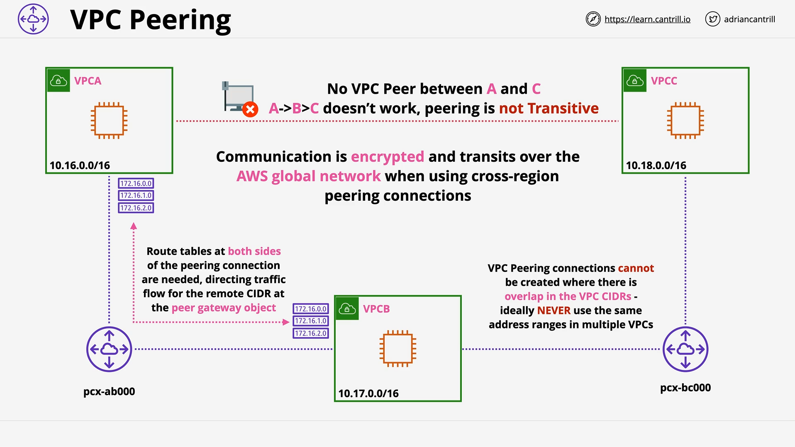

# VPC Peering

## Overview

This lesson covers the **theory and architecture** behind **VPC Peering**—a foundational networking concept in AWS. VPC Peering allows private, secure, and encrypted communication between two Virtual Private Clouds (VPCs), either in the **same AWS region** or across **different regions**, and also between **same or different AWS accounts**.

## Key Concepts

### What Is VPC Peering?

- VPC Peering is a **private, encrypted network link** between **two VPCs**.
- It connects **only two VPCs** at a time.
- It is **not transitive**: communication cannot pass through a third VPC (e.g., A ↔ B and B ↔ C does **not** imply A ↔ C).

## Supported Scenarios

| Feature               | Supported?            |
| --------------------- | --------------------- |
| Same Region Peering   | ✅                    |
| Cross-Region Peering  | ✅ (with some limits) |
| Same Account Peering  | ✅                    |
| Cross-Account Peering | ✅                    |

## DNS Resolution Options

When creating a VPC peering connection, you can enable an option that allows **public hostnames** of services in the paired VPC to resolve to their **private IP addresses**. This means:

- You can use the same DNS hostname.
- The public DNS resolves to the private IP if peered.
- Useful for inter-VPC service discovery without needing public IPs.

## Security Group Behavior

- **Same Region Peering**: You can reference **Security Group IDs** from the other VPC.
- **Cross Region Peering**: You must use **IP addresses or CIDR ranges**.
- Referencing SG IDs allows for **efficient, secure configuration**.

## VPC Peering Is Not Transitive

### Visual Scenario:

| VPC A | ↔   | VPC B | ↔   | VPC C |
| ----- | --- | ----- | --- | ----- |

- **A cannot communicate with C** unless there's a **direct VPC Peering connection** between A and C.
- You need **3 Peering Connections** for full mesh communication between A, B, and C:
  - A ↔ B
  - B ↔ C
  - A ↔ C

## Architecture and Configuration



### Example Setup

- **VPC A**: `10.16.0.0/16`
- **VPC B**: `10.17.0.0/16`
- **VPC C**: `10.18.0.0/16`

Each VPC is isolated by default.

### Steps to Enable Communication

1. **Create Peering Connection**: Between each VPC pair that needs communication.
2. **Configure Routing**:
   - Add routes in the **route tables** of each VPC.
   - Point routes for remote VPC CIDRs to the **Peering Connection object**.
3. **Update Subnet Associations**: Ensure routing tables are associated with appropriate subnets.
4. **Configure Security**:
   - Ensure **Security Groups** or **Network ACLs** allow traffic between the VPCs.

## Code Explanation (Conceptual, Not Literal)

**Route Table Configuration:**

```bash
Destination: 10.17.0.0/16   Target: pcx-123abc
```

- `Destination`: The **CIDR block** of the remote VPC.
- `Target`: The **VPC Peering Connection ID** (e.g., `pcx-123abc`).

> This tells the VPC router: "If you're trying to reach `10.17.0.0/16`, send traffic through the Peering Connection."

**Security Group Rule Example (Same Region):**

```json
{
  "Type": "ingress",
  "Protocol": "tcp",
  "PortRange": "22",
  "SourceSecurityGroupId": "sg-0abc123def456"
}
```

- Allows **SSH (port 22)** from instances in a **peered VPC’s Security Group**.

## CIDR Block Rules

- VPCs **must not** have **overlapping CIDR blocks** to create a Peering Connection.
- This is critical for **routing logic** to work without ambiguity.

## Performance and Security

- All traffic is **encrypted**.
- Cross-region peering uses **AWS Global Network**, not the public internet, giving better **latency and security**.

## Summary

- **VPC Peering** connects **two VPCs** at a time.
- Connections are **not transitive**.
- Requires configuration of:
  - **Peering Connection**
  - **Routing**
  - **Security Groups / NACLs**
- Offers secure, efficient, and private communication between VPCs.
- DNS resolution and SG referencing are **region-sensitive features**.
- Use **non-overlapping CIDRs** to ensure compatibility.
