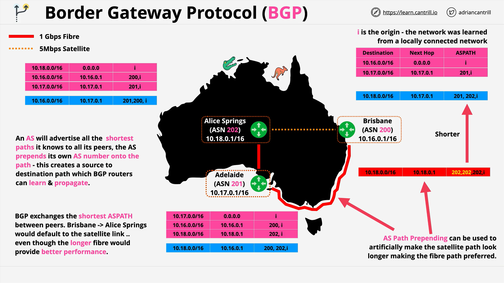

# BGP (Border Gateway Protocol)

## **Introduction to BGP**



**BGP (Border Gateway Protocol)** is a **routing protocol** responsible for determining how data flows from one network to another, particularly across different **autonomous systems (AS)**.

Although BGP is a **complex topic**, AWS Solutions Architects need a **high-level understanding** of it because services like **AWS Direct Connect** and **VPNs** utilize it.

## **Key Concepts**

### **1. Autonomous Systems (AS)**

- A network or group of routers under a **single administrative domain**.
- Seen as a "black box" by BGP—its internal topology doesn’t matter to BGP.
- Used to abstract away internal complexities and focus on **inter-network routing**.

### **2. ASN (Autonomous System Numbers)**

- Allocated by **IANA (Internet Assigned Numbers Authority)**.
- Usually **16-bit numbers** ranging from `0 to 65,535`.
- **Public ASN Range:** `0 - 64,511`
- **Private ASN Range:** `64,512 - 65,534` (Used for internal peering)

### **3. BGP Protocol Characteristics**

- Operates over **TCP (port 179)**.
- Includes **error correction and flow control**.
- **Manual configuration required** for peering relationships.
- Once peering is established, autonomous systems share **network topology**.
- BGP builds a network of **routing knowledge** among connected ASNs.

## **BGP as a Path Vector Protocol**

BGP only advertises the **best path** to a destination, not all possible paths. This is called the **AS Path**.

- **AS Path**: The list of ASNs a route passes through.
- BGP doesn't consider **speed or latency**—only **path length**.

## **IBGP vs EBGP**

- **IBGP (Internal BGP)**: Used within a single AS.
- **EBGP (External BGP)**: Used **between** different ASNs.
- In AWS, **EBGP is more relevant**, especially for hybrid cloud architectures.

## **BGP in Practice: A Network Example**

### **Topology Overview (Australia Example)**

| Location      | CIDR Range     | Router IP   | ASN |
| ------------- | -------------- | ----------- | --- |
| Brisbane      | `10.16.0.0/16` | `10.16.0.1` | 200 |
| Adelaide      | `10.17.0.0/16` | `10.17.0.1` | 201 |
| Alice Springs | `10.18.0.0/16` | `10.18.0.1` | 202 |

### **Network Links**

- **Brisbane ↔ Adelaide**: 1 Gbps Fiber
- **Adelaide ↔ Alice Springs**: 1 Gbps Fiber
- **Brisbane ↔ Alice Springs**: 5 Mbps Satellite (High latency)

## **BGP Route Table Construction**

Each AS begins with:

```text
Destination: Local network
Next Hop: 0.0.0.0 (locally connected)
AS Path: I (for internal origin)
```

### **Peering Configuration**

When peering is configured:

- Each AS shares its known network paths.
- Each **advertised route** includes the **AS number** prepended to the AS Path.
- Example:

  - **Adelaide (ASN 201)** shares with Brisbane:
    - Brisbane learns that `10.17.0.0/16` is reachable via `10.17.0.1` with AS Path `201 I`.

- Brisbane also learns from Alice Springs (ASN 202) via satellite:
  - Route to `10.18.0.0/16` via `10.18.0.1` with AS Path `202 I`.

### **Indirect Routing**

- Adelaide also learns about Alice Springs and Brisbane.
- Alice Springs learns about both Brisbane and Adelaide.
- Eventually, all three ASNs know how to route to each other.

## **Route Table Decision Logic**

### **Route Selection Example (Brisbane)**

Brisbane has two possible routes to Alice Springs:

1. **Direct satellite**:
   ```text
   Next Hop: 10.18.0.1
   AS Path: 202
   ```
2. **Indirect via Adelaide**:
   ```text
   Next Hop: 10.17.0.1
   AS Path: 201 202
   ```

**BGP chooses the shorter AS Path by default**, so it picks the **direct satellite route**.

## **AS Path Prepending (Path Manipulation)**

To **influence BGP path selection**, administrators can use **AS Path Prepending**.

### **Why Prepend?**

- The satellite link is:
  - **Slower** (5 Mbps)
  - **Higher latency**
- But it is chosen by default due to being the shortest path.

### **How Prepending Works**

At **Alice Springs**, the AS prepends extra AS numbers to make the path longer artificially:

```text
Original: 202
Prepended: 202 202 202
```

Now the path via satellite has **3 hops**, and the fiber route via Adelaide has **2 hops** (`201 202`), making it **preferred**.

## **Final Outcome**

- BGP now prefers **fiber routes** over the satellite.
- If any site goes down, BGP reroutes based on available paths.
- BGP always advertises the **shortest known path** to its peers.

## **BGP and AWS**

- BGP is **foundational** to services like **AWS Direct Connect** and **Dynamic VPNs**.
- AWS uses BGP to **exchange route information** between your on-premises networks and AWS environments.
- Understanding BGP is critical for **hybrid cloud and complex network architectures**.

## **Conclusion**

- BGP helps in building dynamic routing between autonomous systems.
- It only shares the **best (shortest AS path) route**.
- You can manipulate route preference using **AS Path Prepending**.
- **In AWS**, BGP is essential for hybrid network configurations.
