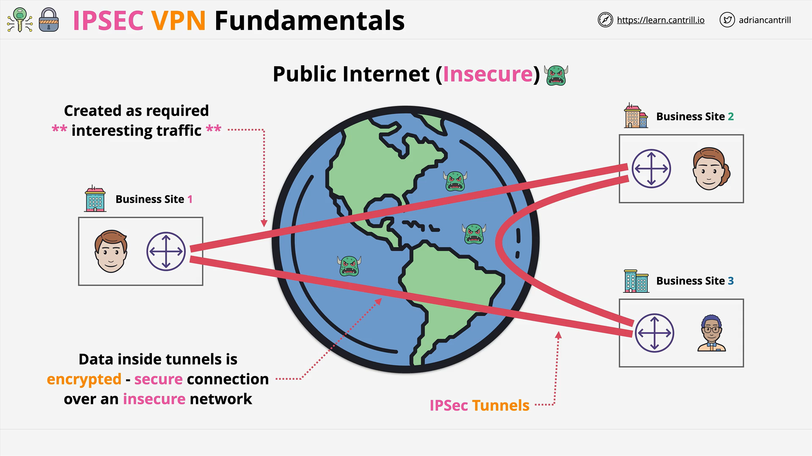
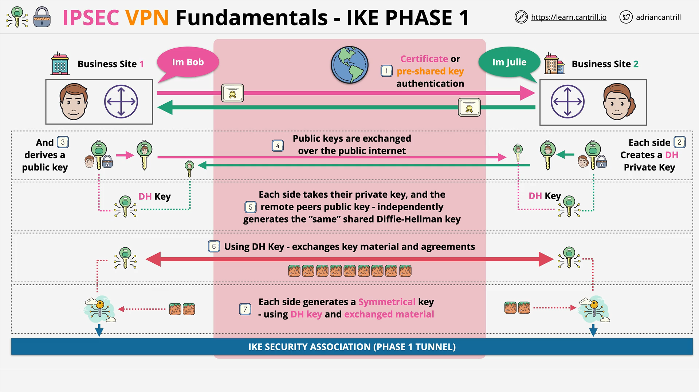
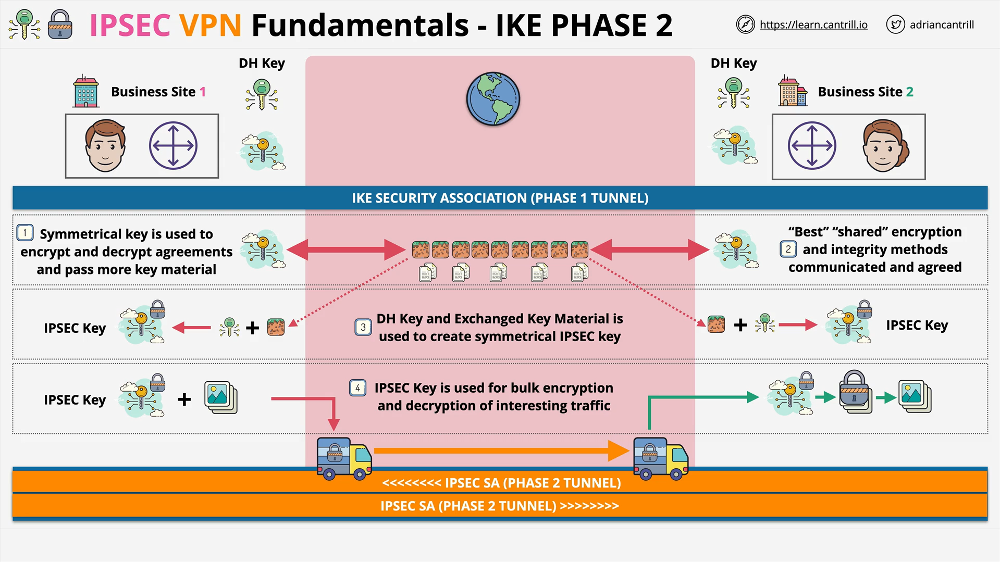
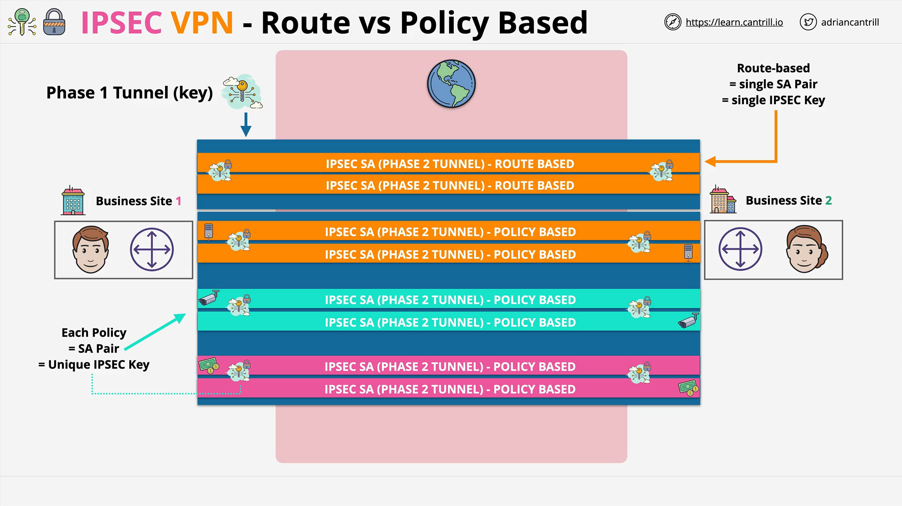

# IPsec VPN Fundamentals

## Overview

This lesson explains **IPsec** (Internet Protocol Security) and its role in creating **secure tunnels across insecure networks**. It's commonly used to securely connect geographically distributed networks or cloud infrastructures (e.g., AWS) to on-premises data centers.

## What is IPsec?



- **IPsec** is a **suite of protocols** that works together to **secure communication** between two endpoints, called **peers**.
- It establishes **encrypted tunnels** over insecure networks (like the Internet).
- Useful for:
  - Businesses with multiple physical locations.
  - Connecting AWS environments to other cloud/on-prem environments.

## Key Features

- **Authentication**: Only known peers can connect after identity verification.
- **Encryption**: Ensures data in transit is secure and cannot be intercepted or altered undetected.
- **Dynamic Tunnels**: Tunnels are established only when “interesting traffic” is detected.

## Interesting Traffic

“Interesting traffic” is defined by **rules or policies**. These can be:

- Based on **network prefixes**.
- Or more **complex match conditions**.

When interesting traffic is detected:

- A **VPN tunnel is established**.
- The tunnel **remains active while needed**, and is **torn down** when idle.

## Encryption Fundamentals Refresher

### Symmetric Encryption

- **Same key** for encryption and decryption.
- **Fast and efficient**, but **secure key exchange is hard**.

### Asymmetric Encryption

- **Public key**: Used to encrypt data.
- **Private key**: Used to decrypt.
- **Safer for key exchange**, though **slower**.
- Common use: **Encrypt symmetric keys** for secure transmission.

## IPsec VPN Phases

### Phase 1: IKE (Internet Key Exchange) Phase 1



- **Purpose**: Authentication and key agreement.
- **Versions**:
  - **IKEv1** (older)
  - **IKEv2** (modern, more features)

#### Steps:

1. **Authenticate** using:
   - **Pre-shared keys** (like passwords), or
   - **Certificates**.
2. **Use Diffie-Hellman (DH)** key exchange:
   - Each side generates a **private** and **public** key.
   - Public keys are **exchanged**.
   - Both parties compute the same **shared secret** (DH Key) using their own private key and the other party's public key.
   - This leads to a **shared symmetric key**, without ever transmitting it directly.
3. The result is a **Phase 1 Tunnel**, known as a **Security Association (SA)**.

> **Note**: This is the “heavy-lifting” phase, slow but essential for secure setup.

### Phase 2: IKE Phase 2



- **Built on top of Phase 1** using the previously established tunnel and key.
- **Purpose**: Define how the VPN will encrypt traffic.

#### Steps:

1. **Negotiate Encryption Methods** (Cipher Suites):
   - One peer offers supported methods.
   - The other picks the **best shared method**.
2. Use DH Key + Phase 1 material to generate a new **IPsec symmetric key** (MU key).
3. Establish a **pair of Security Associations**:
   - One for each traffic direction.
   - These define how data will be encrypted and transmitted.

## VPN Types: Route-Based vs Policy-Based

### Route-Based VPN

- **Traffic matched using routes** (e.g., 192.168.0.0/24).
- One **pair of SAs** (security associations) per prefix.
- **Simple**, but less flexible.

> **Example**:

```bash
Send all traffic to 10.0.0.0/16 via VPN tunnel.
```

- One **Phase 1 tunnel**, one **Phase 2 tunnel**.

### Policy-Based VPN

- **Traffic matched via policies**.
- Multiple **pairs of SAs**, each for different policies (e.g., by application or department).
- **More complex**, but **more secure and customizable**.

> **Example Use Case**:

- Different rules and encryption levels for:
  - **Infrastructure**
  - **CCTV feeds**
  - **Financial data**

## Summary Diagram



### Route-Based VPN Architecture:

- **One Phase 1 Tunnel**.
- **One Phase 2 Tunnel** with a pair of SAs.
- Simple configuration, traffic matched by **route**.

### Policy-Based VPN Architecture:

- **One Phase 1 Tunnel**.
- **Multiple Phase 2 Tunnels**, each with unique SAs per policy.
- Complex, but supports **differentiated security settings**.

## Summary

- **IPsec VPNs** provide **secure**, **authenticated**, and **encrypted tunnels** over the public Internet.
- **Two phases** ensure both identity verification and efficient encrypted data transfer.
- Choose **Route-Based** VPNs for simplicity and **Policy-Based** VPNs for fine-grained control.
- These principles are **foundational to AWS VPNs** and other cloud-native networking models.
