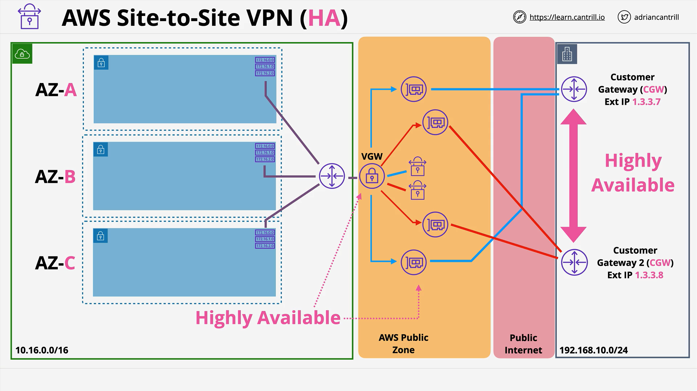
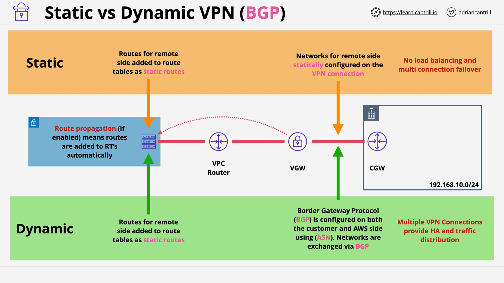

# AWS Site-to-Site VPN

## Overview

AWS Site-to-Site VPN enables secure connectivity between your AWS environment (specifically, a VPC) and external networks such as on-premises data centers or other cloud environments. Understanding its architecture and operational principles is crucial for both the **AWS Solutions Architect Associate (SAA-C03)** exam and real-world deployments.

## What is a Site-to-Site VPN?

- **Definition**: A logical, IPsec-encrypted connection between a VPC and an external (usually on-premises) network.
- **Typical Usage**: Used when direct physical connections like AWS Direct Connect aren't feasible or take too long to provision.
- **Encryption**: Relies on IPsec over the public internet.
- **Alternative**: Can also run over AWS Direct Connect for added security and performance.

## Key Components

### 1. **VPC (Virtual Private Cloud)**

- The AWS environment to be connected via VPN.

### 2. **Virtual Private Gateway (VGW)**

- A logical, highly available AWS-side gateway that connects the VPC to the VPN.
- Associated with a **single VPC** and used as a target in route tables.

### 3. **Customer Gateway (CGW)**

- Represents the **customer-side physical router**.
- Can also be a **logical configuration** in AWS.
- Requires the public IP address of the customer’s device.

### 4. **VPN Connection**

- Ties together the VGW and CGW.
- Manages two tunnels (redundant paths) for high availability.

## Basic Architecture

### Step-by-Step VPN Setup

1. **Gather Information**:

   - VPC CIDR range.
   - On-premises network CIDR.
   - Public IP address of customer’s router.

2. **Create a VGW**:

   - Attach it to the VPC.
   - Becomes a route table target.

3. **Create a CGW**:

   - Represents the customer router.
   - Requires static IP.

4. **Create VPN Connection**:
   - Links VGW and CGW.
   - Two tunnels automatically provisioned for redundancy.

### Architecture Diagram (Conceptual):



- Each tunnel is an **IPsec connection** to a VGW endpoint.
- Redundancy is limited if only **one customer router** is used.

## High Availability

### Partial High Availability

- AWS side (VGW) is **highly available**: multiple AZs, multiple endpoints.
- On-premises side (CGW) is a **single point of failure** if only one router is used.

### Fully Highly Available Architecture

- **Add a second customer router** with a separate internet connection, ideally in a different building.
- Create a **second CGW and VPN connection**.
- This results in **4 tunnels total**, enabling full HA on both ends.

## VPN Types: Static vs Dynamic



### Static VPN

- Requires **manual entry** of routes on both sides.
- Works with any router that supports IPsec.
- **Simpler but limited** in:
  - Failover
  - Load balancing
  - Advanced availability features

### Dynamic VPN

- Uses **BGP (Border Gateway Protocol)** to exchange routes automatically.
- Enables:
  - **Dynamic route propagation**
  - **High availability**
  - **Multi-link failover**
- Requires customer router to support BGP.

#### Route Propagation (Dynamic VPN)

- When enabled, **VPC route tables automatically learn** on-premises routes from the VPN.
- Reduces manual configuration.

```text
Route propagation enabled → VGW learns routes via BGP → VPC route table updates dynamically.
```

## Performance Considerations

### Speed Limits

- Max throughput per VPN connection (2 tunnels): **1.25 Gbps**
- This is an **AWS-imposed cap**.
- Encryption overhead can reduce performance, depending on router specs.

### Latency

- VPNs traverse the **public internet**.
- Each hop adds latency → might be **unsuitable for latency-sensitive applications**.
- Use **Direct Connect** for low-latency, stable connections.

## Cost Considerations

- **Hourly charges** for running VPN connections.
- **Data transfer out** is billed.
- Bandwidth usage may consume on-premises ISP quotas.

## Summary

| Feature            | Static VPN                      | Dynamic VPN (BGP)                |
| ------------------ | ------------------------------- | -------------------------------- |
| Route Management   | Manual                          | Automatic                        |
| HA / Multi-Link    | Limited                         | Supported                        |
| Router Requirement | Any IPsec-compatible            | Must support BGP                 |
| Configuration      | Simpler                         | More complex                     |
| Route Propagation  | Not available                   | Available                        |
| Ideal Use Case     | Simple, single-link deployments | Enterprise-grade, HA deployments |
