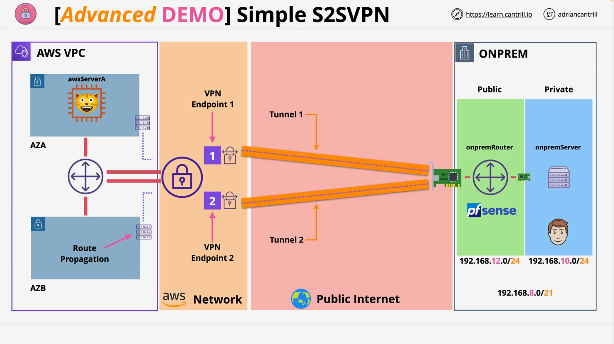
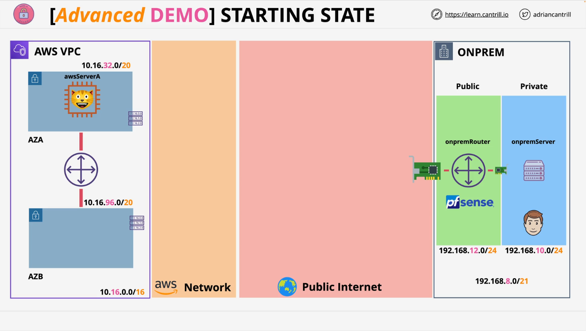

# Simple Site2Site VPN - STAGE0 - SETUP

## Overview

This mini project provides hands-on experience in setting up a **Site-to-Site VPN** between AWS and a **simulated on-premises environment** using **PF Sense**, a widely-used firewall/router/VPN solution. The project does **not require physical VPN hardware** and utilizes a **one-click deployment** on AWS for ease of use.

## Project Architecture

- **AWS Environment (Left Side)**

  - Contains a server running a **cat-themed application**.

- **Simulated On-Premises Environment (Right Side)**
  - Includes:
    - **On-prem server**
    - **PF Sense router** (Virtualized)
- The goal is to create a **VPN tunnel** between the PF Sense router and AWS VPC securely.

## Getting Started

### Resources Used

[1-Click Deployment](https://console.aws.amazon.com/cloudformation/home?region=us-east-1#/stacks/create/review?templateURL=https://learn-cantrill-labs.s3.amazonaws.com/aws-simple-site2site-vpn/infra.yaml&stackName=S2SVPN)

### AWS Account Requirements

- Use an **AWS account with administrative permissions**.

  - If you're a course subscriber:
    - Use the **general AWS account** (management account).
    - Log in as `iamadmin` user.
  - If not:
    - Any AWS account is acceptable as long as you're using an **admin IAM identity**.

- The **AWS Region must be**: `us-east-1` (Northern Virginia).

## Preparation

### Subscribe to PF Sense AMI

- Use the link in the course instructions to subscribe to the **PF Sense AMI** via the AWS Marketplace.
- This subscription includes a **30-day free trial**, so you will **not be charged** for software licensing.
- You **must subscribe** before proceeding with the one-click deployment.

## Bookmark Key AWS Consoles

Pin the following AWS services to your **console favorites** for quick access:

1. **EC2**
2. **VPC**
3. **CloudFormation**

## Create a Key Pair

1. Navigate to:
   - `EC2 Console` > `Network & Security` > `Key Pairs`
2. Click on **Create Key Pair**
3. Set key name to something like: `infra`
4. Choose **PEM format** (for macOS/Linux/modern Windows)
   - Use **PPK** if you're using **PuTTY** on Windows.
5. Click **Create Key Pair**
   - This downloads the `.pem` or `.ppk` file locally
   - Keep this file safe; it will be required for SSH access

## One-Click Deployment (CloudFormation)

1. Open the **deployment link** provided in the course instructions.
2. This will open the **Quick Create Stack** screen with pre-filled values.
3. **Select the Key Pair** you created earlier in the `KeyName` dropdown.
4. Ensure you've already subscribed to PF Sense (as mentioned above).
5. Scroll to the bottom, **check the acknowledgement box**, and click **Create Stack**.
6. Wait for the stack to reach the `CREATE_COMPLETE` status before proceeding.

## Next Steps

After the CloudFormation stack finishes deployment:

- You’ll move on to the **next stage**, which includes configuring the VPN tunnel between PF Sense and AWS.
- This will involve:
  - Reviewing routes
  - Testing connectivity
  - Understanding VPN settings (e.g., pre-shared keys, encryption domains)

## Notes

- This mini project gives a real-world-like experience by simulating a typical **small business environment** setup.
- The PF Sense router mimics what many real SMBs use for their on-prem infrastructure.
- Even if the architecture looks complex, it's broken down into **step-by-step guided implementations**.
