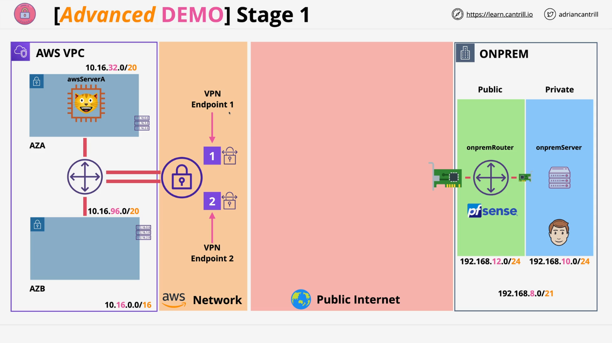

# Stage One: AWS Side VPN Configuration

This stage focuses on implementing the **AWS side** of a **site-to-site VPN** between AWS and a **simulated on-premises PF Sense router**. By the end of this section, the VPN connection on AWS will be fully configured, pending activation.

## Prerequisite

- CloudFormation stack should be in `CREATE_COMPLETE` state.
- You must have already completed the **one-click deployment** of the infrastructure.

### Resources

- **Project Repo**: [learn-cantrill-io-labs/aws-simple-site2site-vpn](https://github.com/acantril/learn-cantrill-io-labs/tree/master/aws-simple-site2site-vpn)
- **Stage 1 Instructions**: [STAGE1.md](https://github.com/acantril/learn-cantrill-io-labs/blob/master/aws-simple-site2site-vpn/02_LABINSTRUCTIONS/STAGE1.md)

## Step 1: Locate On-Premises Router IP

1. Navigate to the **Outputs tab** of your CloudFormation stack.
2. Copy the **IPv4 address** listed next to `OnPremRouterIP`.
3. Save this IP for upcoming configuration steps.

## Step 2: Open VPC Console

- Right-click your pinned **VPC service** in AWS and open in a new tab.

## Step 3: Create Customer Gateway

The **Customer Gateway** (CGW) represents your **on-premises PF Sense router** to AWS.

**Instructions:**

1. Go to:  
   `VPC Console > VPN > Customer Gateways`
2. Click **Create Customer Gateway**
3. Enter:
   - **Name Tag**: `a4l-onprem-router`
   - **IP Address**: Paste your copied on-prem IP
   - Leave **BGP ASN** and other options as default (not used here)
4. Click **Create**

## Step 4: Create Virtual Private Gateway

The **Virtual Private Gateway** (VGW) is AWS’s VPN endpoint, which attaches to the VPC.

**Instructions:**

1. Go to:  
   `VPC Console > VPN > Virtual Private Gateways`
2. Click **Create Virtual Private Gateway**
3. Enter:
   - **Name Tag**: `AWS-VGW`
   - Leave ASN options as default (not needed for static VPN)
4. Click **Create**

**Attach VGW to VPC:**

1. Select the VGW you just created
2. Click **Actions > Attach to VPC**
3. Choose your AWS VPC (e.g., `a4l-aws`)
4. Click **Attach**

## Step 5: Create Site-to-Site VPN Connection

You now connect the **Customer Gateway (on-prem)** to the **Virtual Private Gateway (AWS)**.

**Instructions:**

1. Go to:  
   `VPC Console > VPN > Site-to-Site VPN Connections`
2. Click **Create VPN Connection**
3. Enter:
   - **Name Tag**: Optional
   - **Target Gateway Type**: Virtual Private Gateway
   - **Virtual Private Gateway**: Select `AWS-VGW`
   - **Customer Gateway**: Select **Existing**, then choose `a4l-onprem-router`
   - **Routing Options**: Choose **Static**
   - **Static Prefixes**: `192.168.8.0/21`
     > This is the IP range used in the simulated on-prem environment
4. Leave other settings as default
5. Click **Create VPN Connection**

## Step 6: Download PF Sense VPN Configuration

Once the VPN is in the `Pending` state:

1. Select the newly created **VPN Connection**
2. Click **Download Configuration**
3. In the dropdown:
   - **Vendor**: PF Sense
   - **Platform**: PF Sense
   - **Software**: Ensure version `2.2.5` or higher
   - **IKE Version**: Choose `IKEv1`
4. Click **Download**

This will provide a detailed VPN configuration file used to manually set up PF Sense in the next stage.

## Summary of Architecture at This Stage

- ✅ AWS Virtual Private Gateway created and attached to VPC
- ✅ Customer Gateway object created for PF Sense
- ✅ Site-to-Site VPN connection created
- 🔄 VPN connection is currently **pending**
- 📥 PF Sense config downloaded, ready for next stage

## What’s Next?

In the **next stage**, you'll:

- Log into the simulated **PF Sense appliance**
- Apply the VPN settings manually
- Establish connectivity between the two environments

When you're ready, move on to **Stage Two** of the mini project.
