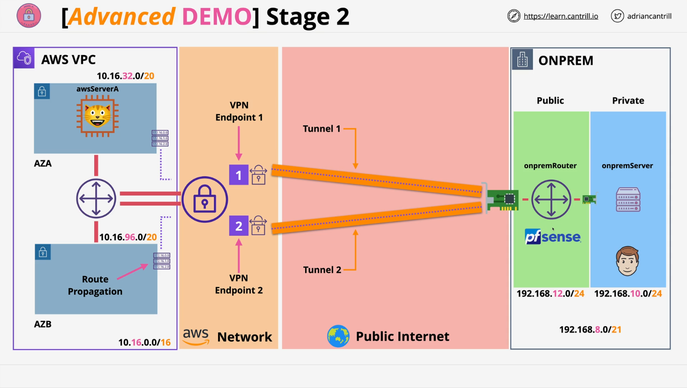

# Stage 2: Simulated On-Premises Site & Site-to-Site VPN Configuration

## Resources

- **Project Repository**: [AWS Simple Site-to-Site VPN Lab](https://github.com/acantril/learn-cantrill-io-labs/tree/master/aws-simple-site2site-vpn)
- **Stage 2 Instructions**: [STAGE2.md](https://github.com/acantril/learn-cantrill-io-labs/blob/master/aws-simple-site2site-vpn/02_LABINSTRUCTIONS/STAGE2.md)

## Overview

This stage involves configuring a simulated **on-premises site** using **pfSense** to establish **two IPSec VPN tunnels** with AWS. These tunnels ensure **high availability** by connecting to two VPN endpoints in AWS.

## Step-by-Step Summary

### 1. Confirm VPN Connection Status in AWS

- Ensure your Site-to-Site VPN connection in the AWS console is in an `available` state.
- If not, wait or troubleshoot before continuing.

### 2. Access pfSense Router via EC2

- Go to the **EC2 Console**, select **on-premises router instance**.
- Retrieve **login credentials** from `Get system log`.
  - Look for: `EC2-user password changed to: <password>`
- Open the router's public IP address (click “Open address”).
- Bypass the SSL warning in browser.
- **Login to pfSense** with:
  - Username: `admin`
  - Password: (from system log)

### 3. Configure pfSense Interfaces

#### Add and Enable LAN Interface

1. Go to **Interfaces → Assignments**.
2. Add the available port as `LAN`.
3. Click `Save`.
4. Go to **Interfaces → LAN**.
5. Enable the interface.
6. Set **IPv4 Configuration Type** to `DHCP`.
7. Click `Save`, then `Apply Changes`.

> _Note: DHCP is fine for this lab; production systems typically use static IPs._

### 4. Create IPSec VPN Tunnel 1 (AWS Endpoint 1)

#### Phase 1 Configuration

1. Go to **VPN → IPSec → Add P1**.
2. Settings:
   - **Description**: `AWS-Tunnel-AZ1`
   - **Key Exchange**: `IKEv1`
   - **Remote Gateway**: (From downloaded AWS VPN config file, Tunnel 1)
   - **Authentication**: `Mutual PSK`
   - **Negotiation Mode**: `Main`
   - **Pre-shared Key**: (From AWS config file)
   - **Encryption Algorithm**: `AES 128-bit`
   - **Hash**: `SHA1`
   - **DH Group**: `2 (1024-bit)`
   - **Lifetime**: `28800`
   - **Dead Peer Detection**: `Enabled`
   - **NAT Traversal**: `Auto`
   - **Delay**: `10`
   - **Max Failures**: `3`
3. Click `Save`.

#### Phase 2 Configuration

1. Click **Show Phase 2 Entries → Add P2**.
2. Settings:
   - **Description**: `IPSec-Tunnel1-AWS-AZ1`
   - **Mode**: `Tunnel IPv4`
   - **Local Network**: `192.168.10.0/24` (On-prem subnet)
   - **Remote Network**: `10.16.0.0/16` (AWS VPC)
   - **Protocol**: `ESP`
   - **Encryption**: `AES 128-bit`
   - **Hash Algorithm**: `SHA1`
   - **PFS Key Group**: `2 (1024-bit)`
   - **Lifetime**: `3600`
   - **Enable Keep Alive**: `Yes`
   - **Keepalive IP**: (AWS Server A private IP)
3. Click `Save`.

### 5. Create IPSec VPN Tunnel 2 (AWS Endpoint 2)

Repeat the same steps for Tunnel 2, using values from **Tunnel 2** section of the AWS VPN configuration file.

#### Phase 1 Configuration

- **Description**: `AWS-Tunnel-AZ2`
- Use the Tunnel 2-specific:
  - **Remote Gateway IP**
  - **Pre-shared Key**

All other settings remain the same as Tunnel 1.

#### Phase 2 Configuration

- **Description**: `IPSec-Tunnel2-AWS-AZ2`
- Use the same:
  - **Local Network**: `192.168.10.0/24`
  - **Remote Network**: `10.16.0.0/16`
  - **Keepalive IP**: AWS Server A private IP

## 6. Apply Changes and Connect Tunnels

1. Click **Apply Changes** in pfSense.
2. Go to **Status → IPSec**.
3. Manually click **Connect** for both Phase 1 and Phase 2 of each tunnel.

- You should see **"Established"** if configuration is correct.
- If not, re-check all entries (pre-shared key, IPs, etc.)

## Recap

At this stage, the simulated on-premises pfSense router is connected to two AWS VPN endpoints through IPSec tunnels. Although VPN connectivity is now in place, further routing and security configurations (covered in the next stage) are necessary to enable full communication.
