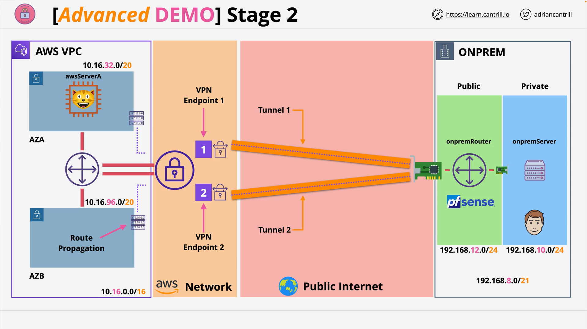

# Stage 3: Routing and Security Group Configuration

**Project Repo:** [AWS Site-to-Site VPN Lab](https://github.com/acantril/learn-cantrill-io-labs/tree/master/aws-simple-site2site-vpn)  
**Stage 3 Instructions:** [STAGE3.md](https://github.com/acantril/learn-cantrill-io-labs/blob/master/aws-simple-site2site-vpn/02_LABINSTRUCTIONS/STAGE3.md)

## Overview

In Stage 3 of the AWS Site-to-Site VPN lab, you will configure **routing** and **security groups** to enable network communication between the AWS cloud environment and a simulated on-premises environment via the VPN tunnel established earlier.

You will:

- Configure AWS and on-premises route tables.
- Use route propagation with the Virtual Private Gateway (VGW).
- Update security groups to allow traffic across the VPN tunnel.

## Architecture Recap



- **Left Side**: AWS Environment
- **Right Side**: Simulated On-Premises Environment
- **Status**: Two VPN tunnels are already operational between both environments.

## Objective of Stage 3

- Enable full **bidirectional routing** between AWS and on-premises networks.
- Modify **security groups** to allow appropriate traffic flows.

## 1. Configure AWS Side Routing

### Navigate to Route Tables

1. Go to the **VPC Console**.
2. Under **Virtual Private Cloud**, select **Route Tables**.

### Identify AWS Route Table

- Look for the route table named: `RT-Hive-AWS`
- This table is attached to both subnets on the AWS side.

### Use Route Propagation

Instead of adding a static route, you will enable **route propagation** from the Virtual Private Gateway:

1. Select the `RT-Hive-AWS` route table.
2. Go to the **Route Propagation** tab.
3. Click **Edit Route Propagation**.
4. Check the box to **Enable** the VGW (Virtual Private Gateway).
5. Click **Save**.

> ✅ This automatically propagates the on-premises route (`192.168.8.0/21`) into the AWS route table.

### Result

You should now see:

```text
192.168.8.0/21 → Target: Virtual Private Gateway (vgw-xxxx)
```

## 2. Configure On-Premises Routing

### Identify On-Prem Route Table

- Select the route table named: `RT-Hive-OnPrem-Private`

### Add Route to AWS Network

1. Go to the **Routes** tab.
2. Click **Edit Routes** > **Add Route**.
3. Destination: `10.16.0.0/16` (AWS VPC CIDR)
4. Target: **Network Interface**
5. Select the **private ENI** of the PF Sense router (`On-Prem-Router-Private-ENI`)
6. Click **Save Changes**

> ✅ This sends AWS-bound traffic from the on-prem private subnet through the PF Sense firewall/router.

## 3. Update Security Groups

### Security Groups Involved

| Name                    | Purpose                           |
| ----------------------- | --------------------------------- |
| `default-a4l-aws-sg`    | Default AWS instances             |
| `default-a4l-onprem-sg` | Default on-premises instances     |
| `on-prem-router-sg`     | PF Sense router (on-premises VPN) |

### a. AWS Security Group: `default-a4l-aws-sg`

1. Select the group.
2. Go to **Inbound Rules** > **Edit Inbound Rules**
3. Add Rule:
   - Type: `All Traffic`
   - Source: `192.168.8.0/21`
   - Description: `Allow on-premises in`
4. Save rules.

> ✅ Allows incoming traffic from on-premises to AWS EC2 instances.

### b. On-Prem Security Group: `default-a4l-onprem-sg`

1. Select the group.
2. Go to **Inbound Rules** > **Edit Inbound Rules**
3. Add Rule:
   - Type: `All Traffic`
   - Source: `10.16.0.0/16` (AWS VPC range)
   - Description: `Allow AWS in`
4. Save rules.

> ✅ Allows AWS-originated traffic into the on-premises VMs.

### c. On-Prem Router Security Group: `on-prem-router-sg`

1. Select the group.
2. Go to **Inbound Rules** > **Edit Inbound Rules**
3. Add Rule:
   - Type: `All Traffic`
   - Source: `default-a4l-onprem-sg` (Security Group)
   - Description: `Allow private subnet to use VPN`
4. Save rules.

> ✅ This allows internal on-premises systems to access the VPN router for routing to AWS.

## Final Outcome


At this point:

- **Routing** is fully configured on both sides.
- **Security Groups** allow traffic to traverse the VPN tunnel.
- The VPN is ready to be tested for end-to-end connectivity.

> The actual connectivity test is performed in the **next stage** of the mini-project.

## Notes for Production

- In real-world deployments, security groups on the on-premises side would be replaced with **firewall rules**.
- Route propagation is a scalable option for managing routes dynamically, especially when connecting to multiple networks.
