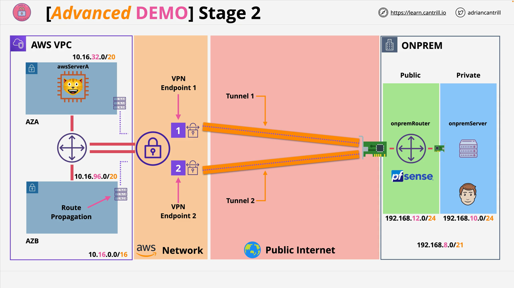

# Stage 4: Verifying VPN Functionality Between On-Prem and AWS

**Resources:**

- **Project Repository:** [acantril/learn-cantrill-io-labs - aws-simple-site2site-vpn](https://github.com/acantril/learn-cantrill-io-labs/tree/master/aws-simple-site2site-vpn)
- **Stage 4 Instructions:** [STAGE4.md](https://github.com/acantril/learn-cantrill-io-labs/blob/master/aws-simple-site2site-vpn/02_LABINSTRUCTIONS/STAGE4.md)

## Objective



In this stage, you simulate using a typical on-premises Windows machine to:

- Connect via **SSM Fleet Manager** to an EC2 instance representing the on-prem server.
- Verify connectivity through the **site-to-site VPN** to an EC2 instance in AWS (**AWS Server A**).
- Confirm connectivity via **ping** and **web access**.

## Step-by-Step Process

### 1. **Connecting to the On-Premises EC2 Instance**

- Navigate to the **EC2 Console** > **Instances**.
- Locate the **on-prem server** EC2 instance.
- Right-click → **Connect** → **RDP Client**.
- Choose **Fleet Manager**, a feature of **AWS Systems Manager (SSM)**, to open a graphical session.

### 2. **Obtaining Credentials**

- Click **Get Password**.
- Upload the **SSH key pair** created earlier in the project.
- Decrypt the password and copy it to your clipboard.

### 3. **Remote Desktop Connection via Fleet Manager**

- Re-select **Fleet Manager Remote Desktop** if needed.
- Choose **User credentials**:
  - Username: `administrator`
  - Password: Paste the one you just decrypted.
- Connect. It may open in a low-resolution window; click the **instance ID** at the top bar for fullscreen.

> Note: This simulates sitting at a physical on-prem workstation connecting to AWS via VPN.

## VPN Verification

### 4. **Ping AWS Server A**

- Switch back to the EC2 Console.
- Locate **AWS Server A**, copy its **private IP**.
- On the remote desktop:
  - Open **Command Prompt**:
    ```cmd
    ping <AWS-ServerA-Private-IP>
    ```
- A successful ping confirms the **VPN is operational**.

### 5. **Web Access Test**

- Open **Internet Explorer** on the on-prem server.
- Visit the private IP of AWS Server A via HTTP:
  ```url
  http://<AWS-ServerA-Private-IP>
  ```
- You should see a **corporate-themed web app**.

### 6. **Instance Verification**

- Confirm the instance ID shown in the webpage matches **AWS Server A**.
- Example ID ending in: `999D3`.

## Summary

At the end of this stage:

- You’ve verified **VPN connectivity** using ping and HTTP.
- Demonstrated how an **on-prem user** can access AWS internal services via a **site-to-site VPN**.

## Notes for Real-World Scenarios

- In production, you may use different **VPN/firewall hardware** on-prem.
- Common elements:
  - **Multiple VPN tunnels** for redundancy.
  - **Routing tables**, **Security Groups**, and **Network ACLs** need to be configured.
- For advanced setups, Cantrill offers a demo using **Dynamic BGP VPN**, which auto-manages routing.

## Next Step

In the next stage, you'll **clean up** all resources created during this mini-project to avoid ongoing AWS costs and restore your environment to its original state.
